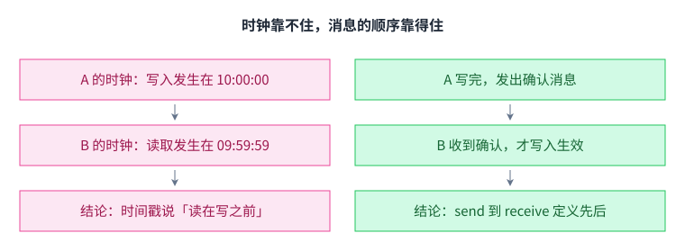
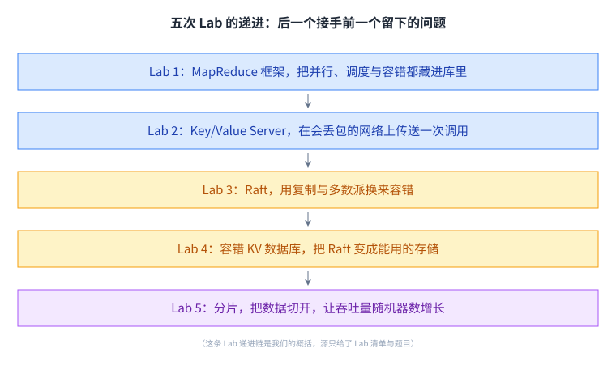
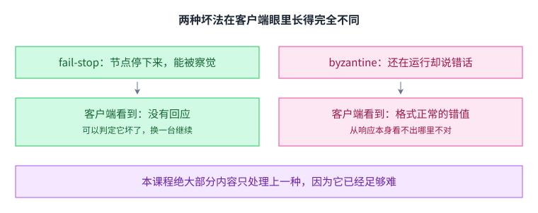
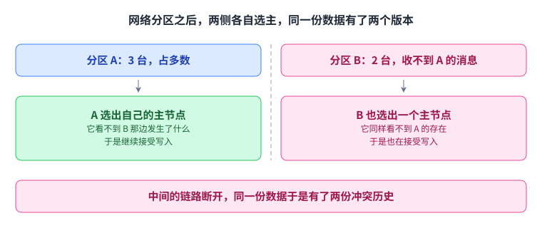
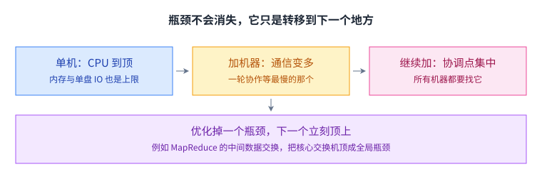
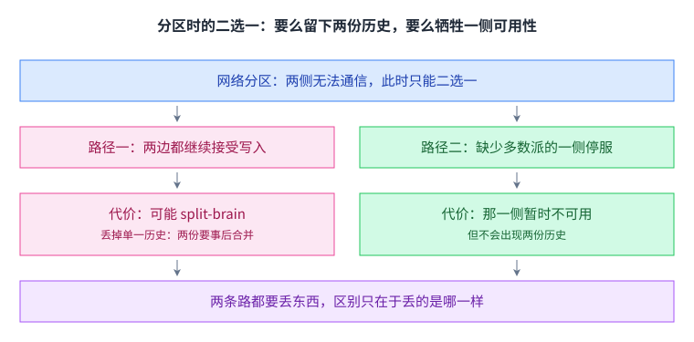
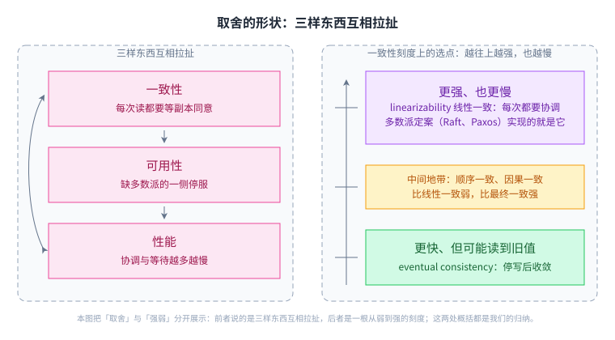
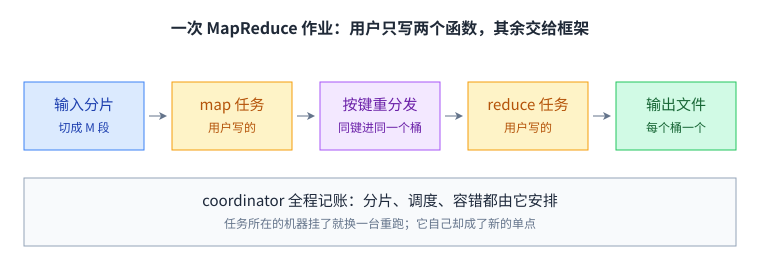
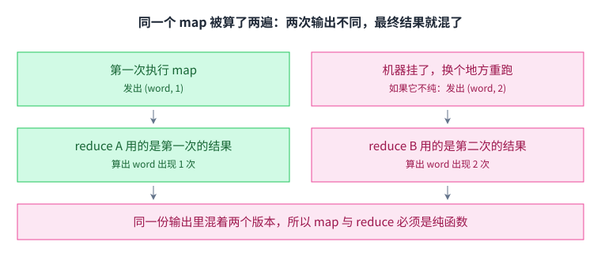

+++
title = "分布式系统导论"
lecture = 1
slug = "introduction"
status = "draft"
source_kind = "notes"
source_url = "https://pdos.csail.mit.edu/6.824/"
source_title = "Lecture 1: Introduction"
output_mode = "explanation"
papers = ["mapreduce"]
+++

> 来源课程：MIT 6.5840 / 6.824 Distributed Systems（Robert Morris、Frans Kaashoek 与 MIT PDOS）；
> 对应内容：Lecture 1 — Introduction（rtm 主讲，2026 春季学期）；
> 原文链接：https://pdos.csail.mit.edu/6.824/ ；
> 上游许可：课程**主页**标注 CC BY 3.0 US — https://creativecommons.org/licenses/by/3.0/us/ ；
> **注意：该徽章只出现在课程主页。本讲所依据的笔记文件本身没有许可声明，覆盖范围未获确认**
> —— 因此本页只讲概念、不转载任何原文。
> 本文由 CourseLingo 原创撰写：我们对这一讲的主题做了**重新讲解**，而不是翻译原讲座文本，也没有逐句改写原文、没有转载它的幻灯片与图表（若 CC BY 确实适用，其要求标注是否作了修改 —— 以上即是我们的标注）；本文非官方材料，CourseLingo 与 MIT 及本课程教学团队无隶属关系；如与原文有出入，以原文为准。

## 现状与痛点：两台机器一断网，你丢掉了什么

先看一个最小的场景。你在笔记本上跑着一个计数服务，为了不丢数据，把它搬到两台机器上，只允许这两台机器通过网络发消息。第一个用户写入之后，第二个用户立刻去读。你会期望他读到刚写进去的那个值；而在真实网络里，这个期望没有任何保证。

麻烦的根源是：你在单机上写的每个程序，都悄悄依赖了三件从不写进代码的事。

同一个进程里，两条语句谁先谁后是确定的，CPU 和锁替你排好了序，你甚至可以把一个本地计数器当成「时间」用。调用一个函数，它要么返回、要么抛异常；进程挂了，操作系统和父进程立刻就知道。内存只有一份，两个读者读到的必定是同一个字节。

换到两台机器上，只允许它们通过网络发消息，这三件事会同时失效。

顺序失效。每台机器有自己的时钟，走时快慢还有细微差异，这就是[[term:clock-skew]]。于是「A 先写入、B 后读取」这种话失去了依据：你无法用时间戳裁决先后，只能依靠消息传递本身定义的先后关系。

顺序和失败这两件事，看着都有判据，其实都没有：



上排讲顺序：时间戳会被时钟偏差推翻，只有「发出去之后才可能收到」定义得了先后。下排讲失败：A 能看到的全部事实只是「没有回音」，而崩溃、变慢、去程丢包、回程丢包各需要完全不同的处置。

失败变得不可判定。B 没有回消息，可能是它[[term:crash]]了，可能只是它慢，可能是网络丢了包，也可能是它算完了而回复在回程丢了。这四种情况对 A 而言一模一样。「超时」只是你的猜测，不是事实。

状态有了多份。你写下的数据存在若干地方，它们可以暂时不一致，而这个「暂时」并没有天然的上界。

把两侧并排放，这三项保证的失效方式一目了然：


左边三项在单机上都不需要维护，右边三项却各自要用一套协议去替代。

现在可以给定义了。[[term:distributed-system]]指的是：一组计算机通过网络互相发消息，合起来对外提供一个服务，让使用者感觉自己面对的是「一个系统」。这句话的重点不在「很多台机器」，而在「对外像一个」。

而这三条失效，几乎解释了后面每一讲的全部难度：本课程后续出现的那些协议，本质上都是在为这三种失效补上可控的替代品。

## 那为什么还要建分布式系统

单机有上限，现实的需求总会顶到这个上限上。常见的驱动力有四条，而且它们常常同时出现：

1. 要更大的容量。单机的核数、内存、磁盘与网卡都有上限。把工作切给多台机器去做，[[term:throughput]]才有增长的可能。注意是「有可能」，理由见后面两节。
2. 要[[term:fault-tolerance]]。在上千台机器的集群里，故障是常态而不是意外。让服务在部分机器失效时继续工作，最核心的手段是[[term:replication]]：同一份数据存几份，坏掉一份还有别的。
3. 数据与用户本来就分散在不同地方。与其把几 TB 数据搬到计算的机器旁边，不如把计算发到数据旁边去跑。后面的 [[term:MapReduce]] 与 GFS 都在反复利用这一点。
4. 要隔离。把不可信的代码关进独立的机器，用机器边界换取安全边界。

课程的实验与这四条驱动力是**交叉**的，不是一一对应：Lab 1 写一个分布式大数据框架（对应第 1 条），Lab 2 在不可靠网络上做客户端/服务器，Lab 3 用 Raft 做[[term:replication]]级别的容错（对应第 2 条），Lab 4 把它包成容错的数据库，Lab 5 用[[term:sharding]]把性能撑起来（又回到第 1 条）。第 4 条「用隔离换安全」在课程实验里没有对应的一个，它是另一类系统的主题。（另有可选的期末项目，它可以替代 Lab 5。）

这五次 Lab 不是五个孤立练习，它们排成一条递进链：



顺序本身就是要讲的：Lab 2 会把 RPC 用起来（第 2 讲的主题），Lab 3 的 Raft 跑在 Lab 2 搭好的 RPC 之上，Lab 4 把 Raft 包成存储，Lab 5 再把它切开（这条递进关系是我们的概括，源里只给了 Lab 的清单与题目）。

## 五条无法回避的现实

网络不可靠。丢包、重复、乱序、延迟抖动都是常态。更麻烦的是：网络故障与机器故障在调用方看来无法区分，你以为对端死了，它可能只是慢。「超时」只是你的猜测。

机器会失败。最简单也最常用的模型是[[term:fail-stop]]：节点要么正常工作，要么停下来，**而且停下来之后绝不再发出错话**。要特别注意这是**被假设的模型，不是观察得到的事实**：在观察者眼里，「它停了」和「它只是慢」「丢包了」长得一模一样，所以「没有回音」本身证明不了任何事（这正是上一条那个缺口）。真实的坏法更多，比如节点还在运行却发出错误甚至欺骗性的消息，那就是[[term:byzantine-fault]]。本课程绝大部分内容只处理 fail-stop，因为它已经足够难。

麻烦在于这两种坏法骗过的不是机器，而是观察者：



前一种坏法在模型上被假设为「不会说错话」，它只是不再出声；后一种坏法连回应本身都不能当证据。但要注意：**「没有回音」并不是一条判据**，它与变慢、丢包在客户端眼里没有区别。fail-stop 之所以好用，是因为它让系统可以不去处理「说错话」这一类，而不是因为它能被观测出来。

没有全局时钟。[[term:clock-skew]]让「用时间戳决定先后」变得不安全。真实系统常用[[term:lease]]这类带时限的授权来近似，但它的正确性最终仍要回到「多数派是否同意」这种不依赖物理时间的事实上。

部分失效。这是分布式系统区别于单机程序的最大特点。单机程序出错，通常是整体倒下，你能立刻看到；分布式系统出错时，是整个系统里**一部分**组件坏了，其余部分还在正常工作，而外部观察者往往无法判定究竟坏了什么。「一部分好、一部分坏」这种中间态，是绝大多数 bug 与设计难点的根源。

网络分区。[[term:network-partition]]是上面几条的组合拳：网络断开，集群被切成几块互不可达的部分。此时最危险的结果是[[term:split-brain]]：两侧各自以为自己是主节点，同时接受写入。

把分区之后的两侧摆在一起，这个结果是怎么长出来的就清楚了：



两侧都不缺「我自己是主节点」这条判断，缺的恰恰是对方那一半的消息。要挡住这个结果，只有让选举必须凑够多数派：凑不到多数派的那一侧没有资格继续服务。

## 「加机器就行了」是这一行最常见的误解

[[term:scalability]]指的是增加机器时性能能否跟着提升。它远不是自动的：

- 协调是有成本的。机器越多，需要交换的消息越多。通信本身的[[term:latency]]不会因为机器变多而下降，反而常常上升，因为一轮协作必须等最慢的那个参与者。
- [[term:bottleneck]]会转移。单机时卡在 CPU，加机器后可能卡在网络，再往后卡在某个集中的协调点上。优化掉一个瓶颈，通常只是把下一个瓶颈推到台前。
- 总有一部分工作无法并行。只要作业里存在必须串行的一小段，它就会给整体加速比设一个上限。
- 负载不会自己均分。任务确实切开了，但每份的大小与每台机器的速度都不一样：少数慢得多的任务，也就是[[term:straggler]]，会把整个作业拖住，因为其它机器只能空等。

瓶颈的搬家路线是这样的：



所以要问的是：加机器之后，下一个瓶颈会落到哪里。

一个具体的例子：MapReduce 在中间数据交换阶段，几乎所有工作节点都要去别的节点取数据，于是核心交换机的带宽成了全局瓶颈。这个瓶颈有多大，源里给了能算的数：论文用的集群是 **1800 台机器、两级交换网络**，根交换机的总带宽是 100 到 200 Gbit/s，摊到每台机器只有大约 **55 Mbit/s**，比磁盘和内存都慢得多。这解释了它的设计为什么要反复强调「让计算尽量靠近数据」「中间数据只过网络一次」。

另一笔账更能说明天花板在哪里：


串行段不参与分摊，机器再多也只能让总时间逼近它，加速比的上限就是这么来的。

## 核心张力：一致性 vs 可用性/性能

[[term:consistency]]这个词在不同语境里含义差别很大，这里先取一个朴素的版本：多个副本对外表现得像只有一份数据。要维持它，副本之间就必须通信，而通信既慢又会失败。于是矛盾出现了：

想让所有副本都同意，就要等待。等待推高[[term:latency]]；等待期间如果对方失联，还会伤到[[term:availability]]。想立刻回应用户，就只能先答应下来、之后再慢慢同步，于是短时间内副本之间可能不一致，甚至读到比刚才的写入更旧的值。

[[term:network-partition]]把这件事逼到极限：分区两侧无法通信时，你只能二选一：要么两边都继续接受写入（可能[[term:split-brain]]、产生冲突），要么让缺少[[term:majority]]的那一侧停止服务（牺牲可用性）。没有第三条路（这个「三选二」的口径不在第 1 讲笔记里，见文末溯源；笔记里的三元组是「容错／一致性／性能」，角度不同，本页按系统可用性来讲）。

这两条路各自要付什么，摆在一起看最清楚：



两条路都会丢东西，设计者能选的只是丢掉哪一样。

再往下看，一致性的强弱其实是一根连续的刻度。一端是[[term:linearizability]]：每个操作都像在某一瞬间原子生效，全局顺序与真实时间一致，代价是每次操作都要付出协调开销。另一端是[[term:eventual-consistency]]：停止写入后副本最终会收敛到相同状态，中途可能读到旧值，但通常快得多。本课程从 GFS、[[term:paxos]]、Raft 一路走到 Spanner，本质上就是在看不同的系统如何在这根刻度上选点，以及为这个选择付出了什么代价。这里要避免一个误读：Paxos 与 Raft 并不落在刻度中间，多数派定案给出的就是**最上面**那一档的线性一致。

把取舍的形状和这根刻度画在一起：



三条边都是拉扯：想保住任意两样，第三样往往会在故障或高峰期先崩；而每个系统都是在这根刻度上挑一个点，再为这个点付账。其中 Paxos 与 Raft 走的多数派定案，实现的就是刻度最上面那一档：它换来的是线性一致，代价是每次操作都要协调。

还有一点必须记住：[[term:replication]]不是免费的午餐。副本让数据更安全，却让维持一致性的成本随副本数上升。所以很多时候「多加几个副本」换来的不是更高的[[term:throughput]]，而是更好的[[term:availability]]。

## MapReduce：把并行与容错藏进库里

LEC 1 指定的阅读材料是 2004 年的 MapReduce 论文，它同时是 Lab 1 的原型。导论就讲它，是因为它把本课程的全部主题压缩进了一个极小的接口。

问题的背景很朴素：在几千台机器上处理几 TB 数据，建搜索索引、排序、分析网页结构。输入输出都放在 GFS 上：GFS 把文件切成 **64MB** 的块分散到多台机器，每份数据存 **2 到 3 份**，所以 map 可以并行读、reduce 可以并行写，这两件事都是 MapReduce 一讲的伏笔。这类计算如果让程序员自己操心「数据怎么分给谁」「某台机器中途挂了怎么办」，那么每写一个新程序都要把这些事重来一遍。MapReduce 的答案是：这些都不该由应用作者处理。

于是接口被压缩成两个函数：

- [[term:mapper]]：读一段输入，产出若干中间键值对；
- [[term:reducer]]：拿到一个键和这个键对应的所有值，把它们汇成一个结果。

以词频统计为例：map 把一段文本切成单词，每遇到一个词就发出「(词, 1)」；reduce 收到某个词的全部分值，把它们加起来就是总量。用户写下的通常是几十行顺序代码。

```python
def Map(chunk):           # chunk 是输入文件的一小段，由框架决定谁去读哪一段
    for word in split(chunk):
        emit(word, 1)     # 只产出中间键值对，不访问任何外部状态

def Reduce(key, values):  # 框架保证同一个 key 的全部 values 都送到同一个 Reduce 任务
    emit(key, sum(values))  # 只依赖参数，不写外部文件，也不与别的任务通信
```

这段代码里看不到网络、重试与调度，而这正是重点所在。框架替它承担了：把输入切成很多段并分配任务；把 map 产出的中间数据按键重新分发（每个 reduce 任务负责一个键桶）；跟踪每个任务是否完成，并尽量把任务调度到数据所在的那台机器上；某个任务所在的机器挂了，就在别的机器上把它重跑；收尾时还要对付落后者。

下面这张图把这条分工线和流水线画在一起：



左边两个函数是用户写的，分片、调度、容错与数据搬运全部落在框架手里；从分片到 reduce 的每一步都由[[term:coordinator]]记账，机制因此简单，它自己却成了新的单点。中间数据按键分桶，所以每个 reduce 任务只处理**一个**桶；但要拿到这个桶，它得去**每一个** map 工作节点的本地磁盘上各取一份，这些位置由 coordinator 告诉它。不需要知道 map 跑在哪里的，是用户写的那个 `Reduce()` 函数。

这里有一个容易被跳过、却最该问一句的地方：中间数据为什么不写进 GFS？讲义给的答案是网络往返的次数：留在本地磁盘时，中间数据只过一次网络（map 写本机，reduce 从各台 map 机器上拉走）；若改走 GFS，同一份数据至少要过两趟（先写进 GFS，再读出来），而 shuffle 本来就是整条流水线上最贵的一段。论文本身只写了「中间结果落在本地磁盘」这个设计，没有给理由；这条理由是讲义给的 —— 它属于取舍，不是推导出来的必然。

这里有一个值得琢磨的连锁反应。既然失败的任务会被重跑，同一个函数就可能被算两次。如果两次算出的中间结果不同，一部分 reduce 基于第一次的结果、另一部分基于第二次的，最终输出就错了。于是框架反过来对应用提出要求：map 与 reduce 必须是**确定性的纯函数**，只许看自己的输入，不许读写外部状态、不许用随机数、不许与别的任务通信。这就是[[term:side-effect]]在分布式系统里的代价：容错能力不是白拿的，它要靠收紧编程模型来换。

这笔交易的另一面是表达能力的收缩。MapReduce 只承认「Map → 重分发 → Reduce」这一种形状；任务之间不能交互、不能保留状态（中间输出除外）；而且它只适合批处理，做不了实时或流式处理。用通用性换易用性，这是一笔写在明面上的账。

这一节的两笔容错账，画在一起最清楚：



容错要能重跑，重跑就要允许算两次，算两次就要求函数是纯的；而落后者不去诊断哪台机器慢，只用一份多余的副本把最后那一小截砍短。

还有两个细节值得先记下，它们会在后面的讲座里反复出现。第一，对付[[term:straggler]]的办法很直接：当绝大多数任务已经完成、只剩最后几个还没回来时，把这几份任务复制到别的空闲机器上再跑一遍，谁先完成用谁，这就是[[term:backup-task]]。它不去诊断「哪台机器慢」，而是用一个额外的副本把长尾砍短，这种「用冗余换时间」的取舍在本课程里会一再出现。第二，整个作业由一个[[term:coordinator]]统一调度：它记录每个任务的状态，把任务发给空闲的工作节点。这让整套机制变得简单，同时也制造了新的单点。它自己挂掉怎么办？本讲没有回答这个问题，你可以先记着。

## 脉络回顾：这一讲在整门课里的位置

回到最开头那个场景：两台机器、一次断网、一个没有回音的请求。这一讲给你的，是把这类麻烦拆成三个可以分别处理的问题的能力。谁先谁后，只能由消息定义，不能由时钟定义；失败无法被判定，只能用[[term:replication]]去掩盖；状态会有多份，只能靠协议慢慢收敛。后面的协议，解决的都是这三件事。

LEC 1 立的是框架：**这门课讲的是基础设施：存储、通信、计算**，而它的一个总目标是把分布式的复杂度对应用隐藏起来；分布式系统难在并发、复杂的交互、性能瓶颈与部分失效；而一门课能教的，是前人已经踩出来的设计点。后面的每一讲，都是在一个具体系统里看它怎么选：

- [[term:rpc]] 与[[term:thread]]：跨机器通信如何伪装成本地调用，以及并发如何引入新的不确定性；
- GFS：把大文件切块、分散存储并复制，用中心化的[[term:master]]换取简单的设计；
- [[term:paxos]] 与 Raft：用[[term:consensus]]、[[term:leader-election]]、[[term:term]]编号与复制[[term:log]]，换来可用的强一致；
- [[term:zookeeper]]：把共识包装成通用的协调服务；
- 分布式[[term:transaction]]与 Spanner：把一致性推到跨分片、跨数据中心的量级；
- Chain Replication：用链式结构同时优化[[term:throughput]]与可用性。

读这一讲，最值得带走的不是任何具体算法，而是一个习惯：看到一个设计，先问它把哪一样牺牲掉了。

## 读完应该能回答

1. 用自己的话说清：为什么「对方没有回应」不能作为「对方已经挂了」的证据，以及这种不确定性会怎样影响一个最简单的客户端/服务器程序。
2. 单机世界里「全局顺序」是免费的；到了多台机器上，请说明时间戳为什么不能替代它，以及在不依赖物理时钟的前提下还能怎样定义两个事件的先后。
3. 若要把一份数据放在三台机器上，并保证之后读到的总是最新写入的值，请说明每次写入至少要拿到几台机器的确认，以及剩下的那台为什么不能在写入路径上被省掉。
4. 请说明 MapReduce 为什么要求 map 与 reduce 是确定性的纯函数，并构造一个「不纯」的 map，指出它在什么情况下会让最终输出出错。
5. 「增加机器就能提高吞吐量」在什么条件下成立、在什么条件下不成立。请举出一个「加了机器反而更慢」的具体场景。

## 溯源

- 对应：MIT 6.5840 / 6.824 Lecture 1 — Introduction（rtm 主讲，Spring 2026）
- 主要依据：**Lecture 1 笔记 l01.txt**（本讲的框架、四条驱动力、五次 Lab 与期末项目、MapReduce 一节、集群规模与带宽数字）；**Lecture 2 笔记 l-rpc.txt**（「现状与痛点」里的失败不可判定、「超时只是猜测」这个缺口）
- 官方链接：https://pdos.csail.mit.edu/6.824/
- 本讲阅读材料：MapReduce (2004)，论文页 https://www.usenix.org/conference/osdi-04/mapreduce-simplified-data-processing-large-clusters

**本讲之外的背景**：以下内容是我们按后续讲座与通行定义补的，属于讲解需要，不是这一讲的说法（l01 与 l-rpc 都没有展开）。它们包括 CAP 三元组、线性一致与最终一致的刻度、[[term:lease]] 与时钟偏移、[[term:byzantine-fault]] 的完整定义、Amdahl 串行段与「瓶颈会转移」，以及 [[term:clock-skew]] 这个术语和「单机默认依赖的三件事」「五次 Lab 排成递进链」这两处框架。凡此都是**我们的归纳**，不当作源材料引用。
- 说明：本文为该讲的重新讲解，未逐句翻译原笔记，也未转载其幻灯片与图表。
