+++
title = "远程过程调用与线程"
lecture = 2
slug = "rpc-and-threads"
status = "draft"
source_kind = "notes"
source_url = "https://pdos.csail.mit.edu/6.824/schedule.html"
source_title = "Lecture 2: RPC and Threads"
output_mode = "explanation"
+++

> **来源与署名**
> 本篇对应 MIT 6.5840 / 6.824（Distributed Systems）第 2 讲「RPC and Threads」，主讲 Frans Kaashoek。
> 上游材料入口：<https://pdos.csail.mit.edu/6.824/schedule.html>，课程主页 <https://pdos.csail.mit.edu/6.824/>。
> 上游许可：课程**主页**标注 **CC BY 3.0 US** —— <https://creativecommons.org/licenses/by/3.0/us/>。
> **注意：该徽章只出现在主页；本讲依据的笔记子页面没有许可声明，覆盖范围未获确认。**
> 为免歧义，此处说明改动：**本文是 CourseLingo 自己撰写的原创讲解，不是官方材料，也不是译文。**
> 我们对原讲座的内容做了重新组织、取舍与补充，并用中文重新表达；概念归功于原课程，文字与原讲座无关。

## 现状与痛点：把本地函数搬到另一台机器上

单机写代码时，你对一次调用有几条默认的信赖。函数返回了，说明它做完了；抛了异常，说明它没做完；返回值就在手上，中间没有第三种状态。

现在把这件事搬到网络上。数据在那台机器上，函数也在那台机器上，你只能发一个请求过去。程序跑起来，第一秒钟就撞上一个新情况：请求发出去了，两秒过去，没有回音。屏幕上只有一行 `timeout`。

这行 `timeout` 里的信息量是零。对面可能压根没收到这个包；可能收到了、也做完了，只是答复在回来的路上丢了；也可能正忙，还没轮到处理它。你的程序只看到「没回复」，分不清是哪种。对面到底做没做完？

这就是这一讲要解决的痛点之一。另一个痛点在并发：一个程序往往要同时等很多台机器，单线程写不动，于是要引入 goroutine 和线程。两个痛点合起来，决定了这一讲的两块内容：怎么写并发，以及怎么把跨机器的调用写得像本地调用，又在哪里露出了破绽。

把两种调用的结局并排放在一起，差别只有一处：

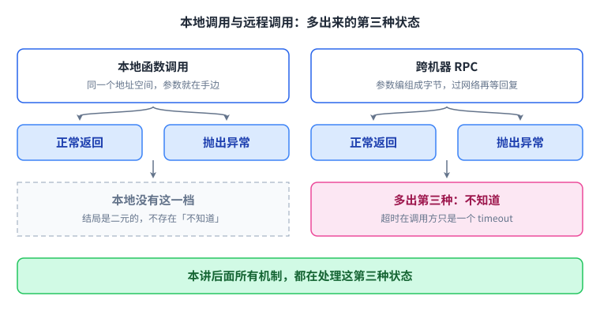

多出来的这第三种状态，就是本讲后面所有机制要处理的对象：既然分不清，重试就得被做成无害的动作。

## 这一讲在整门课里的位置

第 1 讲是总论；从第 3 讲起就进入 GFS、[[term:paxos]]、Raft 这些真正的分布式协议。第 2 讲夹在中间，讲的是工程底子：怎么用 Go 写并发程序，以及怎么让一次跨机器的调用看起来像在本地调了个函数。它表面上最不「分布式」，实际上后面每个实验都踩在这两块砖上：goroutine 和 [[term:RPC]]。

把这一讲放回课程的顺序里，位置会更清楚：

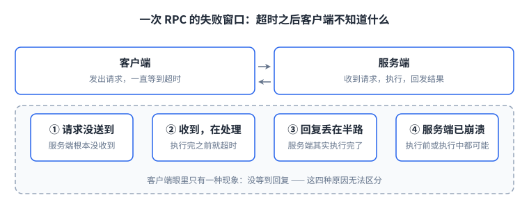

也就是说，后面每个实验在动手之前，都得先会用这两样东西。

## 为什么并发绕不开

在分布式系统里写并发程序是被迫的，没有挑风格的余地。理由大致三类：

- I/O 并发：一个客户端要同时向很多台服务器提问；一台服务器要同时应付很多客户端。等磁盘、等网络的时候，不能让整个程序停在那里干耗。
- 多核性能：真正把多个核用起来，缩短总耗时。
- 便利性：比如后台每秒检查一次各个工作 [[term:node]] 是否还活着，这种「顺便做点事」的需求，用并发表达最自然。

「被迫」说的是这些需求绕不开，不是说只有一种实现风格。课程另外提了一条路：**事件驱动**，也就是单线程加一个事件循环，为每个活动维护一张状态表，循环里检查有没有新输入、推进每个活动的下一步。它能拿到 I/O 并发，还能省掉可观的线程开销（这个开销并不小）；但它拿不到多核加速，而且写起来痛苦得多。课程选线程，理由是用它写出来的代码更接近我们习惯的顺序写法。

这里要先分清两个常被混用的词。[[term:concurrency]] 指多个任务在时间上重叠地推进；[[term:parallelism]] 指同一时刻真正同时执行，那需要多核。单核机器上照样能并发（靠快速切换轮转），但不可能并行。这个区分后面很有用：并发是结构问题，把一个程序拆成多个活动；并行是性能问题，到底能快多少。

这两个词的差别画出来最省口舌：

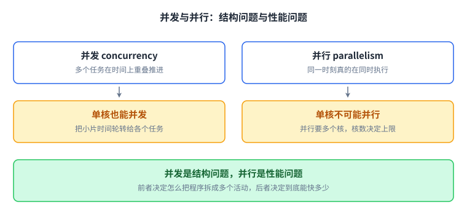

一句话记住这张图：单核也能并发，想并行必须有多个核。

## 线程：共享地址空间的双刃剑

[[term:thread]] 就是一条执行流。单独看，每个线程都像在跑一个普通的单线程程序，从头到尾串行执行；但同一个 [[term:process]] 里的所有线程共用一块地址空间。这既是效率的来源（线程之间通信不用经过内核），也几乎是所有并发 bug 的来源。每个线程另外还有自己的私有状态：程序计数器、寄存器、栈。

哪些东西是共享的、哪些是每个线程私有的，以及共享之后会出什么事，可以画在一起：

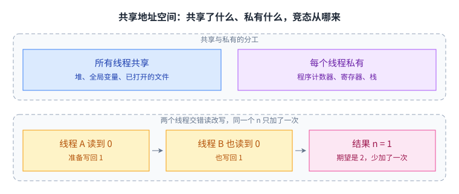

共享的那部分省掉了内核这一层，也正是竞态与死锁的温床：两个线程各自读到旧值、各自写回 1，同一个 n 只加了一次。

### 第一类麻烦：数据竞争

想象两个线程同时执行 `n = n + 1`。这行代码在机器层面是「读、加、写」三步。如果两个线程的三步交错进行，可能都读到旧值，各自加一写回，结果只加了一次，而不是两次。更隐蔽的是「一个线程写、另一个线程读」的情况。

这类问题叫**数据竞争**：两个线程同时碰同一块内存，其中至少一个在写。它常常是 bug，而且经常「平时跑得好好的，一上压力就出错」，所以极难靠肉眼发现。问题不在「谁先谁后」，而在于「读」与「写」之间塞进了另一个线程的动作。也正因为如此，**输出正确不代表没有竞态**：课程用的 `go run -race` 就是干这个的，哪怕这次运行的输出完全正确，它也能把没有同步的并发访问报出来。

出路有两条：加锁（Go 里的 `sync.Mutex`），或者干脆不共享可变数据。加锁还有第二个理由，和「加一次算错」是两回事：Go 的 map 内部是一种复杂结构，并发地更新它可能破坏内部不变量，并发地读与写则可能直接把读的那一方弄崩。

### 第二类麻烦：协调与死锁

常见的场景是一个线程生产数据、另一个线程消费。消费者需要等数据，而且等待的同时要释放 CPU；生产者需要在数据准备好之后把消费者叫醒。这类「等待与唤醒」的配对关系，靠共享内存硬写很容易写错。

Go 为此提供了几种工具：channel、`sync.Cond`、`sync.WaitGroup`。而如果把等待关系接成一个环，甲等乙、乙等甲，就得到**死锁**：谁都动不了，程序永远卡住。死锁有三个来源：锁（忘了 `Unlock()`，或者甲持 A 等 B、乙持 B 等 A 这样交叉等待）、channel（发送方等接收方，而接收方又在等发送方），以及 [[term:RPC]]（客户端在等服务器的回复，服务器那一步又在等这个客户端，或者等一条绕回来的调用链）。

等待接成环，以及锁粒度两端各自的坏法，画在一起最清楚：

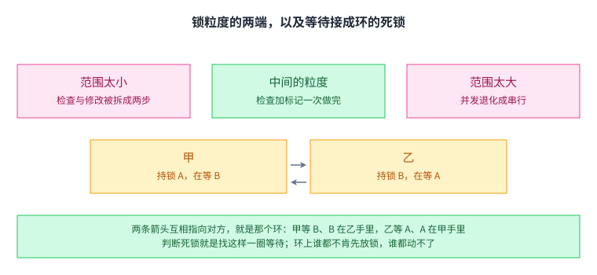

判断死锁就是找这个环，只要有环谁都不会先动；粒度则是另一笔账，实践顺序是先保证正确，再在确认安全的地方放宽。

### 锁粒度：一个没有免费午餐的取舍

有一个观念必须先建立起来：锁和数据之间没有任何强制关系。语言不会检查「你锁住那个 map 了吗」，`sync.Mutex` 也不知道自己保护的是谁。「锁保护某块数据」纯粹是程序员之间的约定。忘了 `Unlock()`，就是死锁；锁错了对象，等于没锁。

于是就有了粒度的取舍：锁的范围太大，并发度下降，这把锁自己成了 [[term:bottleneck]]；锁的范围太小，本来该被同一把锁盖住的「检查加修改」被拆开，竞争窗口依然存在。实践顺序是先保证正确，再考虑放宽，而不是反过来。

锁和数据之间没有强制关系，粒度也就没有免费午餐：放宽之前，先想清楚这把锁到底在保护什么。

## Go 的两种并发风格

课程用网络爬虫当例子：从起始页面出发，递归地把所有链接抓一遍，每个 URL 只抓一次，并且要能从环状的链接图里正常结束。它同时包含了两件难事：别重复抓，以及知道什么时候抓完了。

- 串行版本：递归深度优先，逻辑最简单。但它一次只抓一个页面，把网络的 [[term:latency]] 一段段累加起来。网络的 [[term:throughput]] 往往很高，限制在于每次往返的固定延迟，这正是并发能救回来的部分。顺手把递归调用前面加个 `go`，程序立刻就不对了，这个实验值得亲手做一次。
- 共享状态加互斥锁版本：给每个页面起一个 goroutine。共享的「已抓取」表由一把锁保护，而且「检查是否存在」与「标记为已抓取」必须在同一个临界区里完成，否则两个线程会同时看到「还没抓过」，于是都去抓。结束的判定交给 `sync.WaitGroup`：它本质上是个计数器，`Wait()` 等待所有 `Add()` 被对应的 `Done()` 抵消掉，也就是等所有子线程收工。
- channel 版本：每个 worker 抓完页面后，把页面里的 URL 列表发到一条 channel 上；一个 [[term:coordinator]] 从 channel 里读，见到新 URL 就再起一个 worker。它不需要给「已抓取」表加锁，因为那张表根本没有被共享。这里的 channel 同时承担了两件事：传值和通知事件（比如「某个线程结束了」）。

channel 本身不贵，课上给的量级是一次收发不到一微秒，所以它常被顺手当作同步手段来用。它有一个容易被忽略的语义：发送方会一直阻塞，直到有接收方接收。所以它是通信与同步二合一，也所以它照样能写出死锁。另外，多个 goroutine 共用一条 channel 是安全的，因为 channel 内部自带同步；但「发送之前只由发送者写、接收之后只由接收者读」才是这段代码没有竞争的真正理由。

于是有了课上留的那个选择：用共享变量加锁，还是用 channel？绝大多数问题两种风格都能解。经验上，状态用共享内存加锁，通信用 channel；选哪个更多取决于你怎么思考问题。课程对实验的建议是：状态类的共享数据，用 `sync.Mutex` / `sync.Cond`。

两种风格的结构差别，落在「那张已抓取的表由谁持有」：

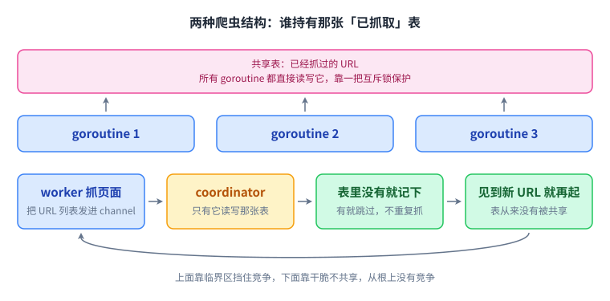

前者靠临界区让「检查加标记」不被打断，后者靠干脆不共享，从根上没有竞争。

## RPC：把网络调用伪装成本地调用

[[term:RPC]] 的目标是让客户端与服务器的通信好写：把网络协议的细节藏起来，把参数在内存里的形态转换成能上线的字节序列，并追求可移植与互操作。它要营造的错觉是：调远端就像调本地函数。

这里有一个绕不开的小问题：客户端怎么知道该找哪台机器、哪个端口？这一步叫 **binding**。Go 的 RPC 把它简化成 `Dial` 的一个参数；大型系统里则通常有一台名字或配置服务器专门回答「这个服务在哪」。

软件结构是分层的，客户端和服务端各有一套对称的栈：

| 位置 | 客户端 | 服务端 |
| --- | --- | --- |
| 业务 | 客户端应用 | 处理函数 |
| 代理 | [[term:stub]] | dispatcher |
| 通信 | RPC 库 | RPC 库 |
| 传输 | 网络 ←→ 网络 | 网络 ←→ 网络 |

[[term:stub]] 是替身代码：它把参数 [[term:marshalling]] 成线格式、把请求发出去、等待回复、再把回复解组回内存里的对象。对调用者来说，它看起来就是一个普通函数。

一次调用具体穿过哪几层、服务端那一侧又为什么会冒出新麻烦，摊开来看是这样：

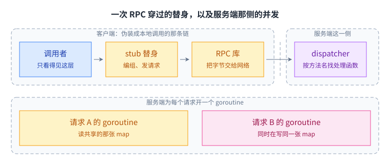

调用者只看得到最上面那一层，中间这些替身代码就是「像本地调用」这句话的全部来源；而服务端 RPC 库为每个请求开一个 goroutine，处理函数里的共享数据得由你自己保护。

Go 的 `kv.go` 例子是一个玩具键值服务器，提供 `Put(key, value)` 与 `Get(key)`：

- 客户端：`rpc.Dial` 建立 TCP 连接；`get()` 和 `put()` 就是客户端桩，内部调用 `Call()`，指定连接、方法名、参数和存放回复的位置。`Call()` 的返回值表示有没有收到回复，业务层面的失败则另用回复里的 `Err` 字段表达。这两种「错」必须分开看。
- 服务端：注册一个对象，它的方法就是处理函数；RPC 库接受 TCP 连接，为每个请求开一个新的 goroutine。正因为如此，处理函数里访问共享状态时必须自己加锁。
- 编组的边界：只能传大写的导出字段；指针按「拷贝所指内容」处理；channel、函数这类东西传不了。

这里还有一层容易混的地方：两种错来自两个不同的层。

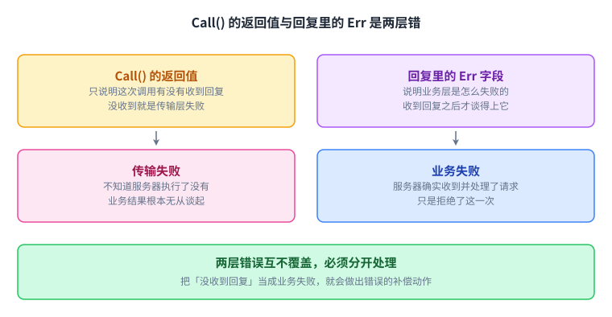

两种失败的确定性正好相反：业务层失败，说明服务器一定收到了请求（它是在处理过程中判断出失败的）；传输层失败，则说明客户端**无从知道服务器到底收到没有**，可能压根没送到，也可能已经执行完、只是回复没能回来。

## 抽象在哪里漏了：本讲的核心

一个单机函数调用有个默认前提：它要么正常返回，要么抛出异常，不存在「不知道它到底执行了没有」这种状态。RPC 没有这个保证。

失败在客户端一侧的表现总是同一个样子：永远没等到回复。但客户端无法区分下面这些情况：

1. 服务器根本没收到这个请求；
2. 服务器收到了，但正忙，还没轮到处理它；
3. 服务器执行完、回复也发出去了，但网络在回复到达之前断了；
4. 服务器收到了、也执行完了，但在把回复发出去之前 [[term:crash]] 了。

这四种情况在调用方眼里一模一样。这就是「远程调用和本地调用并不等价」的根本原因，也是整门课反复出现的主题。

还不止如此。消息可能被复制、延迟、乱序。一个特别坏的场景：客户端依次发出「把 k 设成 10」和「把 k 设成 20」，两次都报告成功，最终读出来却是 10。原因是第一个请求其实只是慢，客户端等不及就重发了一次：重发先到、也成功了，客户端于是接着发第二个请求；这时**最初那个原包**才迟到落地，又把 k 写回了 10。一次逻辑上的操作，因为重试变成了两次真实执行，而这两次执行各自都带着 [[term:side-effect]]。

这件事和上面那种「没等到回复」是同一个缺口的两面，画在一起就是这一讲的核心：

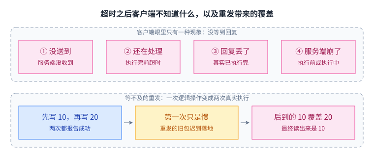

四种原因对应完全不同的后果，只有第一种重发一定安全；而最初那个原包迟到落地，会让一次逻辑操作变成两次带副作用的真实执行。

## 失败语义：三次、两次、恰好一次

- 尽力而为（best-effort）：`Call()` 等上一会儿，没回复就重发，试几次后放弃并返回错误。它给不出任何关于次数的承诺，正确性只能由应用自己兜住。
- [[term:at-most-once]]：请求可能丢失，但绝不会被执行两次。Go 的 RPC 就是这种语义的一个简化实现：它从不重发，所以服务器不会看到重复请求。代价是调用失败时你只拿到一个错误，无从知晓服务器到底执行了没有。
- [[term:at-least-once]]：靠重试保证请求终将执行，代价是可能重复执行。它必须配合 [[term:idempotent]] 才安全。
- **恰好一次**（exactly-once）：这是所有人最想要的语义，也是最难兑现的。它要求服务器记得「这个请求我已经处理过了」，而去重需要跨请求保留的持久状态。只要出现「服务器记录完请求标识、还没执行副作用就崩了」这类窗口，或者状态因为 [[term:network-partition]] 而分裂，严格意义上的恰好一次就不成立。所以现实中的做法是：用至少一次加上幂等，把恰好一次的效果近似出来。

三种语义摆在一起，各自的代价就一目了然：

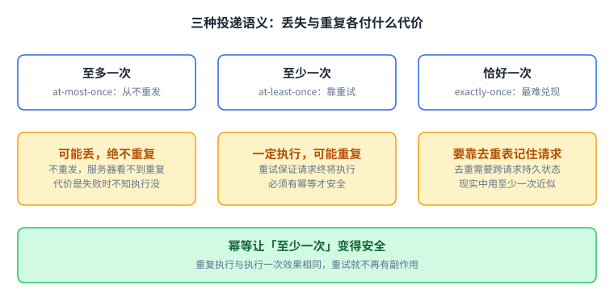

前两种是牺牲一个方面换另一个方面；只有把操作做成幂等，才能让「至少一次」的重试变成安全的默认选择。

## 幂等：让重试变得安全

[[term:idempotent]] 的含义是：重复执行与执行一次，效果相同。

- 读操作天然幂等。`Get("k")` 查一百遍结果一样，重试没有副作用。
- 把某个键写成固定值通常也幂等，覆盖成同一个值而已。这里要分清「携带版本号」的两种含义：如果写入是**带条件**的（只有版本号与服务器上的一致才写），那么同一个请求重发多少次结果都一样，仍然幂等，课程 Lab 2 的键值服务器正是这样挡重复的，它没有用请求 ID；不幂等的是每次重试都新造一个版本号或时间戳的写法。至于自增计数器、余额累加这类操作，天生就不幂等。
- 「余额加 10」「往列表尾部追加一条」「弹出一个元素」都不幂等。

让一个操作变得幂等的常用手段是**去重**：给每个请求带一个唯一标识，服务器保存最近处理过的标识集合，收到重复标识时不再执行，直接返回上次的结果。这里有个工程细节容易被忽略：那张去重表必须有界，否则它会无限增长，变成一个慢性故障。

去重表让重试变安全的机制只有三步：

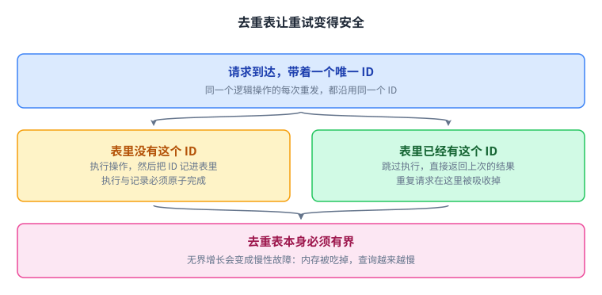

关键在「执行」与「记录 ID」必须原子完成，否则崩在两者之间时，重复执行照样会发生。

## 超时之后，客户端到底不知道什么

超时只说明没能在预期时间内拿到回复。它不是「服务器已经挂了」的证据。请求可能还在路上，服务器可能只是很忙，回复可能刚丢在回程，服务器也可能真的刚崩。

几条实践策略：

1. 超时时间要基于观测到的延迟分布来定，而不是拍脑袋。定得太短，会把「慢」误判成「死」，触发大量无谓重发；重发本身又加重服务器负担，形成**重试风暴**。
2. 重试要让服务器能认出重复。常见做法是带一个唯一 ID，服务器据此查去重表；如果操作本身条件化（比如带版本号的写入），靠版本号也能挡住重复，Lab 2 走的就是这条路，并不一定非要请求 ID。真正不行的是不带任何标识的无条件重写。
3. 优先把接口设计成幂等的。做不到，就在服务器侧维护去重表。
4. 区分可重试的错误与终态错误。连接被拒通常可以换个副本再试；而业务校验失败，重试一千次还是同样的结果。
5. 当「是否执行过」无法判断时，选一个业务代价更小的默认动作。比如宁可多查一次余额，也不要多扣一次款。

第 1 条里的「重试风暴」是一个正反馈，值得单独看清楚：

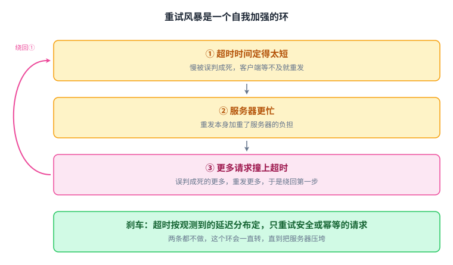

止住它只有两条路：把超时定在观测到的延迟分布之上，以及只重试安全或幂等的请求。

## 常见误解

| 误解 | 实际情况 |
| --- | --- |
| 并发就是并行 | 单核也能并发，只是不能并行；两者是结构与性能的区别 |
| 加了锁就正确 | 锁与数据之间没有强制关系，锁错对象等于没锁 |
| RPC 和本地调用一样 | 失败语义完全不同，超时无法区分「慢」与「死」 |
| 重试总是安全的 | 只有在幂等或带去重的前提下才是 |
| 可以做出严格的恰好一次 | 需要跨请求持久状态；现实做法是靠幂等近似 |

这张表说的是哪里想错了，没说要怎么办；把它换成一张三岔路口的判断：

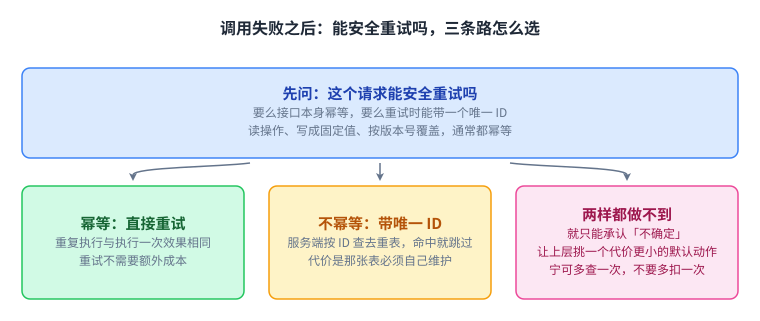

三条路里前两条都是在争取让重试变安全；两条都走不通，才把「不知道执行没执行」交给上层挑一个默认动作。

## 读完应该能回答

1. 并发与并行的区别，以及为什么单核机器上可以并发却不可能并行。
2. 两个线程同时执行 `n = n + 1` 为什么可能只加了一次；「锁保护某块数据」这句话的准确含义，以及语言会不会替你检查。
3. 共享 map 加互斥锁的爬虫，与 channel 加 coordinator 的爬虫，各自靠什么保证每个 URL 只抓一次，又靠什么判断已经抓完了。
4. 客户端 RPC 超时之后为什么无法区分「请求丢了」「服务器太忙」「回复丢了」「服务器崩了」这四种情况，以及它们分别带来什么后果。
5. 为什么至少一次语义必须配合幂等才安全；要把「账户余额加 10 元」做成可安全重试的接口，可以怎么设计。

## 脉络回顾

这一讲没有给出任何分布式协议，给出的是两块砖：goroutine 让一个程序同时推进很多件事，RPC 让消息能在机器之间往返。第 3 讲的 GFS 要靠它让成百上千个客户端同时读写，后面的 [[term:paxos]] 和 Raft 要用它把提案和日志送到一台台机器上。这一讲留下的那个事实（超时无法区分慢与死），正是后面 [[term:term]]、[[term:heartbeat]]、[[term:lease]]这些机制不得不存在的理由。

[[term:fault-tolerance]] 的意思是出了故障仍然正确工作，而不是保证不出故障。要谈它，先得有并发把多台机器同时推起来，有 RPC 把结论送出去，然后才谈得上它们在有人宕机、有人掉线的时候仍然说同一件事。
