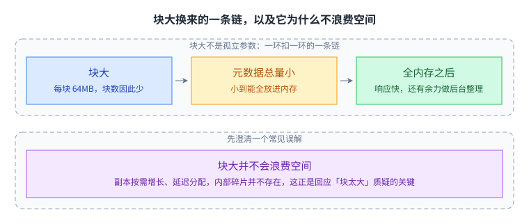
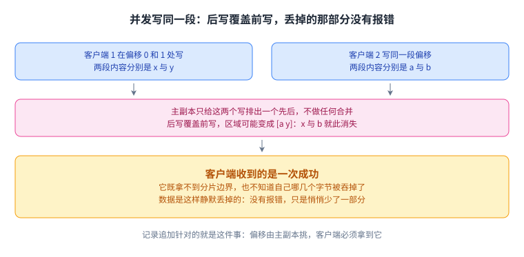
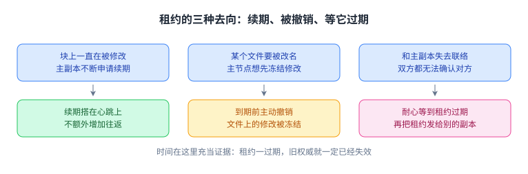
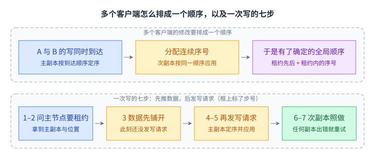
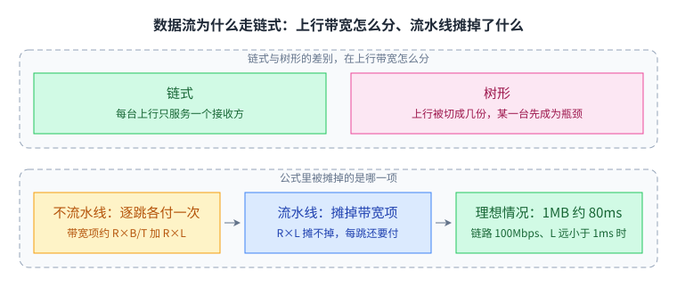
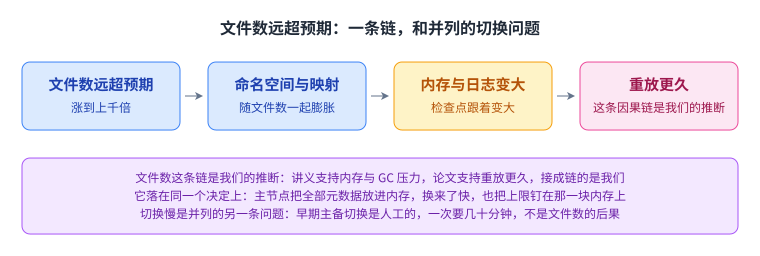

+++
title = "GFS：为大规模数据密集应用设计的文件系统"
lecture = 3
slug = "gfs"
status = "draft"
source_kind = "notes"
source_url = "https://pdos.csail.mit.edu/6.824/schedule.html"
source_title = "Lecture 3: GFS"
output_mode = "explanation"
papers = ["gfs"]
+++

> **本讲的指定阅读是《The Google File System》（SOSP 2003，ACM 出版）。**
> 作者为 Sanjay Ghemawat、Howard Gobioff、Shun-Tak Leung；论文入口见
> [10.1145/945445.945450](https://dl.acm.org/doi/10.1145/945445.945450)。
> 课程**主页**标注的许可为 CC BY 3.0 US（[许可原文](https://creativecommons.org/licenses/by/3.0/us/)）；
> **该徽章只出现在主页，本讲依据的笔记子页面无许可声明，覆盖范围未获确认。**
> 论文版权属 ACM，我们**没有**取得翻译许可，因此**本页是 CourseLingo 自己撰写的概念讲解，不是该论文的译文**，
> 不复制原文表述，也不复现原文插图。本页同样不是 MIT 官方材料，不代表课程方立场。

## 这一讲要解决什么问题

2003 年的 Google 面对一个很不浪漫的处境。搜索索引、爬虫抓下来的网页、日志，加起来已经是几百 TB，一台机器无论多大都装不下。而按 Google 的预算能买进来的机器，是那种随时会坏的廉价货：一个由成百上千台机器组成的集群里，总有机器正在坏，也总有机器正在回来。

要在这样的机器上做出一个存下几百 TB 数据、同时被几百个客户端持续读写的 [[term:distributed-system]]，最自然的选择是「做得更强」：更强的硬件、更强的[[term:consistency]]、更严格的协议，让系统本身不容易出错。

GFS 反过来走。它先接受两件事：硬件会坏；应用其实只需要很弱的一致性。接受之后，系统就可以做得很简单。这一讲的重点不在它有哪些模块，而在每个设计选择背后那句「因为我们的工作负载是这样的」。

两条路各自换来什么，先摆在一起看。

GFS 选右列，先把约束接受下来。

## 一、先看清工作负载，再谈设计

论文第二章开头列了六条设计假设。把它们读成一句话就是：**故障是日常**，不是异常。系统要持续地自我监控、检测、容忍，并快速从组件故障中恢复，而且这是一项常规工作，不是等人来介入的应急流程。

其余几条决定了整个系统的形状：

- 文件数量不算多，但每个都很大：预期几百万个文件，单个通常 100MB 以上，多 GB 是常态。小文件必须支持，但不值得为它优化。
- 读有两种，都偏向大块。大流式读单次通常几百 KB，1MB 以上更常见，并且连续读相邻区域；小随机读在任意偏移读几 KB，但讲究性能的应用会把小读批量化、排序，让访问在文件上稳步前进，而不是来回跳。
- 写主要是追加：大量顺序写把数据追加到文件末尾，写完之后文件几乎不再被修改。任意位置的小写要支持，但不必高效。
- 同一个文件经常被多个客户端并发追加，用途是生产者与消费者之间的队列，或者多路归并。所以原子性必须做到，同步开销又要尽可能小。
- 最后一条最容易被忽略：持续的高[[term:throughput]]比低[[term:latency]]重要。目标应用在乎的是批量处理数据的速率，很少对单次读写的响应时间有硬性要求。

把这几条放在一起看，后面的选择就都顺理成章了：因为在文件上基本只有追加，所以敢放松一致性；因为吞吐比延迟重要，所以优化带宽；因为读写都是大块、连续的，所以块可以做得特别大。

三条因果链是这样接起来的。

三条链最后都指向同一件事。

## 二、单[[term:master]]加许多块服务器

架构本身很朴素：一个主节点、许多块服务器、许多客户端，跑的都是廉价 Linux 机器上的用户态进程。文件被切成固定大小的[[term:chunk]]，每个块有一个由主节点在创建时分配的、不可变的、全局唯一的 64 位块句柄；块服务器把块当成普通 Linux 文件存在本地磁盘上，按句柄加字节区间来读写。默认存三份[[term:replication]]，用户也可以对命名空间的不同区域指定不同的副本级别。

这一节的架构与一次读写要走的三层定位，可以先看这一张：

句柄是块服务器认得的地址，偏移是客户端认得的地址；主节点只回句柄与副本位置，文件数据从不在它那里过。

主节点保存三类元数据：命名空间、文件到块的映射、每个块副本当前的位置。前两类会持久化，写进本地的操作日志（这本质上就是一种[[term:write-ahead-log]]），并在改动对客户端可见之前先把日志刷到本地与远程磁盘，再配合周期性检查点把日志控制在小规模。第三类刻意不持久化：主节点在启动时、以及任何块服务器加入集群时，直接问它「你有哪些块」。

这个不对称很值得琢磨。块的位置不是权威数据，而是块服务器自己磁盘状态的缓存视图。块服务器最清楚自己有什么；让主节点另外记一份，只会制造两个可能互相矛盾的事实来源，而块服务器消失又回来恰恰是常态。

三类元数据的去处与读的路径，画在一起：

判断依据是块服务器自己最清楚自己有什么；而主节点通常只在第一次被问到，之后读同一个块就直接找块服务器，直到缓存过期才再问一遍。

放弃持久化块位置换来的是元数据量极小：主节点为每个 64MB 的块保存的元数据不到 64 字节，因此可以全部放进内存。全内存带来两个后果：主节点的操作很快；并且它有余力在后台周期性地扫描整个状态，实现孤儿块的垃圾回收、块服务器失效时的再复制、以及为平衡负载和磁盘占用而做的块迁移。

比「存了什么」更重要的是「没存什么」：主节点不存文件数据，客户端也从不通过它读写文件内容。客户端拿到文件名和字节偏移，用固定块大小换算出块下标，向主节点询问这个块在哪几个块服务器上；主节点只回块句柄和副本位置。客户端把这份映射缓存起来（键是文件名加块下标），之后直接与块服务器通信：在缓存过期或者文件被重新打开之前，读同一个块不再需要打扰主节点。客户端还常常在一次请求里问好几个块，主节点顺带把紧随其后的那些块的位置也一并返回，几乎零成本地省掉了很多次往返。

主节点只回答第一次。

GFS 这样安排，根本原因在于主节点是单点。所有命名空间操作都要经过它，它的内存有多大、系统里能放多少个块就有多大上限。每块元数据不到 64 字节，所以在中等规模下内存不是最先撞到的那堵墙；但文件数一旦暴涨，这条限制就真的咬人（见第七节）。GFS 的对策不是把主节点分布化，而是把它从数据面上挪开。只有让几百个客户端的读写流量不经过它，这个单点才可能活得下去。这里补一句论文没有讨论的：把主节点分布化，就等于让几个副本对顺序达成一致，也就掉进了[[term:consensus]]问题里。这是我们顺着机制做的推断，论文本身没有比较这条替代路线。

这种「元数据走中心、数据绕开中心」的划分后来被不少系统照抄。HDFS 沿用了同一套骨架：一个 NameNode 管元数据，客户端拿到块位置后直接与 DataNode 读写。Ceph 换了一条实现路径：客户端用 CRUSH 自己算出对象该落在哪些 OSD 上，数据同样不经过元数据节点；它的元数据分工与 GFS 并不对应，MON 维护的是集群地图，文件系统的元数据由 MDS 处理、最终仍然存在 OSD 上。这两处外部比较是我们的补充，源材料里没有提到它们。

## 三、为什么块是 64MB

64MB 是整套设计里最显眼的参数。论文只说它比典型文件系统的块大得多，没有给出倍数；按当时常见的 4KB 块粗算，差距在四个数量级上下（这个换算是我们做的，不是论文里的数字）。先澄清一个常见误解：块大并不会浪费空间。副本按需增长、延迟分配，内部碎片并不存在；论文特意点出，这一点正是回应「块太大」这个质疑的关键。

那么大块买到了什么？主要是三样东西。

1. 客户端与主节点的交互次数骤减。同一个块上的读写只需要一次初始的位置查询；即使是小随机读，客户端也能把一个多 TB 工作集的块位置全部缓存下来，因为块数量本身就不多。
2. 更少的网络开销。客户端在一个大块上更可能做很多次操作，于是值得保持一条长连接，省掉反复建连的开销。
3. 元数据总量更小，小到能全放进主节点内存，这又反过来换来了上一节说的后台扫描能力。这里是一条环环相扣的链：块大，块数就少；块数少，元数据总量就小；元数据少，就能全放进内存；全放进内存之后，主节点既响应得快，又腾得出余力做后台整理。

这三样东西是一环扣一环的，画出来就是一条链：

块大不是孤立参数，它一路换到主节点的响应速度与后台整理能力；而内部碎片并不存在，这一点正是回应「块太大」这个质疑的关键。

代价也同样真实：

- 热点。小文件往往只占一个块，许多客户端同时读它，存这个块的少数块服务器就被打爆。论文如实记了一个事故：某个批处理队列系统把一个可执行文件当作单块文件写进 GFS，然后在上百台机器上同时启动它，那几个块服务器瞬间被压垮。修法有两条：给这类文件更高的副本数；让启动时间错开。长期的思路是允许客户端之间互相读取数据。这是很典型的一课：参数选择要和真实使用方式一起被验证，而不是在纸上推导。

论文在这一节只记下热点这一条代价；下面另外两条是我们顺着机制补的，论文没有把它们列为块大的缺点。三条画在一起：

热点靠提高副本数与错开启动来应急；链式路径上最慢的一环决定写在客户端眼里要花多久；而 1KB 与 64MB 的文件都只占一个块，省下的是磁盘空间，付出的是调度精度。

另外两条代价是我们补的，论文没有这样列：修改沿着一条链式路径流水线推进（见第六节），链条上最慢的一环决定这次写在客户端眼里要花多久，块越大，尾部的抖动越容易显现；而一个 1KB 的文件和一个 64MB 的文件在「占几个块」这件事上是一样的，主节点的内存、后台扫描与负载均衡全都以块为单位，真正被牺牲的是调度的精细度。

## 四、容错：副本、再复制与版本号

[[term:fault-tolerance]]在 GFS 里的落地方式很直接：默认三副本，副本会因三种原因产生：块的创建、再复制、再均衡。主节点在选择把新副本放到哪台机器上时会考虑三件事：放在磁盘使用率低于平均的机器上，时间一长，各台机器的使用率就会趋于均衡；限制每台机器上「最近创建」的块数量，因为块的创建几乎总预示着马上有一次大量写入，而写满之后这些块基本就变成只读的；以及尽量把一个块的副本分散到不同机架。

主节点挑机器的三条考虑各治一个毛病。

副本数掉到目标值以下会触发再复制，但主节点不会一发现就动手。触发原因可能是块服务器不可用、它报告自己的副本可能已损坏、某块磁盘因错误被停用，也可能是管理员调高了副本目标。真正需要斟酌的是等多久。等得太短，一台刚刚静默、磁盘却完好的机器往往还会回来，这时铺开的复制工作全是白做；等得太长，副本不足的窗口就一直敞着，一旦在等待期间又坏掉一块，数据就真的没了。

设计选的是中间那条路。主节点先让系统带着一个缺失的副本继续跑，同时让主副本对失败的副本重试一段时间，直到把这个块服务器判为永久失效，才安排再复制。这个等待有量级感：一块 80GB 的磁盘按 10MB/s 的网速铺满要一两个小时，所以再复制本来就是缓慢的批量工作，不值得为一个可能马上回来的节点反复启动。等待期一过，再复制才按优先级排队：丢掉两个副本的块比只丢一个的更急，恢复资源有限时先补损失最大的那批。论文另外还有两条优先级，挡住客户端读写的块排在前面，仍然存活的文件里的块也排在已删除文件的块前面。

副本从放置到再复制的整条路，画在一起就是它的生命周期：

三条考虑合起来，副本不会挤在一起；而副本数掉到目标以下时不会一发现就动手，主节点先让系统带着一个缺失的副本继续跑，等判为永久失效才安排再复制，并按损失大小排队。

主节点怎么知道一台块服务器失效了？讲义写得很直接：它**定期向所有块服务器发 ping**，超时就认为它挂了（讲义 195 行；论文的说法是主节点与每台块服务器之间定期交换 heartbeat）。判定之后的动作有三件：把这台机器从各个块的副本列表里移出去，不再派新活给它；它上面的副本记为缺失，于是触发上一段说的再复制；然后把新的次副本列表告诉相关的主副本（讲义 195–199 行）。至于它当时持有的租约，主节点不会立刻另发一份，而是要等旧租约到期才能把这块的租约发给别的副本，否则可能与刚失联的那位同时生效。

那「掉线又回来」的块服务器怎么处理？靠块版本号。每个块维护一个版本号，主节点每次授予新[[term:lease]]就让版本号加一，通知所有仍然最新的副本，并且在通知任何客户端之前，先把它写进这些副本的持久状态，于是客户端开始写之前，涉及的副本版本号已经推进完毕。当时联系不上的那个副本不会被推进；等它重启并汇报自己有哪些块、版本号是多少时，主节点一眼就能看出它落后了。落后的副本在垃圾回收时被清掉，在此之前主节点干脆当它不存在，既不会派它参与修改，也不会把它告诉来问位置的客户端。论文还多处理了一种情况：如果块服务器报上来的版本号比主节点记录的还大，主节点就认为当初授予租约那一步是自己失败了，以较大的版本号为准。

版本号让「落后」变成可比较的数字。

数据本身的完整性靠[[term:checksum]]。每个块再切成 64KB 的小块，每小块配一个 32 位校验和，与用户数据分开存放（放在内存里，并随日志一起持久化）。读的时候先验证再返回，所以损坏的数据不会被传播给别的机器；一旦不匹配，块服务器向请求方报错并上报主节点，请求方转去读别的副本，主节点则从有效副本克隆出这个块，最后让报错的机器把坏副本删掉。这个开销很小：多数读至少覆盖好几个校验小块，而且针对「追加到块末尾」这种主流写法的校验和是增量更新的。除了读的时候验证，块服务器还会在空闲时后台扫描那些不常被读的数据块，主动把陈旧或损坏的副本找出来。

两份记忆画在一起：版本号管「落后」，校验和管「损坏」：

版本号让「落后」变成可比较的数字；而校验粒度只有 64KB，几乎不额外花钱，损坏的数据也不会被传播给别的机器。

整体的故障处理可以概括成一句话：块服务器失效靠握手发现，数据损坏靠校验和发现。只要不是所有副本在系统来得及反应的几分钟内一起消失，数据总能从有效副本恢复回来。真的全丢了，结果也是「不可用」而不是「读到坏数据」，这个区别是设计者刻意保留的。

主节点自己挂了怎么办？讲义把可选的恢复办法列成两条：一是**重启后重新读入磁盘上的状态**接着干，配合周期性的检查点，要重放的日志就被控制在有界的一段里，这也回过头解释了日志为什么不能放任增长；二是**让每条状态更新同时写到一个备份协调者**，它自己也记盘，主协调者起不来时由它接手（讲义 236–243 行）。重启还带一条与租约有关的时序约束：**新上任的协调者必须先等一个租约时长**，然后才能指定任何新的主副本，否则可能与刚下台的那一位同时发出有效租约（讲义 249–250 行）。论文另外讨论的是**只读的影子主节点**：它读操作日志的一份副本、跟着应用同样的改动，所以会略微滞后，通常是零点几秒；它的用处是在主节点不可用时提高只读可用性，适用于那些不被频繁修改的文件、或者不在乎略微陈旧结果的读。文件内容本身是从块服务器读的，所以真正可能滞后的是目录内容、访问控制这类元数据。

## 五、一致性模型：先把承诺说清楚，再说为什么够用

GFS 的一致性模型是**刻意做弱**的。要读懂它，先分清两个词：

- **一致**：所有客户端无论读哪个副本，看到的数据都一样。
- **已定义**：不仅一致，而且客户端能看到某一次修改完整写入的内容。

于是有三种情况。某次修改串行地成功（没有并发写者干扰），被改动的区域是已定义的；某次修改并发地成功，区域未定义但仍然一致，大家看到的是同样的字节，那些字节可能是几次写混在一起的碎片；某次修改失败，区域不一致，因此也未定义。命名空间操作（比如创建文件）则是原子的，因为它们只由主节点处理：主节点用命名空间加锁保证原子性，操作日志给出这些操作的全局全序。

失败那一档具体长什么样：如果某次修改只在部分副本上成功、在另一个副本上失败了，客户端会收到一个错误，但**已经成功的那些副本上，改动是生效的**；论文的原话是「这次写可能已经在主副本和任意一部分次副本上成功，而如果连主副本都失败，它根本不会被分配序号」（论文 §3.1）。于是读同一个块的两个人可能看到不同的内容，取决于各自落在哪个副本上；客户端重试又算一次新的修改。这正是「不一致」这一档的日常形态。

两个词落到具体情形就是三档状态。

GFS 承诺的底线只是「一致」；而命名空间操作之所以原子，是因为它们只由主节点处理，全序由一条日志直接给出。

真正有意思的是原子记录追加（record append）。先说普通写为什么会真的丢数据，而不只是「看起来乱」。普通写的偏移由客户端指定，两个客户端把数据写到同一段重叠区域时，主副本只给这两个写排出一个先后，不做任何合并，于是后写把前写覆盖掉。具体一点：一个客户端往某块的偏移 0 和 1 处写 x 与 y，另一个客户端在同一位置写 a 与 b，一种可能出现的结果是 [a y]，x 与 b 就此消失。客户端这边既拿不到分片边界，也不知道自己哪几个字节被吞掉了，它收到的只是一次成功。数据是这样静默丢掉的，没有报错。这就是「未定义」在实践里的含义：几个副本可能保持一致，却一致地丢掉了某次写的一部分。

这条因果链值得单独看一遍。

覆盖发生在字节层面，而客户端收到的那次成功什么也没告诉它。

记录追加针对的正是这件事。它只要求客户端提供数据，GFS 在它自己选的偏移上把这条记录至少一次地原子追加进去，并把选定的偏移返回给客户端。效果类似以追加方式打开文件，但没有多写者之间的竞争条件。

这里有一个必须讲明白的细节。如果某次记录追加在某个副本上失败，客户端会重试，于是同一个块的不同副本之间可能含有不同的数据，可能整条记录重复，也可能只重复了一部分。GFS 不保证各副本逐字节相同，它只保证这条数据作为一个原子单元至少被写了一次。因此对客户端而言，记录追加是[[term:at-least-once]]的：你必须容忍重复，也必须容忍中间出现的填充。

GFS 不承诺各副本逐字节相同。

返回的偏移标记了包含这条记录的已定义区域的起点，两次成功追加之间的填充与重复则落在未定义区域里；论文指出这些字节相对用户数据量可以忽略。还有两条边界：主副本发现追加会让块超过 64MB 时，会先把块填满到上限、让所有次副本照做，然后告诉客户端换下一个块重试；单条记录的大小也因此被限制在块大小的四分之一以内，以免最坏情况下的碎片不可接受。

块满时的边界与应用这边的三条约定，画在一起：

单条记录因此被限制在块的四分之一以内；而这三条约定把未定义区域挡在业务之外，只要读取端能安全处理重复，弱一致性就不构成正确性问题。

看起来不干净，但未定义区域本来就在业务之外。只要读取端是幂等的，重复就不构成正确性问题。

这么弱的一致性之所以可以接受，是因为 GFS 的应用本来就不需要更强的东西。它们几乎不改写文件，只追加：一个写者从头到尾生成文件，全部写完后原子改名；或者周期性写检查点（检查点里往往带应用级校验和），读者只处理到最后一个检查点为止。于是未定义区域天然被排除在业务之外。配合这三招，用追加而不是改写、写检查点、写自校验且自识别的记录，应用就能自己绕开弱一致性的坑。唯一剩下的要求是重复记录必须能被安全处理，也就是处理逻辑要[[term:idempotent]]，或者每条记录自带唯一标识，让消费者可以自行去重。

这三条把未定义区域挡在业务之外。

换句话说，GFS 把一部分复杂度从存储系统下推给了应用，而它赌的是这些应用本来就在做类似的事。换回来的东西很值：不需要实现通用的分布式事务，也就不必写出一套自己都推不清楚的一致性协议。这里还有一条我们顺手推出来的好处，论文没有这样写：主节点不必在一次写里为几十个客户端反复同步。这是一个清醒的工程取舍，不是偷懒。

同一种取舍在别的系统里也出现过，这条比较是我们的补充，源材料没有提：Kafka 的每个分区同样是一条只能追加的日志，顺序由分区的领导者一个人定，客户端只与它打交道，重复记录的处理同样留给消费端。

## 六、一次写入的关键路径：控制流与数据流分离

先立规矩。一次修改（mutation）指改变块内容或块元数据的操作，比如写和追加；每一次修改都要在该块的所有副本上执行。要保证所有副本以同样的顺序执行，就需要[[term:lease]]：主节点把某个块的租约授予其中一个副本，称它为主副本；主副本为这个块上收到的所有修改挑一个串行顺序，其余副本都照这个顺序执行。全局修改顺序由两件事共同定义：主节点授予租约的先后，以及租约之内由主副本分配的连续序号。

多个客户端的修改要排成一个顺序。

全局顺序来自租约先后与租约内的序号。

租约的初值是 60 秒，但只要这个块一直在被修改，主副本就可以不断申请续期，而且续期请求与授权是搭在主节点和块服务器之间已有的[[term:heartbeat]]上的。这正是「用时间换通信」的经典用法：因为在租约有效期内主节点和主副本不会同时怀疑对方，所以写路径上不需要额外的「你还拿着授权吗」这种往返。反过来，主节点也可以在租约到期之前主动撤销它，比如某个文件要被改名，它想先冻结这个文件上的修改。如果主节点和主副本失去联络，它只要耐心等到租约过期，就能安全地把租约发给另一个副本；时间在这里充当了「保证旧权威一定已经失效」的依据。

这套租约要守住一条不变量：**同一块在任一时刻最多只有一个有效租约，因此最多只有一个主副本**。它是修改顺序唯一的合法性来源：如果两个副本同时以为自己该定序，同一块上就会分出两条互相矛盾的修改顺序，也就是所谓的脑裂。讲义在开篇就把租约的作用写成一句话：保证只有一个主副本（讲义 17 行）。所以租约在 GFS 里不只是省通信的优化，它承担的是安全性。

租约有三种去向。

这就是用时间换通信。

一次写的完整步骤：

1. 客户端问主节点：这个块当前谁持有租约，其他副本在哪里。如果没有人持有，主节点会挑一个副本授予租约（这一步论文的图里没有画）。
2. 主节点回复主副本是谁、其余副本在哪里。客户端把它缓存起来，之后只有当主副本不可达、或者主副本回话说「我已经不再持有租约」时，才需要再去找主节点。
3. 客户端把数据推送给所有副本，顺序随意。每个块服务器先把数据放进内部缓冲里，直到被使用或者过期淘汰。注意：此刻还没有发出任何写请求。
4. 所有副本都确认收到数据之后，客户端才把写请求发给主副本，请求里指明刚刚推过去的那份数据。
5. 主副本给自己收到的所有修改（可能来自多个客户端）分配连续序号，完成串行化，然后按这个顺序在本地应用。
6. 主副本把写请求转发给所有次副本，次副本按主副本给出的同一顺序应用。
7. 次副本回复主副本，主副本回复客户端。任何副本上出错，客户端都需要重试。

把这七步画成一张图，两条流的分工一眼可见：

绿色是数据流、橙色是控制流：数据先铺开，写请求才发出，主副本因此不在数据搬运的必经之路上。

关键在于控制流与数据流被拆开了。控制流是「客户端 → 主副本 → 各次副本」；数据流则沿着一条精心挑选的链式路径流水线推进：客户端推给网络拓扑上「最近」的那台块服务器，它收到一部分就立刻转发给下一台「离它最近且还没收到这份数据」的机器，如此接力，谁都不等谁。

用链式分发而不用树形分发，是因为链式能让每台机器的上行带宽被单一接收方吃满，而不是被切成几份分给多个接收方。「最近」是拿 IP 地址估出来的拓扑距离（论文的网络拓扑足够简单，距离估得足够准），目的就是尽量绕开跨交换机的链路这种既容易拥塞、延迟又高的地方。

流水线则把延迟摊薄。论文给出的理想耗时是 B/T 加 R×L：把 B 字节推给 R 个副本，最少要花这么多，其中 T 是网络吞吐，L 是两台机器之间传输的时延，量纲是每跳的链路时延，不是「传一个字节」的时延。这个式子本身就是流水线之后的数字。如果不做流水线，每一跳都要把 B 字节完整收下来再转发出去，带宽项会被逐跳重复支付，耗时接近 R 乘 B/T 再加 R×L（这一步推演是我们做的：论文只给了流水线之后的式子，没有给不做流水线的对照式）；流水线摊掉的正是这个被重复支付的 B/T，而 R×L 摊不掉，因为链路上每一跳的时延都要付一次。论文里链路是 100Mbps 级别、L 远小于 1ms，所以理想情况下 1MB 数据大约 80ms 就能铺开。

链式与树形的差别在上行带宽怎么分，公式里被摊掉的是哪一项，画在一起最清楚：

链式让每台机器的上行带宽只服务一个接收方，而不是被切成几份分给多个接收方；流水线摊掉的是被逐跳重复支付的带宽项 B/T，R×L 仍要按跳数付一次（不做流水线那个对照式是我们推的）；理想情况下 1MB 大约 80ms 就能铺开。

这样拆分之所以值得，是因为先推数据、后发写请求，等于把最昂贵的搬运环节从「谁当主副本」这个控制决定里解放出来：数据可以按网络拓扑走最快的路径，而与谁是主副本无关。它还顺手避免了一个更糟的情形。如果客户端先发写请求、再让主副本去分发数据，那么全部数据都要流经主副本这一台机器，它的上行带宽会立刻成为[[term:throughput]]的[[term:bottleneck]]，而这正是一个吞吐优先的系统最不能接受的事。

论文的测量一节给了几个能校准直觉的数字：16 个客户端配 16 台块服务器时，聚合读速率到 94 MB/s，已经接近交换机之间那条 1 Gbps 链路的 125 MB/s 上限，所以这里受限于网络而不是磁盘（讲义 303–307 行给的参照物是：当时单块磁盘顺序吞吐约 30 MB/s、单张网卡约 10 MB/s）。写低得多：单客户端 6.3 MB/s，16 个客户端聚合成 35 MB/s。论文的表 3 另外给出一个真实集群 500 MB/s 的聚合吞吐（讲义 310 行）。

## 七、这套设计付出了什么

- **单点主节点**：元数据全在内存里，集群规模受主节点内存限制。更麻烦的是主节点一旦不可用，命名空间操作就全部不可用。让客户端直接去找块服务器读数据，压下去的是数据面的流量，控制面并不因此变轻：讲义在回顾里记着，上千个客户端一起进来会把协调节点的 CPU 负载压得过重，总结那一节写的是内存与 CPU 都耗尽了；论文也承认早期版本的主节点曾经是瓶颈。单点这个事实从头到尾没有被消除。
- **弱一致性**：重复、填充、未定义区域，以及去重所需的幂等性，都要应用自己处理。
- **没有通用事务**：也不支持高效的任意位置随机写。这不是遗漏，而是「先看清工作负载」的直接后果。反过来说，如果你的负载是大量小文件随机改写，GFS 的设计前提根本不成立。
- **复杂度只是被搬家**：单条记录不能超过块的四分之一、块服务器报来的版本号高于主节点记录时该怎么办，论文为这些边角花了不少篇幅；而**主节点授予租约途中崩溃后怎么恢复**是讲义提出来讨论的边角，论文没有展开。为了「让主节点保持简单」，复杂度被移到了别处。

四条代价之外，还有两个更晚才暴露出来的问题，讲义把它们并列记下。

第一个是文件数。第一节引用的设计假设是「预期几百万个文件」，而讲义回顾里引了一组实测：实际文件数涨到了论文表 2 所列数字的上千倍（讲义 320 行）。后果都落在同一个决定上：命名空间表项与文件到块映射随文件数一起膨胀，主节点内存、操作日志与检查点都要跟着变大，日志越长、启动与故障恢复要重放的内容就越多。这两段因果其实各有出处：讲义回顾里说文件数多到协调者的内存装不下，而且协调者要扫描全部文件与块做垃圾回收，因此很慢（讲义 321–322 行）；论文则说为了让启动时间短，必须把操作日志控制得小（§2.6.3）。但把这两句接成一条链是我们的推断，源里没有这样连。也就是说，把全部元数据放进内存换来了快，也把整个集群的上限钉在了那一块内存上。至于这么多小文件本身，后来的答案是 BigTable 与 Colossus 这类把元数据切开的系统。

第二个是故障切换。讲义单独列了这条：早期 GFS 的主备切换是人工的，一次要几十分钟。它和文件数问题是并列的两条，源里并没有把切换慢记成文件数变多的后果。

文件数这条问题的来路画出来是一条链。

这条链的起点不是磁盘不够，而是那个「全部放进内存」的决定本身。

把这几条代价放回前提上看。

这些账来自前提，不是实现疏忽。

反过来说，如果你的负载恰好是大量小文件的随机改写，要的就不是这类系统。此时另一条路是把中心节点整个去掉，Amazon Dynamo 就是这么做的：用一致性哈希分片，接受最终一致，代价落到客户端要自己处理冲突合并。这条对比同样是我们的补充，源材料里没有提 Dynamo。

## 读完应该能回答

1. 主节点不持久化块的位置，是因为块服务器自己最清楚本地有哪些块；重启之后，它逐个询问块服务器，就能把这份映射重建出来。
2. 64MB 的块买到了三样东西：与主节点的交互次数少、网络开销低、元数据小到能全放进内存。论文自己列的代价只有一条：小文件常常只占一个块，所有读都落在存这个块的少数几台机器上，它们于是被打爆。另外两条代价（链式写路径上被放大的尾部延迟、下降的调度精度）是我们补的，论文没有把它们列为块大的缺点。
3. 一次写先推数据、后发写请求，是为了把数据搬运与「谁当主副本」这个控制决定解耦。如果把两步合并，全部数据都要流经主副本，它的上行带宽会先成为瓶颈。
4. 记录追加只保证至少一次，客户端必须容忍重复与中间出现的填充。论文给出的三个技巧是：用追加而不是改写、写检查点、写自校验且自识别的记录。
5. 块版本号解决的是「掉线又回来的副本如何被识别为落后」。没有它，一个掉过线的副本重启后会带着过期数据重新参与进来，主节点既看不出它落后，就可能把它当成有效副本来读。

## 脉络回顾

回头看这一讲的取舍：GFS 没有去解决「多个副本如何就一个值、一个顺序达成一致」这个难题，而是把对客户端的承诺调弱，再用应用层的约定把剩下的漏洞补上。它换来了单个主节点、全内存的元数据、能同时服务几百个客户端的读写，也换来了应用端的负担。这是「先看清工作负载」的收益，同时也是它的边界：负载一换，这套设计就不成立。

接下来的几讲要做的是反方向的事。[[term:paxos]]和 Raft 研究的是怎么让一组副本在故障面前仍然给出强一致的结果，也就是让多个副本就同一个顺序达成一致。那类系统的承诺比 GFS 强得多，代价是每次写都要在多数派之间来回通信，协议本身也复杂得多。

把 GFS 放在这条线上看，它回答的是「把一致性调弱，能走多远」；后面的 Paxos 与 Raft 回答的是另一头的问题：不去弱化承诺，而是用共识把承诺做实。
