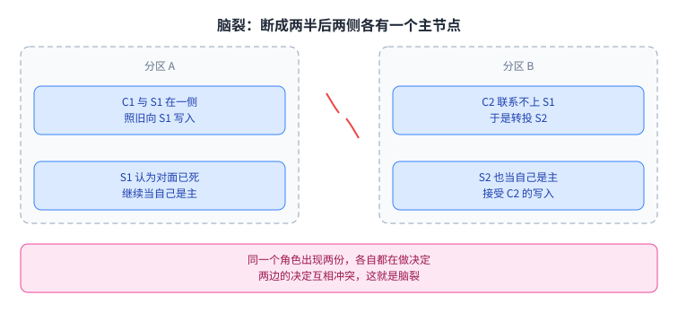
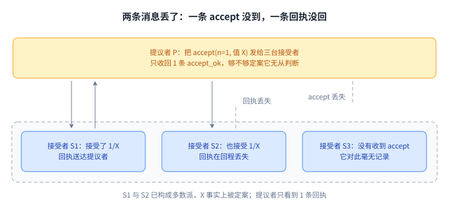
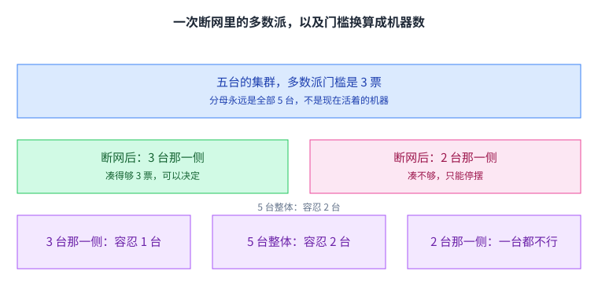
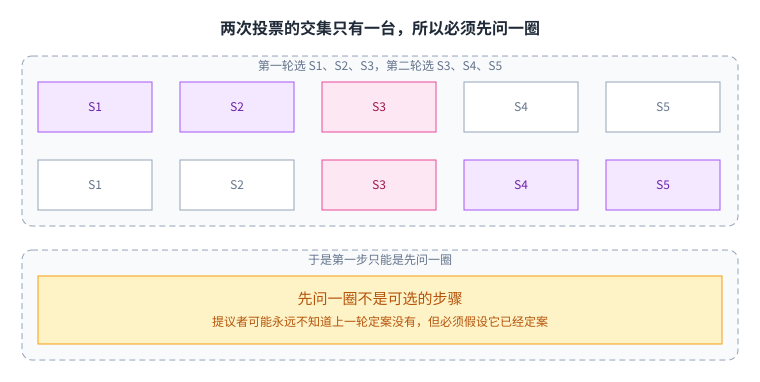
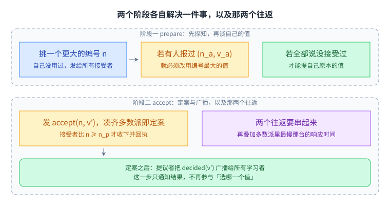
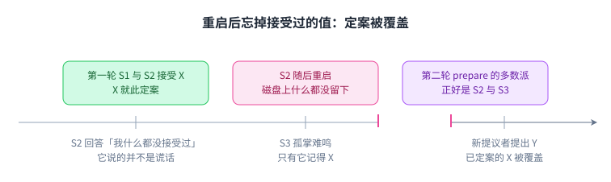
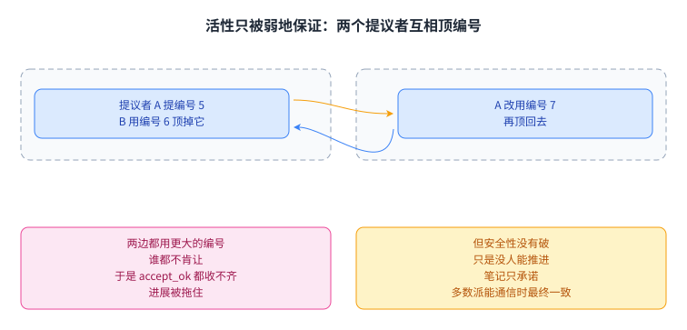

+++
kind = "lecture"
lecture = 4
slug = "paxos"
title = "Paxos"
status = "draft"
output_mode = "explanation"
source_kind = "notes"
source_url = "https://pdos.csail.mit.edu/6.824/notes/l-paxos.txt"
+++

> 来源课程：MIT 6.5840 / 6.824 Distributed Systems（Robert Morris、Frans Kaashoek 与 MIT PDOS）；
> 对应内容：Lecture 4 — Fault-Tolerant Agreement, Paxos（2026 春季学期）；
> 原文链接：https://pdos.csail.mit.edu/6.824/notes/l-paxos.txt ；
> 上游许可：课程主页标注 CC BY 3.0 US（https://creativecommons.org/licenses/by/3.0/us/ ），但该徽章只出现在主页，本讲依据的笔记文件本身没有许可声明，覆盖范围未获确认；
> 因此本页只讲解概念，不转载任何原文句子，也不复制原文的图表；本页为 CourseLingo 原创撰写，不是 MIT 官方材料，与课程教学团队无隶属关系。

## 这一讲要解决的痛点：让「谁是主节点」变成多数派的决定

第 3 讲里的 GFS 把所有元数据操作都交给同一个[[term:coordinator]]。它敢这么中心化，是因为块的位置信息随时可以重新问出来，它自己并不保存不可重建的数据。但这也意味着：它一旦不回应，命名空间操作就全部停在那里。要让这个角色[[term:fault-tolerance]]，直觉是「再放一台，坏了就换」。麻烦在于「换谁、什么时候换」本身就是一个必须大家一起同意的决定：不能一半机器认旧的，一半机器认新的。[[term:consensus]]要解决的正是这件事，压成一句话就是：让一组机器就一个值达成一致，并且保证一旦有机器把这个值当结论用了，之后任何机器都不可能得出不同的值。

这件事为什么难，值得先看清楚。单机世界里没有「达成一致」这个动作：内存只有一份，谁先写谁算。到了网络上，同一份决定要落在多台机器上，而这些机器会[[term:crash]]、会重启、会遇上[[term:network-partition]]，消息会丢、会重复、会迟到。于是「已经达成一致」这件事，没有哪个瞬间能被某台机器在本地观察到。这一讲的每一个反例、每一处「必须先探知」，追到底都是这句话在起作用。

目标也要说清楚，因为我们同时要两样东西。一份是高可用：坏掉一台还能继续服务，没有单点。另一份是强一致：对外看起来像一台机器，也就是[[term:linearizability]]。这两样要一起拿，代价就落在下面要讲的这个协议上。

把这一节的压力收成一张图：单点、停摆、再放一台，然后卡在哪里。

卡住的地方不在机器数量，而在「换谁」这件事要由多数派来认定。

## 直觉做法为什么不行：谁先回话就信谁

最省事的方案是[[term:primary-backup-replication]]：客户端把操作都发给主节点 S1，S1 回话，顺便把操作转发给备节点 S2。客户端收不到 S1 的回话，就改发给 S2。听起来 S1 崩了系统还能用。

问题出在「收不到回话」这句话上。假设网络断成两半：客户端 C1 和 S1 在一侧，C2 和 S2 在另一侧。C1 照旧跟 S1 说话，C2 联系不上 S1 就转投 S2。两边都认为对面那台死了，于是 S1 和 S2 都当自己是主节点，都在接受写入。这就是[[term:split-brain]]：同一个角色出现两份，两边的决定还会互相冲突。

把那个断网场景按两侧摊开看一遍。

两侧都只看到「我没有收到回话」，于是各自立了一个主节点。

把这件事说狠一点：机器能观察到的只有「我这条请求没有回话」。这可能是对方崩了，可能是它只是慢，可能是请求包丢了，也可能是它算完了而回复在回程丢了。这和第 2 讲讲过的[[term:rpc]]超时是同一个事实，只是这次赌注从「一次调用」变成了「谁是主节点」。

更早的年代靠人来切主：机器失联，运维人工把备节点提上来。人又成了单点，而且扛不住规模。退一步的办法是用「谁的回答先到就采纳谁」来裁决，可只要把三台接受者摆出来看一眼，就知道这条路也不行。

三台[[term:acceptor]]里已经有两台答应了同一个值 X，但发给第三台的那条 accept 没到，S2 的回执又在回程丢失：

提议者眼里的「只有一台答应」和集群里「多数派已经答应」是两个不同的事实，而它没有任何本地手段把两者区分开。

「先到先得」的毛病就在这里：你采纳的那条回答，未必来自知道最新事实的那台机器。要安全，回答的集合就必须大到「不管怎么挑都一定包含知情人」。

## 核心思路：让多数派定案，并且只认多数派

[[term:quorum]]指的是「足以做出决定的那个子集」，本讲用的具体形式是[[term:majority]]，也就是超过半数：三台里要两台，五台里要三台。换成多数派之后，前面那个漏洞被两条性质补上。

第一条，任意两个多数派必然相交。三台里各要两台，两个集合加在一起是四台，而集群只有三台，所以至少有一台同时出现在两边；五台里各要三台也一样。这条性质的含义是：如果某个事实被上一轮的多数派知道了，那么下一轮的多数派里至少有一台知道它。

第二条，至多一个分区能包含多数派。网络断成两半时，只有大的那半边凑得齐多数派，小的一半拿不到，就做不了决定。脑裂被堵住，代价是少数派那一侧停止服务。

这里有个容易忽略的细节：**多数派的分母是全部机器，不是现在活着的机器**。如果按活着的算，三台里掉了一台之后，剩下两台里过半只要一台，那么一个分区里孤零零的那一台也能宣布自己赢了。

把这两条性质放进一次真实的断网里，顺便把门槛换算成机器数。

少数的那一侧凑不齐多数派，只能停摆，这正是换掉脑裂要付的价钱。

于是 2f+1 台机器能容忍 f 台故障：三台容忍一台，五台容忍两台。多数派还有第三层用处：它给了协议一个固定的「够用了」的门槛，提议者不必等最后那台慢机器，收到足够多回执就可以往下走，少数慢节点不再拖住所有人。

门槛固定下来，少数慢节点就不再决定整个协议的节奏。

[[term:paxos]]的承诺就是围绕这个门槛的。一旦某个值被多数派定案，之后任何一次定案都只能是同一个值；多数派能通信就能继续推进；凑不齐多数派就停下来，等修好之后从停下的地方继续，整站断电也扛得住。关于最后一条，笔记的措辞值得记住：「最终会达成一致」被称为一条很弱的性质，因为它只保证多数派能长时间通信时会达成一致，既不说多久，也不说这期间会不会有人反复打断。

协议停下与继续这两种状态，值得单独看一眼。

停摆是设计的一部分，它换来的是永远不会给出错误答案。

## 机制：两个阶段各自解决一件事

### 先把几个词定义清楚

- 接受：某台接受者回了 accept_ok，就说它接受了 n/v。n 是[[term:proposal-number]]，v 是值，这一对合起来就是一个[[term:proposal]]。
- 定案：多数派接受了同一个 n/v，就说这个提案定案了。定案是全局性质，任何单台机器都可能不知道自己身上那一票已经凑成了定案。
- 角色：发起提案的是[[term:proposer]]，投票并记忆的是接受者，只负责得知结果的是[[term:learner]]。真实系统里同一台机器通常三个角色都演。

### 多数派相交为什么就够

把两次投票的接受者集合摆在一起，重叠的那一格就是全部安全性的来源：

第二轮唯一知道第一轮已经接受过 X 的就是 S3，所以新提议者只要问到它，就不可能把一个与 X 冲突的值提出来。安全性不靠某台机器的权威，靠的是任何一次新投票都逃不开上一轮的知情者，这就是先问一圈不是可选步骤的原因。

### 阶段一 prepare：先探知，再谈自己的值

提议者要做的第一件事，不是提出自己的值，而是先问一圈「你们接受过什么」。它挑一个自己从没用过、并且比它见过的任何编号都大的 n，把 prepare(n) 发给所有接受者，也包括自己。

编号的两条规则各自对应一种失败：必须自己没用过，又比见过的都大。挑小了只是这一次做不成，它改不动任何已经定案的值。

接受者的回答只有两种。如果 n 比它记住的最高编号还大，它就把自己接受过的、编号最大的那对 (n_a, v_a) 随回执交出去；如果它从没接受过任何值，就说没有。否则直接拒绝。注意它交出去的是自己记得的最新事实，不是自己的偏好。

收到多数派回执之后，提议者要做一件看起来很奇怪的事。只要回执里有任何一台报告了它接受过的值，提议者就必须放弃自己想提的值，改用回执里编号最大的那个 v_a，记作 v′。只有当所有回执都说「我没接受过任何值」时，它才能用自己原本想提的值。

原因就是前面那条相交性质。两个多数派必然相交，所以新提议者的多数派里至少有一台来自上一次的多数派；如果上一次已经把 X 定案了，那台机器就会把 X 带回来。提议者自己可能永远不知道 X 到底定案没有，它见到的多数派也许只重叠一台，但它必须保守：只要有证据表明一致可能已经达成，就得当作它已经达成来行动。

举个具体例子。S1 提编号 1、值 X，把 accept 发给 S2 和 S3 之后自己崩了，S3 已经把 X 记下来。此时 X 已被多数派定案，但活着的机器里没人能凭自己断定这件事。接着 S2 想提自己的 Y，编号 2，于是先发 prepare(2)：S3 的回执里带着 X，S2 的第二阶段就只能提 X。要是 S2 的多数派正好由 S3 这一台知情者凑成，那 S3 的这条回执就是 X 唯一的活证据。

S3 那条回执是 X 唯一的活证据，提议者只能照着它提。

把两个阶段连起来看，顺序、分工与延迟都在这一张图上：

提议者在发出 accept 之前必须先把值定下来，而它能用的值只有一个来源，就是阶段一收回来的那批回执；两个往返还要串起来，再叠加多数派里最慢那台的响应时间，所以它慢在结构里，不在实现没优化。

### 阶段二 accept：把 v′ 交给多数派

拿到 v′ 之后，提议者把 accept(n, v′) 发给所有接受者。接受者的规矩是：编号 n 不小于它记住的最高编号 n_p 才接受，接受时把 n_p 更新为 n，并记下 n_a = n、v_a = v′，然后回 accept_ok。凑齐多数派 accept_ok，值就定案，提议者把 decided(v′) 广播给学习者，其余机器据此更新结果。

定案的那一刻，各台机器的认知并不整齐：单机的判断不可靠，能作准的只有多数派这个事实。

为什么门槛是「不小于」而不是「大于」，值得单独看。accept 可能先于该轮的 prepare 到达某台机器，所以它需要一个能比较的基准，而 n_p 正是这个基准。少了这条比较，就会出现这样的序列：S1 收到 p1、p2，然后接受 a1(A)；S2 收到 p1、p2、a1(A)，然后接受 a2(B)；S3 收到 p1、p2 与 a2(B)。A 曾经被 S1 与 S2 这两台接受过，却被 B 覆盖，前后两次定案的值不一样。

接受者还要在收到 accept 时把 n_p 抬到 n，否则更早的编号仍然能被接受。另一个反例是这个形状：S1 收到 p1、a2(B)、a1(A)、p3、a3(A)，S2 收到 p1、p2、p3、a3(A)，S3 收到 p2、a2(B)。B 先被定案，随后又被 A 覆盖，同样是前后不一致。

至于提议者自己挑了比别人小的编号会怎样：它凑不齐多数派，只是这件事做不成，不会破坏安全性。安全性和进展在这里是分开的两笔账。

### 接受者必须把什么写进磁盘

n_p、n_a、v_a 三样必须持久化，重启之后要能恢复。最脆的例子是这一种：第一轮里 S1 与 S2 接受了 X，X 定案，随后 S2 重启；第二轮 prepare 的多数派是 S2 与 S3，S2 是两轮唯一的交集。如果 S2 重启后忘了自己接受过 X，第二轮的 prepare 就学不到 X，X 会被另一个值覆盖。所以笔记里的结论很硬：**记不住这些状态的节点，不能重新加入这次 Paxos**。

S2 是两轮唯一的交集，它忘掉的正好是 X 唯一的证据。

n_p 也要持久化。假设一台机器重启后不记得自己见过编号 11 的 prepare，它就会收下一个更早的编号 10 的 accept，把那个早已定案的值又接受一次。持久化在这里的作用不是「记录做过什么」，而是「拦住更早的编号」。

最高编号那一份状态起的是另一类作用：它挡的是更早的编号，不落盘的话编号 10 的 accept 照样能进。

### 为什么 Paxos 只决定一个值，剩下的都是 Multi-Paxos

前面整段协议只决定一个值。可是一个能用的系统要的是一串值：日志第 3 条是什么，第 4 条是什么。[[term:state-machine-replication]]要求所有副本按同一顺序执行同样的操作，所以真正需要达成一致的，其实是日志里每一条的内容。

做法不复杂。客户端把操作发给任意一个副本；副本挑一个日志下标，用一次 Paxos 让所有副本同意这个下标上放的是什么；定案之后，所有副本按[[term:log]]顺序把它应用到自己的状态。举例：客户端把「x=1」发给 S1，S1 挑第 3 条，用 Paxos 让所有副本同意第 3 条是 x=1，之后每台机器的数据库都执行这条操作，日志第 3 条就算[[term:commit]]了。

[[term:multi-paxos]]指的就是把 Paxos 反复用在一条日志上的工程做法，而这部分才是真正花时间的地方：

- 每个值都走两个阶段太贵。现实做法是先选出[[term:leader]]，让它一次 prepare 覆盖后面很多个值，之后的值只花阶段二一轮。
- 但「谁是领导者」本身又要一次一致，这就是[[term:leader-election]]要解决的事，而选举、失效检测、超时又各自是一摊工作。
- 并发要处理：后面的操作必须等前面的操作定案，因为日志是有顺序的。
- 落后的副本要追上：笔记特别提到日志的另一个用处，是让暂时不在多数派、离线过一阵子的副本补课。
- 空间要控制：通常只保留日志的尾部加一份状态快照，而不是整条历史。

把接受者要记住的东西和这一段工程做法收进一张图，省掉的与没省掉的就分清了：

S2 是两轮唯一的交集，它忘掉的正好是 X 唯一的证据；最高编号那份状态挡的是更早的编号；而 Multi-Paxos 先选出领导者，一次 prepare 覆盖一段日志，省下的是重复的阶段一，多数派表决在每个下标都没有少。

这里要坦白一句：《Paxos Made Simple》的重点在单值协议上，把 Paxos 变成一条高效日志的细节写得相当简略，讲座笔记也只给了骨架，工程量主要集中在后面的 Raft 与[[term:zookeeper]]。所以这一讲能回答的是「一个值怎么定案」，「整条日志怎么跑起来」是后面几讲的主场。

## 代价与边界

- 每次决定两个往返。延迟不是一次 RPC 那么久，而是两个来回，再加上多数派里最慢那台的响应时间。笔记直说 Paxos 常被认为慢，现实系统靠批处理和优化把这一段压下来。
- [[term:replication]]至少要三份。想容忍一台故障就要三台，想容忍两台就要五台，两份做不到「坏一台还能继续而且不脑裂」。这在严肃的容错系统里几乎绕不开。
- 选主是额外的机器。Paxos 对提议者是开放的，任何人都可以提，这份对称性既是它并行、可重试的来源，也是它慢的来源。把阶段一摊薄要靠领导者，而领导者的选举与失效检测不在这一讲的协议里。
- 没有多数派就没有进展。这是设计的一部分，不是缺陷：少数派那一侧会拒绝服务，恢复之后继续，过程中不会给出错误答案。想在凑不齐多数派时照样读写，只能放松一致性，那样拿到的就不是 Paxos 的承诺。
- 活性是弱的。笔记把「最终达成一致」称为很弱的性质，没有给出任何时间上界。两个提议者不停用更大的编号互相否决会把进展拖住，这一条是 Paxos 的已知性质，但讲座笔记没有展开，本页也没有从笔记里找到对应的推导，如实标注。
- 这一讲不负责的还有一大片：读要走哪一台才算[[term:linearizable-write]]，成员怎么变更，跨分片的事务怎么办。论文与笔记都没有给出这些，本页也不替它们补。

活性这条边界的形状值得单独画出来。

两个提议者互相顶编号时没人能推进，但没有任何一台机器得出了错误的值。

## 读完应该能回答

1. 三台接受者里两台接受了 X，但提议者只收到一条回执，它为什么不能就此认定 X 已经定案？
2. 阶段一里提议者为什么必须放弃自己的值、改用回执中编号最大的那个？请用「两个多数派必然相交」来说明。
3. 接受者的 n_p、n_a、v_a 为什么必须写进磁盘？请举出一个「重启后忘掉它们」导致定案被覆盖的序列。
4. 一次 Paxos 只决定一个值；要变成一条能用的日志，还要补上哪几件事？

## 溯源

- 对应：MIT 6.5840 / 6.824 Lecture 4 — Fault-Tolerant Agreement, Paxos（Spring 2026）
- 主要依据：讲座笔记 l-paxos.txt；论文《Paxos Made Simple》（Leslie Lamport，2001）
- 官方链接：https://pdos.csail.mit.edu/6.824/
- 本讲阅读材料：Paxos Made Simple，论文页 https://lamport.azurewebsites.net/pubs/paxos-simple.pdf
- 说明：本页为该讲的重新讲解，未逐句翻译原笔记，也未转载其幻灯片与图表。

## 脉络回顾：这一讲在整门课的位置

第 1 讲讲的是分布式系统为什么会同时丢掉单机那几样保证；第 2 讲的超时告诉我们「没有回话」不等于「对方死了」；第 3 讲的 GFS 把中心化协调者用得恰到好处，同时把「它挂了怎么办」留成了一个悬念。这一讲把那个悬念拆开：答案不是找一台更可靠的机器，而是找一个足够大的集合，多数派。

把这一讲压成一句：共识的作用是把「一台机器的话」变成「整个集群的话」，而 Paxos 用两个阶段加上多数派相交这条性质，在没有可靠时钟、没有可靠网络的前提下把这件事做成了。

往后看，Raft 把 Multi-Paxos 里那些工程选择固定成一套明确算法：怎么选主，怎么用[[term:term]]编号识别过期的消息，日志怎么复制、什么时候算提交；ZooKeeper 把共识包装成配置、命名、选主、锁这些现成原语；Spanner 把它推到跨数据中心的量级。它们的内核都是这一讲的两个阶段加一次多数派投票。

收尾留一个习惯：看到任何一个共识系统，先问它把哪一轮往返省掉了，又拿什么补回了安全性。
