+++
title = "Raft：从复制状态机到选举"
lecture = 6
slug = "raft"
status = "draft"
source_kind = "notes"
source_url = "https://pdos.csail.mit.edu/6.824/notes/l-raft.txt"
source_title = "Lecture 6: RSM and Raft (1)"
output_mode = "explanation"
+++

> 来源课程：MIT 6.5840 / 6.824 Distributed Systems（Robert Morris、Frans Kaashoek 与 MIT PDOS）；
> 对应内容：Lecture 6 — RSM and Raft (1)，以及 Lecture 7 的第二部分（官方日程把 Raft 拆成两次课，而两次课共用同一份讲义 `l-raft.txt`，因此本页按这份讲义一次讲完）；
> 原文笔记：https://pdos.csail.mit.edu/6.824/notes/l-raft.txt ；
> 上游许可：课程主页标注 CC BY 3.0 US，但本讲所依据的笔记文件本身没有许可声明，覆盖范围未获确认，因此本页只讲概念、不转载任何原文；
> 本文由 CourseLingo 原创撰写：我们对这一讲的主题做了重新讲解，而不是翻译原讲座文本，也没有逐句改写原文、没有转载它的幻灯片与图表；本文非官方材料，CourseLingo 与 MIT 及本课程教学团队无隶属关系；如与原文有出入，以原文为准。

## 这一讲要解决什么问题：让服务在机器坏掉时也不停

（用词上，本页混用「领导者」与 leader、「跟随者」与 follower、「任期」与 term，它们各指同一件事。）

前面三讲讲的是单个系统怎么组织数据，这一讲开始处理一个更硬的问题：高可用。目标很直白，一台机器坏掉也不停机。

手段是[[term:replication]]。但复制并不是万能的，笔记先把它的适用范围划清楚：它擅长对付**单台机器的[[term:fail-stop]]（也就是坏掉的那台停下来、不再发出结果，而不是继续给出错误的答案），比如风扇停了、CPU 过热自己关机、有人踢掉了电源线或网线、软件发现磁盘满了就停下来。这类失效的共同点是：坏掉的机器停下不动，而不是继续发出错误的结果。

而它对付不了另外两类。一是缺陷与人为误操作：这些往往不是停止型的，还可能相关，也就是同一个输入会让所有副本一起崩溃；那样复制几份都救不了。二是地震或全城停电这类大范围失效：只有当副本在地理上分开时才管用。

副本数量也是取舍。太多太贵，但必须够撑过「一边修一边又坏一台」的情形，所以很多系统跑 3 到 5 个副本。讲义里还顺带提到另一篇论文只用 2 个副本，也就是只能容忍同时坏掉一台；这里说的「这篇论文」讲义没有点名，本页照录，不去猜它是谁。它出现在这里的用处是对照：同样是复制，副本数不同，能容忍的失效数也不同，2 个只能容忍同时坏一台，而 3 到 5 个才能做到「一边修一边还能再坏一台」。

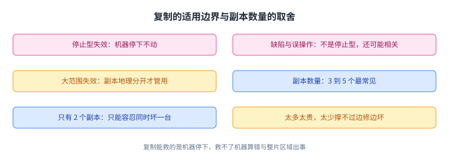

这张图给出了这一讲的边界：**复制能救的是「机器停下」，救不了「机器算错」与「整片区域出事」。**

## 复制状态机：让多台机器表现成一台

复制的经典做法叫[[term:state-machine-replication]]。笔记的描述只有四行，但每一行都是必要条件：

> If same start state, same operations, same order, deterministic, then same end state.

**同一初始状态、同一批操作、同一顺序、操作是确定性的，于是末状态也相同。** 客户端把操作发给主节点，主节点给它们排定顺序再转发给备份，所有副本执行同一串操作。GFS 里的 primary-backup 就是这个套路。

但这条路立刻撞上一个问题：主节点坏了怎么办。GFS 的答案是让一个协调者来挑新的主节点，可协调者自己坏了呢。自然的想法是让副本们自己选，也就是[[term:leader-election]]：两台服务器 S1 与 S2，都活着时 S1 说了算并把决定转发给 S2；S2 发现 S1 不响应了就自己接手。笔记紧接着用一个词点出了它的下场：网络分区，脑裂。

要理解为什么这件事难，得看清一个事实：

> the problem: computers cannot distinguish "server crashed" from "network broken"

对查询方来说，两种情况的表现完全一样：没有响应。这个困难在很长时间里被认为是绕不过去的，似乎必须由人或外部代理来裁决什么时候换服务器。直到 1990 年前后，两个能容忍分区的方案被提出：[[term:paxos]]与 View-Stamped Replication，它们被统称为[[term:consensus]]或一致性协议。而 Raft 是通往现代做法的一个好入口。

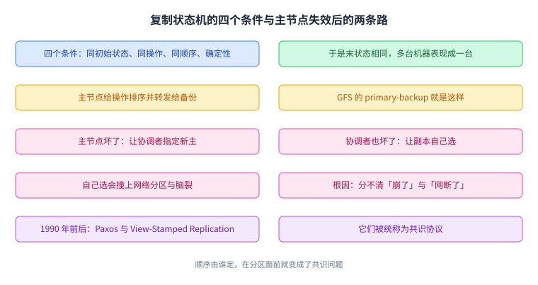

这张图是这一讲的动机链：状态机复制要求顺序，而「谁来定顺序」在分区面前变成了共识问题。

## Raft 在一个副本里长什么样

Raft 在实验室里的形态很朴素。每个副本里有上下两层：上面是键值服务，也就是状态机与它的状态；下面是 Raft 层与它的日志。客户端只跟上层打交道，而 Raft 是被嵌进每个副本里的一个库，不是一个单独的进程。

一条客户端命令的走位是这样的。客户端把一个 Put 或 Get 发给领导者上的键值层；键值层调用 `Start()` 进入 Raft（`Start()` 是 Raft 库给上层的唯一入口；上层把一条命令交进去，剩下的复制由 Raft 负责）；领导者的 Raft 层把这条命令追加到自己的日志里，并通过 AppendEntries [[term:rpc]] 发给[[term:follower]]，跟随者也把它追加到各自日志里。领导者等刚好多数（包括自己）的回复。当[[term:quorum]]都把它放进日志，这条[[term:log-entry]]就算[[term:commit]]。已提交意味着即使发生故障也不会被遗忘；之所以如此，是因为多数派的结构会让下一任领导者的拉票请求必然碰到它。这条推理底下压着一条几何事实，值得单独写出来：**两个多数派必然有交集**，设总共有 n 台服务器，一个多数派至少 n/2+1 台，两个这样的集合加起来超过 n，所以必有至少一台同时属于两边。这条事实是下面所有「多数派保证」的共同依据。

接着，领导者在下一次 AppendEntries 里把提交信息捎带出去，领导者与跟随者都把已提交的条目交给上层键值层执行（课程作业里这条通道叫 applyCh，传过去的消息类型叫 ApplyMsg；不修 Lab 的读者只需知道它是「把已提交条目交给上层」的那条通道），最后领导者回复客户端。

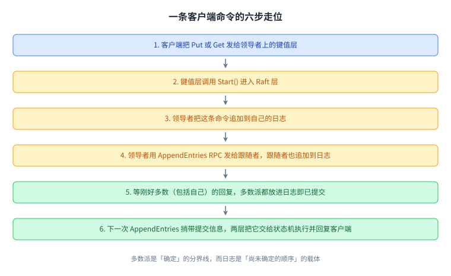

这张图是后面所有讨论的骨架：**日志是「尚未确定的顺序」的载体，而多数派是「确定」的分界线。**

## 为什么状态机之外还要一份日志

既然状态机自己就存着状态，为什么还要一份日志。笔记一口气给了四条理由。

[[term:log]]给命令排定顺序：它让副本们对同一个执行顺序达成一致，也让领导者能确信跟随者的日志和自己一样。日志暂存尚未提交的命令：在拿到多数派之前，这些命令还不能算数。日志留着命令以便重发：领导者可能需要把它们再发给落后的跟随者。日志还持久化，这样重启之后可以把状态重放出来。

那么各副本的日志是彼此的精确副本吗。笔记的回答是否定的：有的副本可能落后，而且按照后面的分析，它们可能暂时拥有不同的条目。好消息是两条：它们最终会收敛到一致，而提交机制保证服务器只执行稳定的条目。

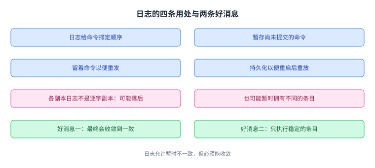

这张图解释了这个设计的要害：日志是暂定顺序的容器，所以它允许暂时不一致，但必须能收敛。

## 为什么需要一个领导者，以及任期编号

实现上的难点，笔记归成三类：失效（网络分区、丢消息、服务器崩溃）、并发（服务器内部与服务器之间），以及由此产生的大量可能执行顺序与角落情况，也就是论文 Figure 2 那张满是规则的表格（本页不复述它的细则，只在用到时展开必要的一条）。这一讲只处理其中一件：选出新的领导者。

为什么要领导者。因为需要有谁保证所有副本以同一顺序执行同一批命令。笔记顺带指出，有些设计（例如 Paxos）是没有领导者的。

Raft 用一个编号把历任领导者串起来：

> Raft numbers the sequence of leaders: new leader -> new term. a term has at most one leader; might have no leader

一个新[[term:leader]]就开一个新[[term:term]]；而一个任期里至多一个领导者，也可能一个都没有。编号的用处是让服务器能跟随最新的那位领导者，而不是已经过气的那位。

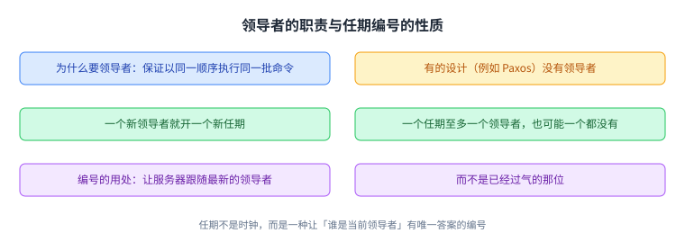

这张图给出了选举的坐标系：任期不是时钟，而是一种逻辑编号，它让「谁是当前领导者」有唯一答案。

## 选举什么时候开始

一个 Raft 节点什么时候开始选举。答案是：

> when it doesn't hear from current leader for an "election timeout"

在超过一个[[term:election-timeout]]没听到现任领导者的消息时，它就把本地的当前任期号（论文里写作 `currentTerm`）加一，然后去收集选票。笔记在这里留了两条注意事项：这会导致本不必要的选举，代价是慢一点，但并不危险；以及老领导者可能还活着，并且仍然以为自己是领导者。

这张图把选举的起点与它带来的两种麻烦放在一起：选举可以多来几次，这是安全换来的代价。

## 怎么保证一个任期至多一个领导者

这一条靠两个规则叠出来。第一，领导者必须拿到多数服务器的同意票。第二，每台服务器在每个任期只能投一票：如果它自己是候选人就投给自己，否则投给第一个来拉票的（论文 Figure 2 里对投票还有更细的规则，本页不复述它的细则；另外论文还要求候选人的日志不能比自己旧，这条限制下一讲再讲）。

两规则一叠，再加上那条几何事实（**两个多数派必然相交**），结论是：若同一任期有两台服务器都拿到多数票，这两个多数派必有交集，而交集里那台服务器按规则二只能投一票，矛盾。因此同一个任期里至多有一台服务器能拿到多数票，因此即使发生网络分区也至多一个领导者；而选举也能在一些服务器已经失效的情况下成功。笔记在这里特意强调了一句容易搞错的细节：多数派是对全体服务器而言的，不是对活着的服务器而言的。

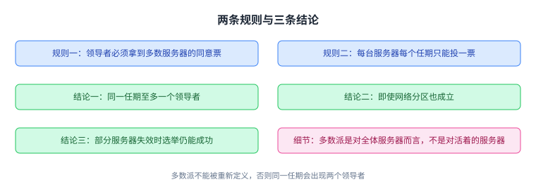

这张图是这一讲最重要的一条不变量：**多数派不能被重新定义，否则同一任期会有两个领导者。**

## 新领导者怎么被大家知道，以及选举为什么会失败

新领导者上任后靠心跳让所有人知道：它发 AppendEntries，里面带着更高的任期号。这里的关键是「只有领导者发 AppendEntries」，而一个任期只有一个领导者，于是看到任期为 T 的 AppendEntries，你就知道 T 的领导者是谁。心跳还负责压住新的选举，所以领导者发心跳的频率必须高于选举超时。

选举也可能不成功，原因有两个：能联系上的服务器不到多数，或者多个候选人同时竞选把票分掉了，谁都没过半数。失败之后不会卡死：没有心跳就再超时一次，于是为新任期发起新一轮选举；更高的任期优先，为旧任期竞选的候选人退出。

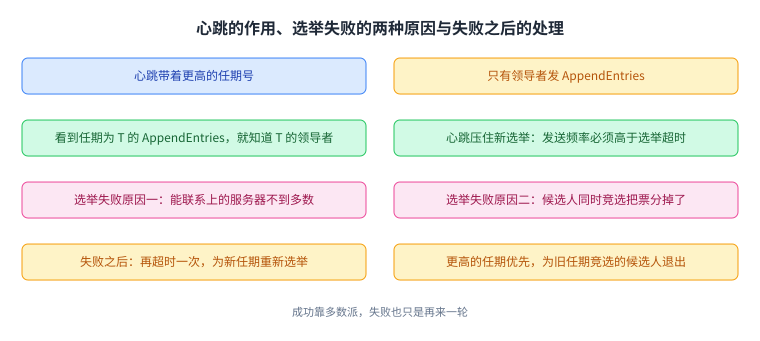

这张图把选举的两面补齐了：成功靠多数派，失败也只是再来一轮。

## 分裂投票：随机化打破对称

如果不做特殊处理，选举会经常因为分裂投票而失败。笔记给的理由很具体：所有选举定时器很可能几乎同时到期，而每个候选人都投给自己，于是没有人会投给别人，结果人人都恰好一票，谁都不过半。

Raft 的解法是给选举超时加随机量：

> each server adds some randomness to its election timeout period

随机量打破了服务器之间的对称性，总会有一台的随机延迟最短，它就先动手；只要它能在**别人**的随机超时到期之前把票拉够（说的是别人的超时，因为每个人的随机量不同），其他人就会先看到新领导者的 AppendEntries 心跳，从而不再参选。笔记顺带点出，随机化延迟是网络协议里常见的手法。

选举超时该选多长，笔记给了四条互相拉扯的要求：

- **至少要是几个心跳间隔**：否则一次心跳丢失就会引发不必要的选举；

- **够短**，以便失效时能快速响应，避免长时间没有领导者；

- **也够短**，以便在测试器不高兴之前能重试几次（测试器要求选举在 5 秒内完成；「测试器」指课程作业里那个自动打分程序）；

- **随机的那部分要够长**，长到让一位候选人能在下一个候选人开始之前成功拉到票。

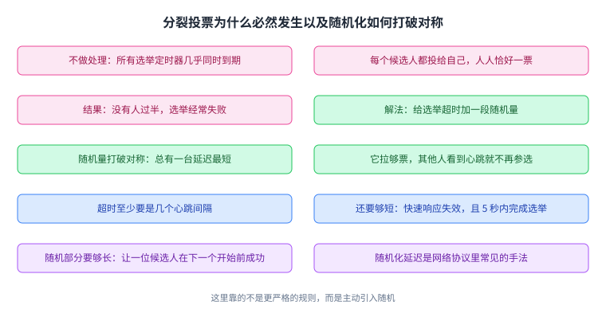

这张图解释了一个反直觉的设计：这里靠的不是更严格的规则，而是主动引入随机。

## 老领导者没退位会怎样

最后一个问题是老领导者。它可能没看到选举消息，也可能身处少数派分区里。笔记的推理分两步：新领导者上任意味着多数服务器已经增加了 currentTerm，所以老领导者要么在 AppendEntries 的回复里看到更高的任期而退位，要么根本拿不到多数回复，于是它无法提交或执行任何新的日志条目。两条合起来，不会出现脑裂。

但笔记紧接着补了一句代价：少数派仍可能接受老领导者的 AppendEntries，于是日志可能在旧任期的尾部出现分叉。这里要分清一件事：**「接受并追加到日志」不等于「提交」**。老领导者能让少数派把条目写进日志，但它拿不到多数派回复，所以那些条目**始终没有提交**，而没有提交的条目是可以被后来的领导者覆盖的。所以「不会脑裂」说的是**不会同时存在两个都能提交的领导者**，而不是「谁都写不了日志」。它给了一个具体例子。先说粗略的版本：S1 有一条任期 3 的条目，S2 与 S3 各有两条任期 3 的条目（笔记前面那句「S1 与 S2 各有一到两条」是粗略说法，后面这组数才是准确的）。更麻烦的是同一个日志位置可能放着不同的命令。

笔记给出的成因链是：S2 在任期 3 当领导者时，把条目 10 追加给了 S1、S2、S3，把条目 11 只追加给了自己和 S3（S1 崩了）；接着 S2 崩溃后很快重启，在任期 4 当上领导者，把条目 12 追加进自己的日志然后崩溃；再接着 S3 在 S1 帮助下成为任期 5 的领导者，往同一个位置 12 追加了一条不同的条目。这句话正是初学者最容易误读的地方：**S2 在任期 4 追加的那条从未提交**，所以它被覆盖并不违反「已提交就不会被遗忘」，那条结论只保护已提交的条目。另外，这段里出现的两个 12 只是碰巧同一个数字：一个是**日志位置**（第 12 条），一个是那条命令**内容**里的编号。

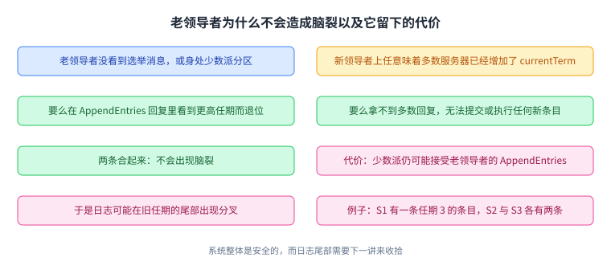

这张图把安全与代价分得很清楚：系统整体是安全的，而日志尾部需要下一讲来收拾。

## 分叉长什么样：三个副本的日志

把上面那个例子画出来更直观。第一层分叉是长度不同：领导者崩溃前没能把 AppendEntries 发全，于是 S1 只有一条任期 3 的条目，S2 与 S3 各有两条。第二层分叉更麻烦：经历几轮领导者崩溃之后，同一个日志位置会装着不同任期的条目，甚至不同的命令。

笔记在最后交代了下一步：下一讲会讲 Raft 怎么处理日志分叉，其中包含一条对领导者选举的额外限制；而这条限制即使先不实现，也能通过 3A 的测试（3A 是课程作业里与选举有关的那一部分；不修 Lab 的读者只需知道它是那部分作业的编号）。

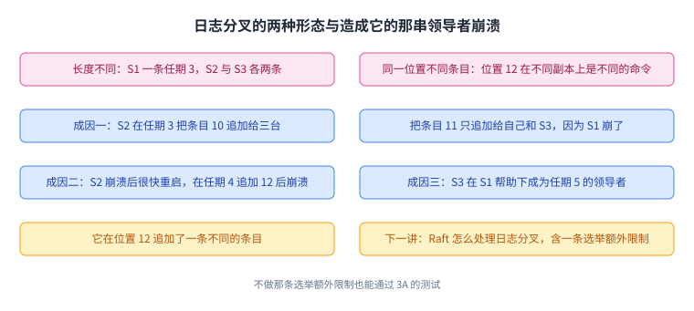

这张图是这一讲的收尾：选举把「谁定顺序」解决了，而「两串日志怎么接上」被明确留到了下一讲。

## 与论文导读的分工

本仓已经有一页 Raft 论文导读。两页的关系需要写清楚，否则同一件事会被讲两遍。

论文导读回答的是论文自己的问题：它提出什么主张、怎么论证、代价在哪，包括候选者日志必须「至少和新的一样新」这条选举限制、条目在什么条件下算提交、为什么「当前任期的条目提交」会连带提交之前的条目、成员变更为什么需要联合共识。那些都是论文层面的深水区。

而这一页跟着课堂笔记那条线走：教师怎么引入复制状态机、为什么这件事在分区面前很难、Raft 在实验室里以什么形态出现（一个库、两层、Figure 2）、以及 3A 要做的选举全流程。凡是论文导读已经讲透的细节，本页只指路、不重讲；反过来，本页讲的实验室形态与选举触发条件，是论文导读里不需要重复的。

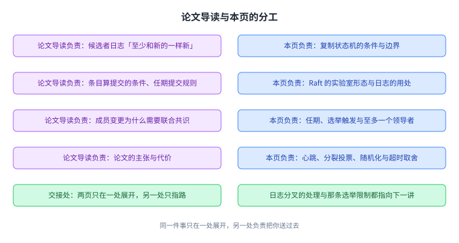

这张图就是两页的分界：同一件事只在一处展开，另一处只负责把你送过去。

## 读完应该能回答

- 复制能对付哪一类失效、对付不了哪两类，副本数量为何取 3 到 5；
- 复制状态机的四个条件是什么，为什么它们缺一不可；
- 为什么「服务器崩了」与「网络断了」对客户端不可区分，以及它为什么让自动切换变得困难；
- Raft 在副本里以什么形态存在，一条命令的完整走位是什么；
- 状态机之外为什么还要一份日志，以及日志为什么允许暂时不一致；
- 任期编号解决的是什么问题，「一个任期至多一个领导者」靠哪两条规则保证；
- 选举在什么条件下开始，失败的两个原因是什么，失败之后为什么不会卡死；
- 老领导者为何不会脑裂、日志分叉有哪两种形态，哪部分留给下一讲。

## 脉络回顾：把「一致」拆成可实现的零件

把这一讲放回整门课里看，它的位置是一次承前启后。

前面几讲处理的是具体系统：MapReduce 与 GFS 讲怎么在大量机器上摊开数据，Paxos 讲一个共识协议长什么样。而这一讲第一次把问题提纯：如果我们只要求一台不会停的服务，最少需要哪些零件。 它给出的答案是复制状态机加上一个共识层，并且把共识层具体化成 Raft。

它解决的那一环是顺序。复制状态机的四个条件里，最难满足的不是「同一批操作」，而是「同一顺序」；而一旦要求顺序，就必须有人来定，于是引出领导者；而领导者一旦可能失效，就必须有选举；而选举一旦遇到分区，就必须引入多数派与任期编号。这条链子上的每一步都是被上一步逼出来的，这也是这一讲值得按顺序读的原因。

最要紧的转折在「不可区分」那条事实上。计算机分不清对端是崩了还是网络断了，于是任何「发现没响应就换主」的直觉做法都会在分区时产生两个主。Raft 的应对不是让判断更准，而是把判断换成多数：不要求知道谁死了，只要求拿到多数票。这一换，安全性就不再依赖对故障的准确判断，只依赖集合论。

后面哪里用到它：这一讲留下的两块拼图决定了后面的走向。一块是日志分叉怎么修，也就是下一讲要讲的内容，其中包含对选举的那条额外限制；另一块是状态机与共识层之间那条窄接口（上层只需要一个顺序确定的操作流），ZooKeeper 那一讲会展示把这套接口包装成通用零件之后能做什么，而 Lab 2 与 Lab 3 会让你亲手把这条窄接口接起来；工业界沿同一条路做出来的还有 etcd 这样的独立服务；更早的 Chubby 提供的是锁与粗粒度协调，而那正是 Raft 想替掉的那种零件。

## 溯源

- 对应：MIT 6.5840 / 6.824 Lecture 6 — RSM and Raft (1)，以及 Lecture 7 的后半部分。

-  两次课、一份讲义：官方日程把 Raft 排在两次课，而两次课共用同一份讲义 `l-raft.txt`（219 行，8,935 字节，SHA256 前 16 位 `8BC18871653E77CF`） 本页按这份讲义一次讲完，因此台账里 `06-raft` 一页对应官方第 6 与第 7 两条讲次。

- 主要依据：讲座笔记 `_fc/l-raft.txt`；笔记里提到的论文为 Diego Ongaro 与 John Ousterhout 的 "In Search of an Understandable Consensus Algorithm"（USENIX ATC 2014），以及笔记作为历史背景提到的 Paxos 与 View-Stamped Replication。

- 官方链接：https://pdos.csail.mit.edu/6.824/notes/l-raft.txt

-  与 `papers/raft` 的分工（两页不重复讲同一件事）：`papers/raft` 讲论文本身，负责深水区的四条（候选者日志「至少和新的一样新」这条选举限制、条目算提交的条件、当前任期条目提交连带之前条目、成员变更的联合共识）；本页讲课堂笔记那条线，负责复制状态机的边界、实验室形态、任期与选举的全流程，以及日志分叉的两种形态。凡是论文导读已经展开的细节，本页只指路（例如日志分叉的处理与那条选举限制，都指向下一讲与论文导读）。

- 说明：本文为该讲的重新讲解，未逐句翻译原笔记，也未转载其幻灯片与图表。文中提到的测试时限 5 秒、3 到 5 个副本、Figure 2 等均来自课程笔记。
