+++
kind = "lecture"
lecture = 9
slug = "zookeeper"
title = "ZooKeeper"
status = "reviewed"
output_mode = "explanation"
source_kind = "notes"
source_url = "https://pdos.csail.mit.edu/6.824/notes/l-zookeeper.txt"
+++

> 来源课程：MIT 6.5840 / 6.824 Distributed Systems（Robert Morris、Frans Kaashoek 与 MIT PDOS）；
> 对应内容：Lecture 9 — ZooKeeper，阅读材料是 Hunt、Konar、Junqueira、Reed 的 "ZooKeeper: Wait-free coordination for Internet-scale systems"（USENIX ATC 2010）；
> 原文笔记：https://pdos.csail.mit.edu/6.824/notes/l-zookeeper.txt ；
> 上游许可：课程主页标注 CC BY 3.0 US，但本讲所依据的笔记文件本身没有许可声明，覆盖范围未获确认，因此本页只讲概念、不转载任何原文；
> 本文由 CourseLingo 原创撰写：我们对这一讲的主题做了重新讲解，而不是翻译原讲座文本，也没有逐句改写原文、没有转载它的幻灯片与图表；本文非官方材料，CourseLingo 与 MIT 及本课程教学团队无隶属关系；如与原文有出入，以原文为准。

## 现状与痛点：同一批协调代码，被每个系统重写一遍

一个容错的服务，迟早都要回答同一组问题：现在谁说了算、配置放在哪、谁拿着锁、集群里还有哪些活着的成员、某个任务被分给了谁。单看每一条都很小，合起来却是每个分布式系统都要重来一遍的工作。

具体一点。假设你要写一个 [[term:mapreduce]] 的 [[term:coordinator]]。它得记住自己的地址、有哪些作业在跑、每个任务进行到哪一步、有哪些工作节点、谁领走了哪个任务。工作节点要能找到它，还要能读到自己的分派；一旦它换了一台机器运行，新的协调者必须能接着干下去。

前面几讲已经给了你办法：把那台协调者做成一个 Raft 集群，状态由多数派复制。这条路是通的，Lab 3 就是这么用的。真正的问题在于，写起来有多别扭。

Raft 是一套 [[term:state-machine-replication]]：它复制的其实不是状态，而是计算。应用必须先把每一个状态变化变成一条 [[term:log]] 记录，等它被 [[term:commit]] 之后，再按同一个顺序执行一遍。你的业务代码于是被拆成一串事件处理函数，还要自己盯着日志下标、[[term:snapshot]]、[[term:membership-change]] 这些事。业务本身可能只有几十行顺序代码，多出来的复杂度几乎全来自框架。

把这条差异画出来：复制的是计算，不是那份业务状态。

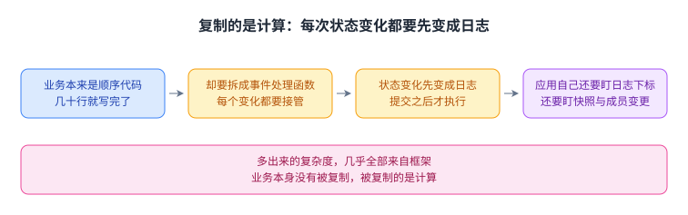

业务代码只有几十行，多出来的复杂度几乎全部来自框架。

第二个问题更不值得：选主、锁、成员表这几样东西，每个系统都要重新发明一次，而每次踩的坑都一样。

[[term:zookeeper]] 就是针对这两条的。课程笔记把它摆在两个角度上看：一是给容错应用提供一个更简单的地基，二是作为「用 Raft 那类复制协议」的一个工程样例。它被用在非常多的地方，后来流行的 etcd 也明显受了它的影响。

## 为什么「直接拿 Raft 写应用」不划算

先把几种直觉做法摆出来，看它们各自错在哪。

最直觉的一种是把状态写在本机磁盘上。简单、快，但机器一崩，状态就没了，容错无从谈起。（**这一档是我们为了对照补的**：笔记比的是「只复制存储」与「自己用 Raft」两条路，没有把「写本机磁盘」列成一档。）

第二种是：干脆不复制计算，只复制存储。这个想法值得停一下。我们让协调者是一个普普通通的、完全没有副本的进程，它把状态写进一个不会丢的存储服务里。协调者崩溃之后，随便找一台机器，把协调者程序启起来，让它从存储里读回状态，接着干。计算没有被复制，复制的是那份状态。

这在大规模云上非常自然：临时申请一台替代机器是很容易的事。代价是，你必须先有一个真正容错的存储服务，而它的正确性一点都不便宜。课程笔记把难点列得很清楚：要能检测出协调者已经死了；要能选出唯一的新协调者，绝不能出现两个；要能从存储里恢复「上一次更新只做了一半」的状态；还要处理一种最容易漏掉的情况：老协调者其实还活着，它自己并不知道自己已经被判死。这几件事，加上性能，任何一条做错都会让整个方案失效。

第三种是「那我自己拿 Raft 存这些东西不就行了」。行，但这几件事仍然得你自己写对，而且每一件都会在你写业务逻辑之前先把你挡住。ZooKeeper 做的事情就是把它们打包成一个现成的服务：应用侧只需要写顺序代码，每次状态变化就发一次写操作，感觉像在写文件；读取的时候像在读文件。状态存进去了，机器崩了再换一台接着跑。

三种直觉做法与它们各自挡路的地方，可以并排看。

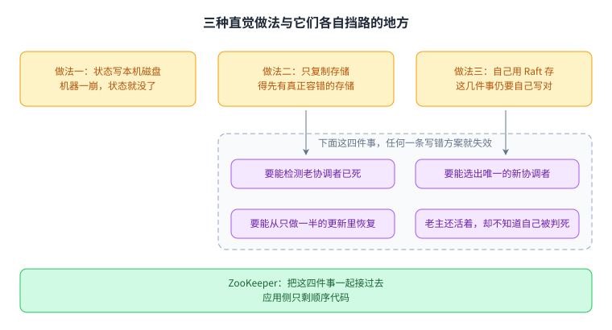

ZooKeeper 把这些一起接了过去，应用侧只剩下顺序代码。

## 核心思路：不暴露共识，只暴露一棵会通知你的树

ZooKeeper 内部确实是一套 [[term:replication]]：一台 [[term:leader]] 加若干 [[term:follower]]，写要走 [[term:majority]] 确认，本质上接近 [[term:primary-backup-replication]] 配一条全序日志（这个类比是我们加的：两篇源都没有用这个措辞）。但它的对外接口里，你看不到投票、任期、日志下标这些东西。

它给应用的只有两样：

- 一棵像文件系统的树，每个节点叫 znode，路径就是它的名字；
- 一个「这个节点变了就叫我一声」的注册机制，也就是 [[term:watch]]。

论文的标题里管这个叫 wait-free（无等待）。这个词不必被吓到，它的意思很朴素：服务端处理每个请求时都不会卡住等人。客户端想等，就自己注册一个监视点然后挂起；服务端不替任何人排队，也不保存「谁正在等这把锁」这类状态。等的人在外面，不在里面。

把这条内外分界收在一张图里。

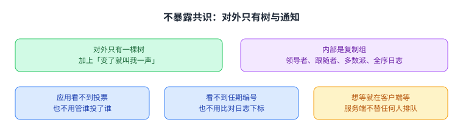

应用看不到投票、任期与日志下标，写起来仍像在写顺序代码。

## 机制一：数据树、版本号与一次最小事务

先看这棵树长什么样，以及树上能挂哪几种节点。

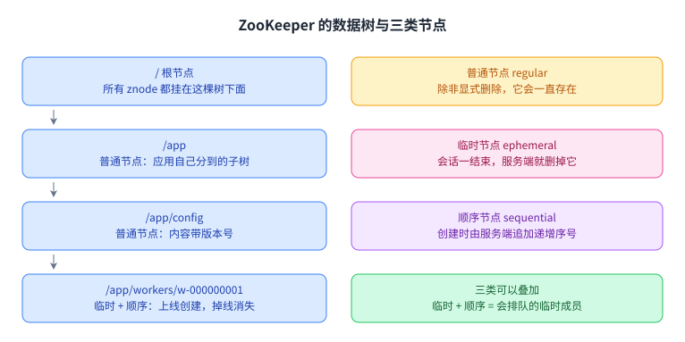

左边一列是路径，一条路径就是树上唯一的一个节点，每一层都是上一层的子节点；右边一列是三类节点各自的存活与命名规则，最后一行说明命名方式可以与任一种存活方式叠加，普通与临时则互斥。

用一个像目录的层级来放数据，好处很直接：不同应用各自占一棵子树，名字天然不会互相撞上，权限和清理也可以按子树来做。每个 znode 上有几样东西值得记住：名字（路径）、内容（一小段字节）、一个版本号，以及 ACL、时间戳与子节点列表（论文把这些一起算作 znode 的元数据；本页后面主要用到前三样）。版本号是后面所有「安全地改」的基础。

写操作里有三个细节，它们直接决定了后面所有的玩法：

- **create 是排他的。** 如果路径已经存在，创建就失败。多个客户端同时创建同一个路径，只有一个会成功。这是「争抢」这件事的基础。
- **setData 要带版本号。** 只有当服务端上这个 znode 的版本号和你手上的一致，写入才生效；否则失败。这等价于一次比较并交换，是一笔最小事务。（把期望版本号传成 **-1**，就等于关闭版本检查、无条件写入，论文的 API 允许这样。）
- **单个 znode 的读写是原子的，但跨多个 znode 的更新不是事务。** 这一条是它最大的能力缺口，后面还会遇到。

把版本号那一条拆开看，它其实是一次比较并交换。

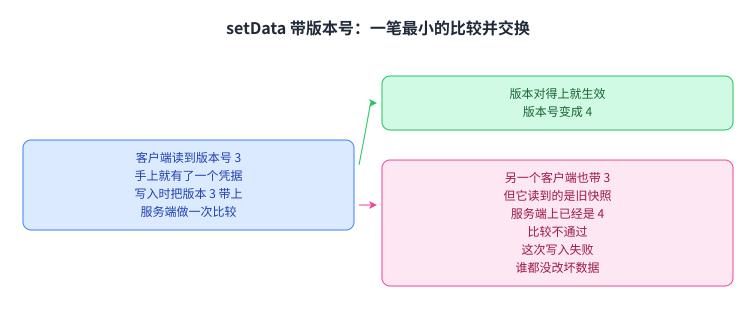

版本对不上就失败，所以两个客户端同时想改时只有一个能成功。

节点的差别来自两件事：活多久，以及名字怎么来，也就是图里右列的内容。普通节点一直存在，除非有人显式删除。[[term:ephemeral-node]] 绑在 [[term:session]] 上，客户端与 ZK 的连接断了、心跳停了，会话超时之后服务端会自动删掉它创建的全部临时节点。[[term:sequential-node]] 在创建时由服务端在名字后面补一个单调递增的序号。

这些规则单看都很小，组合起来才是协调原语。

## 机制二：ZAB 与 zxid，写为什么必须排成一队

如果两个副本对同一批更新按不同顺序执行，最后的状态可能完全不同。一个最土的例子：先加一再乘二，和先乘二再加一，结果不一样。所以 ZooKeeper 用 [[term:zab]] 做 [[term:atomic-broadcast]]，保证所有副本按同一个 [[term:total-order]] 收到并应用同一批事务。

顺序为什么必须一致、以及一次写怎么走完这条全序，画在一起就清楚了：

同一批事务换个顺序终值就不一样，所以复制必须带上全序；这条全序由领导者定位置并分配 zxid 给出，多数派接受后才回复客户端。

流程是这样走的：

1. 客户端把写请求发给它连接的那台服务器。
2. 如果那是 follower，请求被转发给 leader。
3. leader 决定这条请求排在全序的哪个位置，并分配一个 [[term:zxid]]，也就是单调递增的事务编号。
4. 所有副本按 zxid 的顺序执行这条更新。
5. 多数派都接受了，这条事务才算提交，此时才回复客户端。

写是线性化的：写一旦返回，之后所有客户端看到的写顺序都不会再变，代价是每个写都要一次多数派确认。

这就解释了 [[term:linearizable-write]] 是怎么来的：线性化的只是**写**，读由所连的副本在本地完成，因此**读可能返回陈旧值**（笔记原话是 followers 直接执行客户端的读，读不送给 leader；论文说只有更新请求是 A-线性的）。ZooKeeper 对读给的是**逐客户端**的两条保证：读得见自己此前的写，以及读到的位置不会倒退。这里还有一个口径要记住：论文说它给的性质与教科书里的线性一致**并不完全相同**，因为 Herlihy 原来的定义假定一个客户端同时只有一个未完成的操作，而 ZooKeeper 允许多个；论文因此把它称为 **A-linearizability**（异步线性一致）。这是论文自己做的区分。

读走的是另一条路。每台 follower 自己持有一份完整数据，读请求就在本地完成，不发给 leader。这是它性能取舍的核心，也埋下了它的第一个大坑：本地副本可能落后，所以你读到的值可能不是最新的。

## 机制三：三类节点拼出锁、选主与成员表

先说锁。每个想拿锁的客户端，都在同一个父路径下创建一个临时顺序节点。序号最小的那个持锁；其余的人各自只监视自己前面那一个节点。

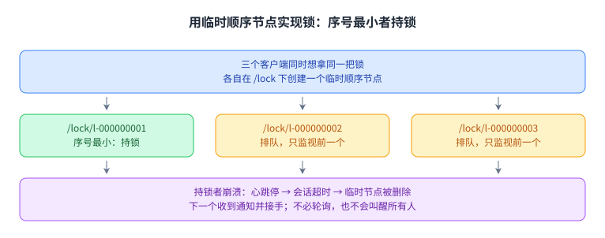

图里三层分别是：三个客户端各建一个临时顺序节点、序号最小的持锁；全体监视与只盯前一个的差别；以及持锁者崩溃后心跳停、会话超时、临时节点被删掉，下一个等待者收到通知并接手。

为什么是「只监视前面那一个」，而不是「所有人都监视锁节点」？后者在解锁时会同时叫醒所有等待者，它们一起冲上去抢，只有一个人成功，其他人重新排队，这就是惊群。只等前一个，解锁就只会叫醒一个人。

只等前一个，解锁就只会叫醒一个人，而队列本身已经把顺序排好了。

被叫醒的人也不能直接动手：锁的协议里，等到通知之后要**重新读一遍子节点列表**，再判断自己是不是最小的那一个（论文的伪代码就是从等待跳回开头那一步），因为在你注册与等待的这段时间里队列可能已经变了 —— 前一个持有者可能放弃，也可能又来了序号更小的人。

选主和抢锁是同一件事：持锁者就是 [[term:leader]]。差别在失败处理上：持锁者崩溃，它的心跳停下，会话超时，临时节点被删掉，下一个人的监视点被触发，于是它成为新的 leader。整个过程里，没有人需要去探测「它到底是不是真死了」，ZooKeeper 替所有人做了这个判断。

这里有一个容易被忽略的设计立场：ZooKeeper 刻意不在服务端实现锁、选主这类原语。论文里的说法是他们「**放弃了在服务端实现具体原语**」，改成暴露一个小 API 让应用自己搭 —— 这样新增一种原语不必改动服务核心，他们把自己做出来的东西叫「协调内核」。论文在讲锁的那一节开头也直接声明：ZooKeeper 不是一个锁服务。所以上面这套锁是例子，不是接口。

成员表也是这样长出来的。每个工作节点启动时，在 /workers 下面创建一个临时节点，名字里带上顺序号以免撞名。于是 /workers 的子节点列表恰好就是「当前活着的工作节点」。想知道成员变化的服务，监视 getChildren 就可以。（顺带一条限制：**临时节点不能有子节点**，所以成员只能挂在固定路径下，不能挂在某个临时成员节点下面。）

成员表和配置管理都不是另一套机制，它们都是前面几样东西组合出来的。

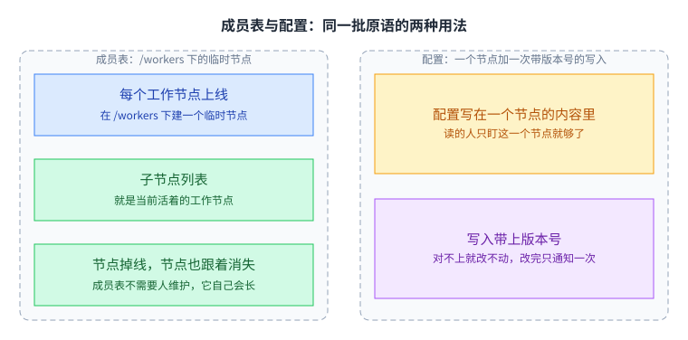

节点死掉时不需要谁去改成员表，临时节点自己会消失；配置小、变更少，也正好适合放在这棵树的节点内容里。

配置管理同理：把配置写在一个 znode 的内容里，修改时带上版本号，其他人在这条路径上注册监视点；通知只有一次，收到后要重新读一遍。

还有一个必须讲清楚的细节：崩溃发生在更新做到一半的时候。ZooKeeper 没有跨 znode 的事务，所以「同时改三个 znode」这种操作完全可能只完成一部分。笔记给了三种绕法。最省事的是把所有信息塞进一个 znode，那样一次写入就是全有或全无。第二种是用一个 ready znode 当闸门：先把 ready 删掉，把其余 znode 全部改完，再重建 ready；读的人先确认 ready 存在，存在才去读那些数据。更好的写法是：先写出一整套全新的 znode，最后改一个指针 znode 指向新集合。三者的共同点是都以一次提交写收尾，这样新上任的协调者能一眼看出上一次更新是不是只做了一半。

三种写法的共同点是最后一次写入定胜负，新主据此判断上一次是否完成。

## 机制四：会话、心跳与 fencing

ZooKeeper 判断客户端是不是还活着，靠的是会话与心跳。客户端定期发心跳；服务端在一段时间内收不到某个会话的心跳，就判定这个客户端已经死了，然后原子地做两件事：

1. 删掉这个会话创建的全部临时节点；
2. 从此拒绝这个会话发来的任何请求。

（这两件事是一体的：删临时节点本身就是**一次 A-线性的写操作**，笔记专门标注了这一点 —— 它不是「顺手清理」，而是和「拒绝后续请求」同属一个原子判决。）

第二件事看起来多余，其实是整个设计的关键。设想一次网络抖动：ZooKeeper 判定老协调者已死，删掉了它的竞选节点，选出了新协调者；可老协调者其实还活着，它仍以为自己是主，正打算写状态。如果它还能写，就会和新主同时修改数据，也就是 [[term:split-brain]]。

因为有第二件事，它写不了：请求会被拒绝，客户端的 ZK 库抛异常，程序必须处理这个异常并意识到自己已经不是主了。这个做法有个正式的名字叫 fencing（隔离）：对一个已经被判死的客户端，即使它其实还活着，也不接受它的请求 —— **这个词与这个含义出自讲座笔记**。更通用的形式是给被保护的资源配一个 [[term:fencing-token]]，也就是单调递增的编号，老主带着旧编号上门就会被拒（**「给资源配一个单调递增的令牌」这种形式是我们的补白，两个源里都没有出现「token」**）。

把判定死亡到隔离老主的这段流程画出来。

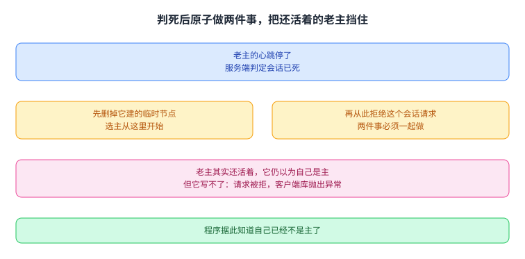

第二件事挡住的正是那个其实还活着、却已经被判死的老主。

这里有一个值得记住的立场：ZooKeeper 的故障检测**可能判错**。网络一抖，一个活得好好的客户端就可能被判死。但所有人都无条件服从它的判决，因为「大家认同同一个判断」比「判断得对」更重要。如果每个节点各自判断谁活着，迟早会出现两个节点同时认为自己说了算。既然判决可能出错，就必须有隔离机制兜底，所以上面那两件事必须一起、原子地完成。

这也是分布式系统里反复出现的一个模式：由一个实体充当故障检测器，它的判决未必正确，但所有人照做；而正因为未必正确，被它判死的角色必须被物理地挡住。

隔离这件事还有更通用的一种形式。

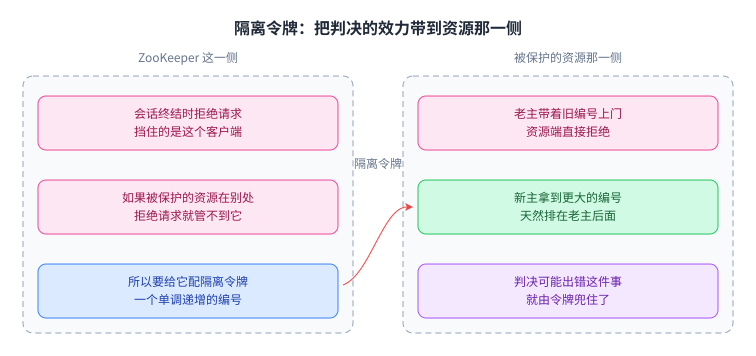

令牌把判决可能出错这件事兜住了，资源那一侧只认编号大小。

## 机制五：watch 为什么能让服务端不等待

watch 是这台服务里最省力的设计。客户端说「这条路径变了就叫我一声」，然后自己去等；服务端只需要记下「谁关心哪条路径」，不用为它保留任何流程状态。这就是 wait-free 的实际含义：等待发生在客户端，不在服务端。

代价是它只有一次。通知发出之后，这个监视点就用掉了，想继续等必须重新注册一个新的。

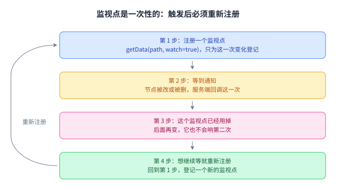

图里那条从第 4 步绕回第 1 步的箭头，就是「一次性」带来的必然循环：想要持续观察，就得反复注册。

围绕这个循环有三个坑：

- 通知不保证恰好在你关心的那一刻、以你期待的次数到来。收到通知之后正确的做法是重新读一遍状态，而不是认为状态已经是你要的样子。
- 在「收到通知」和「重新注册」之间，节点可能又变了一次，所以「读状态、重新注册、再检查一次有没有变」往往要写成一个循环。
- 注册和读是两个操作，不能指望通知和值严格配套。ZooKeeper 保证的是另一组弱一些、但足够用的性质：同一个客户端看到的所有写落在同一个顺序上（按 zxid 排），能看到自己刚才写的值，而且读到的位置不会倒退，哪怕中途换了另一台 follower。课程笔记把这组保证叫客户端 FIFO 顺序。

读到的位置不会倒退、也能读到自己刚写的值，但它可能落后于领导者的最新状态。

这里还有一条容易被忽略、却正是「收到通知就重读」之所以成立的保证：客户端一定是先看到通知事件，再看到变化后的新状态（论文把它列为通知的排序保证）。所以重读不会漏掉通知所指的那次修改 —— 你看到的状态一定已经包含它。反过来说，连接断开这类会话事件也会被送进监视点回调，正是为了让你知道通知可能被延迟。

性能上，ZooKeeper 是按「读和通知」来优化的，写是次要目标：

- 客户端分散连到多台 follower 上，读在本地完成，不压 leader；
- 监视点的信息记在客户端所连的那台 follower 上，不集中到 leader；
- 客户端可以异步地一口气发一批操作，客户端库给它们编号，服务端按这个顺序执行，消息往返和磁盘写都更少；
- 数据全部放在内存里，所以读不必碰磁盘；写要落盘写日志，并定期做 [[term:snapshot]]。落盘的用意是崩溃或断电之后，已经提交的更新不会丢；而快照用的是「模糊」技术，可以在写照常进行的同时做出来，做完就能把旧的日志截断掉，磁盘占用因此不会无限增长。

读的保证与这些做法，画在一起就是它的性能形状：

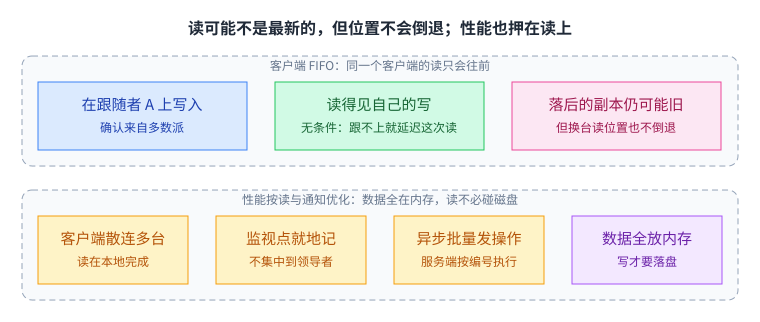

读到的位置不会倒退、也一定读得见自己此前的写（这两条是**无条件**的，与连的是哪台副本无关）；但它可能落后于领导者的最新状态；而读与通知是优化目标，写是次要目标，这解释了后面那些数字。

课程笔记给的量级是：整体每秒几万次操作；如果只有一个客户端、而且每次写完都等确认，延迟大约是 1.3 毫秒，**这样的单客户端每秒只能跑约 776 次**（笔记正是用 1 / 776 反推出这 1.3 毫秒的；笔记里那个约 2000 次是 Table 2 里十 worker 的档位，用来对比 Figure 5 的两万）；leader 挂掉要等选举，停顿是几秒的量级，follower 挂掉则只是吞吐短暂下滑。笔记里还提到，做那组纯写实验时每次操作都按 1000 字节的写来算，并把这一点列为纯写吞吐停在两万左右的可能原因之一。数字之后，笔记列出了几条要解释的现象：纯写（x=0）时性能随服务器数增加而下降、「3 台」那一条在 100% 读时反而最差、x=0 的上限停在两万，以及这些开销究竟落在磁盘写、通信还是计算上；还有一条更朴素的疑问：机械盘的转速账怎么算，它怎么能这么快。（讲义里能找到的是这几条，我按能找到的数目写，没有按「三条」凑。）

## 代价与边界

**读可能陈旧。** 你连的 follower 可能还不在刚才那次写的多数派里，于是你读到旧值。可以接受的情形：数据只是显示给人看的、纯只读的、或者读到的值本身可以被校验（比如 GFS 那种按 [[term:checksum]] 校验的块）。不能接受的情形：读-改-写（比如把计数器加一），或者一组数据必须一起一致。要追上最新，有三条路可以并排看：先做一次写再读、用 ready znode 当闸门（论文 §2.3 的方案）、或者用 API 里的 sync。sync 是其中最省事的那条：它让所连服务器先把待处理的写应用完再回答这次读，论文称它「一次慢读」。这一讲的笔记只点了 sync，没有展开这三条的关系。

能不能接受旧值，取决于你拿这个值做什么。

**监视点是一次性的。** 必须重新注册，而且「通知」与「值」不配套，所以每次通知之后都要重新读一遍。这套循环写错了，就会变成「偶发地漏掉一次变化」，而且很难复现。

把读、注册、再检查写成一个循环，才不会偶发地漏掉一次变化。

**数据必须装在内存里。** 读快正是靠这一点。所以你不能把大文件放进 ZooKeeper：大块数据放 GFS 那类存储，ZooKeeper 里只留路径、地址、状态这类小东西。

这两笔账画在一起，它管什么、不管什么就清楚了：

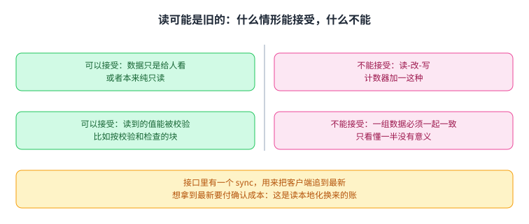

能不能接受旧值，取决于你拿这个值做什么；而内存这个约束直接划出了它管什么、不管什么：大块数据去别的存储，跨对象的事务留给下一讲。

**一切都依赖多数派活着。** 多数派没了，既不能写，也选不出新的 leader。这是所有基于共识的系统共同的边界，不是 ZooKeeper 的缺陷，但你得知道你的系统在失去多数派时会停在哪儿。

**还有一些设计上的缺口**，笔记自己也列了：读不是线性的；会话机制比较粗糙，也许按 znode 做 [[term:lease]] 更合适；很难 [[term:sharding]]，因为 znode 树没有明显的切割点，而会话本身是全局的；跨多个 znode 的事务要是有就好了。

**还有一个参数要在部署时自己定。** 会话超时该取多长，笔记没有给答案。它两头都要付代价：取短了，网络抖一下就会误杀活着的客户端，临时节点被删、主被换掉；取长了，真的崩掉以后要等更久才能完成切换。

监视点的循环与会话超时的两头代价，画在一起就是用它的两条注意事项：

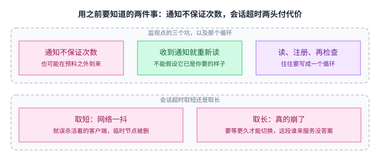

把读、注册、再检查写成一个循环，才不会偶发地漏掉一次变化；而会话超时取短会误杀活着的客户端，取长会让真正的崩溃等更久才切换。

## 脉络回顾：从「达成一致」到「把一致做成零件」

把这一讲放回整门课的线索里看，它的位置很清楚。

前面几讲回答的是「怎么让一批机器对同一件事达成一致」：[[term:paxos]] 与 Raft 给出[[term:consensus]]的做法，[[term:leader-election]]、[[term:term]] 编号、复制 [[term:log]] 是其中的零件；Lab 3 让你亲手写过一遍。ZooKeeper 回答的是另一个问题：达成一致之后，怎么把它做成别人能直接用的零件。

它给出的零件就是这一讲反复出现的几样：[[term:zab]] 用 [[term:zxid]] 给所有写排出一个全序；而每个 znode 自己还带一个**版本号**（它的数据每改一次加一），条件写靠的是这个版本号，不是 zxid（两者不要混：前者是「这条路径的这份数据改过几次」，后者是「整个集群的第几个事务」）；临时节点把「谁还活着」变成一条可以删除的记录；顺序节点把「谁先来」变成一个数字；监视点把「等」从轮询变成一次回调；会话终结时的原子删除加拒绝对话，又把「判决可能出错」这件事兜住。把它们组合起来，就得到锁、选主、成员表和配置管理，而应用侧写的仍然是顺序代码。

代价写在明面上：读可能是旧的，通知只响一次，数据必须装进内存，多数派不在就停摆。它没有解决一致性问题，只是把一致性做成了一个小而通用的服务。etcd 和 Consul 沿着同一条路做了不同的取舍。

再往后看，下一讲是分布式事务，会去处理 ZooKeeper 明确留下的那块空白：跨多个对象的更新怎么变成一笔[[term:transaction]]。[[term:two-phase-commit]] 是怎么做的，它在什么情况下会卡住，以及 Spanner 那样把一致性推到跨分片、跨数据中心的系统又是怎么绕的。

## 溯源

- 对应：MIT 6.5840 / 6.824 Lecture 9 — ZooKeeper（Spring 2026）
- 主要依据：讲座笔记 l-zookeeper.txt；课程笔记引用的论文为 Hunt、Konar、Junqueira、Reed，"ZooKeeper: Wait-free coordination for Internet-scale systems"（USENIX ATC 2010）
- 官方链接：https://pdos.csail.mit.edu/6.824/notes/l-zookeeper.txt
- 说明：本文为该讲的重新讲解，未逐句翻译原笔记，也未转载其幻灯片与图表。文中性能数字来自课程笔记转述的论文数据。
