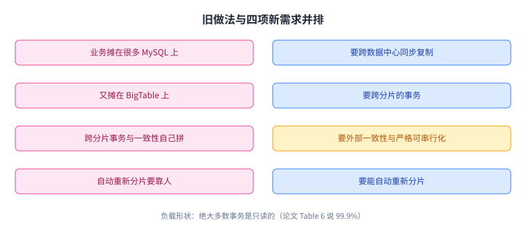
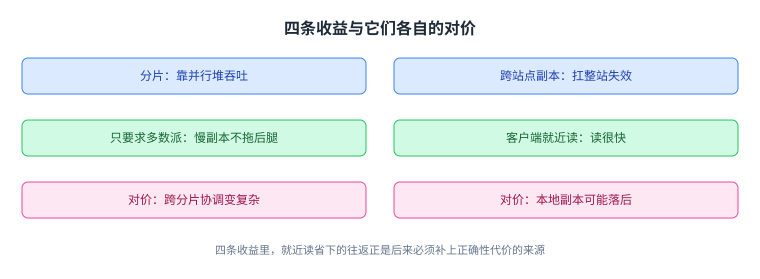
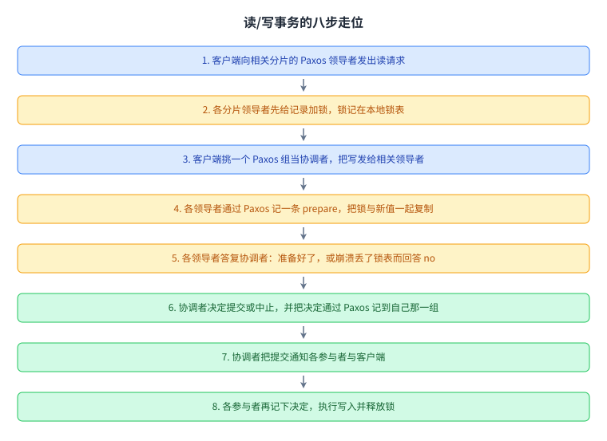
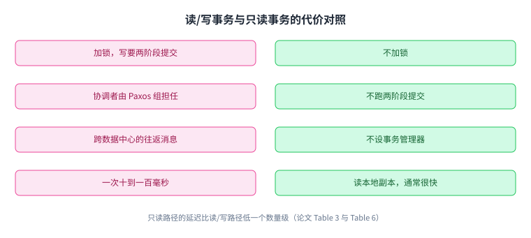
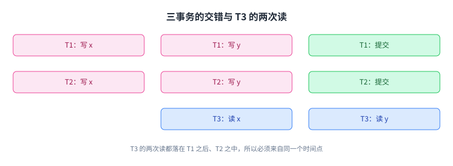
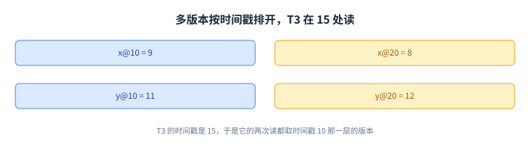
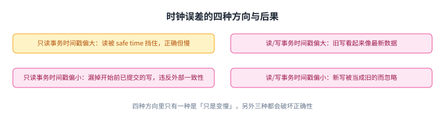
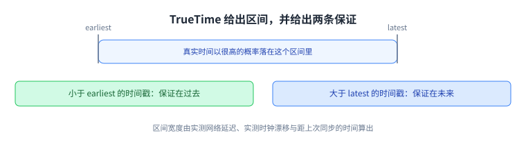
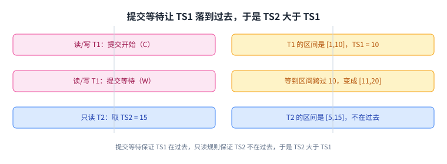
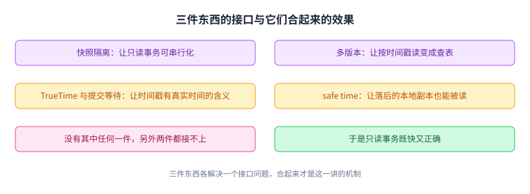

+++
title = "Spanner：把时间戳做成分布式事务的地基"
lecture = 12
slug = "spanner"
status = "draft"
source_kind = "notes"
source_url = "https://pdos.csail.mit.edu/6.824/notes/l-spanner.txt"
source_title = "Lecture 12: Spanner"
output_mode = "explanation"
+++

> 来源课程：MIT 6.5840 / 6.824 Distributed Systems（Robert Morris、Frans Kaashoek 与 MIT PDOS）；
> 对应内容：Lecture 12 — Spanner，阅读材料是 Google 的 "Spanner: Google's Globally-Distributed Database"（OSDI 2012）；
> 原文笔记：https://pdos.csail.mit.edu/6.824/notes/l-spanner.txt ；
> 上游许可：课程主页标注 CC BY 3.0 US，但本讲所依据的笔记文件本身没有许可声明，覆盖范围未获确认，因此本页只讲概念、不转载任何原文；
> 本文由 CourseLingo 原创撰写：我们对这一讲的主题做了重新讲解，而不是翻译原讲座文本，也没有逐句改写原文、没有转载它的幻灯片与图表；本文非官方材料，CourseLingo 与 MIT 及本课程教学团队无隶属关系；如与原文有出入，以原文为准。

## 一个不肯将就的取舍：跨数据中心的分布式事务

前面几讲把「怎么让一批机器对同一件事达成一致」讲透了，但那些系统都待在一个数据中心里。这一讲讨论的 Spanner，把这个问题的范围推到了全球：多台机器分散在多个数据中心，用户仍然要求它们表现成一台数据库。

笔记开头就点明了它当年为什么特别：

> Unusually ambitious for its time: Wide-area distributed transactions. Consistent wide-area replication.

在一个跨广域网上做分布式事务，同时保持副本一致，这在当年是异常激进的目标。而它的做法里有一串值得学的点子：用 [[term:paxos]]Paxos 承载两阶段提交的参与者；只读事务不加锁，靠快照隔离；只读的事务从本地副本读，但读到的仍然是新鲜数据；以及用同步过的时间来保证外部一致性。

而它并不是一个漂亮但没人用的系统。它在 Google 内部被大量使用，并且影响到了后来的系统，笔记举的例子是 CockroachDB。这也解释了它为什么值得花一讲：它的取舍后来变成了许多系统的默认出发点。

在这条路上它并不是 Google 的第一个系统。更早的 Chubby 提供的是锁与粗粒度的协调，而 Spanner 把事务直接做进了数据库，两者的定位并不相同。

这一讲要解决的场景也很具体。真正的动机来自 Google 的 F1 广告数据库（论文第 5.4 节）：它原先是在很多个 MySQL 与 BigTable 数据库上拼起来做分片的，用起来很别扭。它需要四件事：跨数据中心的同步[[term:replication]]，用来扛住整个故障域的失效；跨分片的事务；外部一致性（也就是线性一致性，或严格可串行化）；以及自动重新分片。而它的负载有一个很关键的特征：绝大多数事务是只读的。



这张图给出了这一讲的全部张力：需求里有四条硬指标，而负载的形状（几乎全是只读）决定了优化的重点应该放在只读那一边。

## 基本组织：分片加上每个分片一个 Paxos 组

Spanner 的骨架其实很好描述。数据先按范围分片，比如 `a-m` 一片、`n-z` 一片；而每个分片都在多个数据中心留有副本，副本之间用一个 Paxos 组来维护一致。

> Replication managed by Paxos; one Paxos group per shard. Paxos similar to Raft -- replicas, leader, quorum, log.

笔记顺手解释了这个 Paxos 组是什么：它和前面讲的 Raft 是同一套东西，有机器的角色（副本、[[term:leader]]）、有[[term:quorum]]、有一份[[term:log]]。区别在于副本分布在不同的数据中心，而位置这样摆的用意是：希望它们独立地失效，一个数据中心出事不至于连带另一个。

客户端这边，每个数据中心都有自己的客户端（比如 Gmail 的网页服务器），它们就近连自己所在数据中心的副本。读可以走本地副本，这是性能的来源；写和跨分片的事情则要走到分片的 Paxos 领导者那里。


这张图是后面所有讨论的地图：一份数据横跨多个数据中心，而每一次读写都要在其中选一个副本、付一条跨中心的往返。

## 为什么这样摆：四条收益

骨架摆好之后，收益可以逐条说清。

分片换来吞吐。 数据切成很多片之后，每片各有一组机器在服务，总量上就能靠并行堆上去。

跨站点副本换来可用性。 副本放在不同数据中心，是为了扛住整个站点的失效。这一点与前面讲复制时的理由相同。

只要求多数派，所以慢副本不拖后腿。 Paxos 只要[[term:majority]]同意就能推进，所以少数距离远、响应慢的副本可以被绕过，而不必等它。

客户端就近读，所以读很快。 这是最要紧的一条：只读请求可以交给本地副本，不必跨数据中心往返。

把这四条收益和它们各自付出的代价画在一起，就能看出为什么读那一条最贵：



这张图里最要紧的是最后一条：**就近读省下的那条往返，正是后面必须补上的正确性代价的来源。**

## 挑战：读与写在 Spanner 里被分开处理

收益说完了，代价也就清楚了。只读事务看起来最无害，其实最难，因为用户希望它既本地又快，又必须正确：

> Can we have multi-record read-only transactions without locking? Data on local replica may not be fresh if not in Paxos majority.

两个问题同时压在一起：多记录只读事务能不能不加锁，以及本地副本可能落后（它不一定是 Paxos 多数派中的一员，未必见过最新提交）。第三条则是事务可能横跨多个分片，也就横跨多个 Paxos 组。

面对这些，Spanner 做了一个贯穿全篇的选择：读/写事务与只读事务走完全不同的两条路。

这两条路要解决的问题可以并排看：读/写那条要保住可串行化，只读那条要在不加锁的前提下同时做到可串行化与外部一致性。


这张图解释了这个分岔为什么必要：**只读事务多了一条读/写事务没有的约束，而它又多到占了绝大多数请求。**

## 读/写事务：用 Paxos 把两阶段提交的参与者复制起来

先看读/写事务。笔记用的例子是一笔转账：

> BEGIN
>   x = x + 1
>   y = y - 1
> END

要求有两条。第一条是不许插队：在这两个操作之间，不能让别的读写瞄到 x 或 y 的中间状态。第二条是[[term:commit]]之后人人可见：提交一旦完成，之后所有读都应当看到我们的更新。

做法可以概括成一句：[[term:two-phase-commit]]，而参与者是被 Paxos 复制过的。

> Summary: two-phase commit (2pc) with Paxos-replicated participants.

它的走位分成八步。客户端先把读请求发给相关分片的 Paxos 领导者，领导者先给记录加锁（可能要等，因为锁可能被别人拿着）；每个分片有自己的一张锁表，放在该分片的领导者上。锁不通过 Paxos 复制，所以领导者一失效，事务就只能中止，不能靠另一个副本接着做。客户端随后把写留在本地，谁也不告诉。

到了提交，客户端挑一个 Paxos 组来当两阶段提交的协调者（TC），把写发给相关的分片领导者。每个被写的分片领导者做四件事：拿到或升级记录的锁；通过 Paxos 记一条 prepare 记录，把锁和新值一起复制出去；告诉 TC 自己准备好了；如果它崩溃过、锁表丢了，就告诉 TC "no"。

TC 收到答复之后决定提交或中止，把决定通过 Paxos 记到自己那一组里，然后通知各个参与者和客户端。每个参与者再把 TC 的决定通过 Paxos 记下来，执行写入（值在 prepare 阶段就已经记过），最后释放这把事务的锁。



这张图是这一讲唯一一条完整的事务流程，读它时只要抓住一件事：每一个"记一笔"的动作都是一次 Paxos 复制，而协调者本身也活在一个 Paxos 组里。

而这正好回答了笔记里那个很现实的抱怨：

> 2pc widely hated b/c it blocks with locks held if TC fails. Replicating the TC with Paxos solves this problem!

两阶段提交之所以被人讨厌，是因为协调者一挂，参与者就带着锁僵在那里。而在这里，协调者是被 Paxos 复制的一个组，它自己就容错，于是那一段最危险的等待被消掉了。除此之外，加锁带来的是可串行化，这也是正确性的来源。

代价是慢。笔记给的数量级是 10 毫秒到 100 毫秒：中间要跨数据中心的往返消息，还要同步落盘。但客户端多、分片多，所以只要系统够忙，总吞吐仍然可以很高。



这张图把两条路分开摆：**Spanner 允许读/写事务慢，因为它的负载里几乎全是只读事务。**

## 只读事务：三条要同时满足的约束

只读事务可以一次读多条记录，也可以跨多个分片。而它在负载里的占比高得惊人：笔记引 Table 6 说，99.9% 的事务是只读的。既然绝大多数请求都在这一侧，那就值得为它付代价，哪怕让读/写事务更慢一点。但正确性不能松。

Spanner 为只读事务砍掉了三样东西，而这三样正是读/写路径上最贵的部分：不做两阶段提交、不设事务管理器、完全不加锁。动机有两条：一是避免为了拿时间戳而跑到 Paxos 领导者那里做跨数据中心往返；二是避免用锁把读/写事务堵住。再加上第三个省钱的地方：读本地副本，同样是为了绕开 Paxos 与跨中心通信。代价也很直白：本地副本可能不是最新的。

这一套的效果，笔记用 Table 3 与 Table 6 的数字说明：只读路径的延迟比读/写路径低一个数量级。而砍掉这三样之后还剩一个问题：凭什么仍然正确。

约束有两条，而且都要满足。

可串行化：结果必须和事务一条条顺序执行一样，尽管它们实际上可能在并发。

> I.e. an r/o xaction must essentially fit between r/w xactions. See all writes from prior transactions, nothing from subsequent.

也就是说，一个只读事务必须**恰好嵌在**读/写事务之间：看到它之前所有事务的写，看不到它之后任何事务的写。而它同时又是并发的，还没加锁。

外部一致性，笔记把它与线性一致性、严格可串行化当作同一件事：如果 T1 在 T2 开始之前就已经完成，那么 T2 必须看得见 T1 的写。这里的"之前"指的是真实世界的时间，也就是墙上时钟。麻烦在于 T2 可能完全不知道 T1 存在、可能连的是另一个数据中心的副本、也没有锁可以依靠。

读到这里，一个很自然的想法会被否掉：为什么不让只读事务直接读最新已提交的值。笔记用一个三事务的例子说明它不够用：

> T1:  Wx  Wy  C
> T2:                 Wx  Wy  C
> T3:             Rx             Ry

T1 与 T2 是两笔转账，T3 要读这两个账户。要求是：T3 要么看到 T2 的两笔写，要么两笔都看不到，不能只看到一半；并且 T3 的两次读必须落在同一个时间点上，相对 T1 与 T2 不能一半在前一半在后。加锁确实能解决它，但那正是只读事务想避免的东西：T3 的读会把 T2 的写堵住。



这张图是只读事务全部难点的来源：两条读语句之间的那一小段并发，正是必须被消掉的东西。

## 快照隔离：多版本加上每笔事务一个时间戳

Spanner 的办法是让数据库为每条记录保存多个版本，每个版本带一个时间戳。写不是覆盖，而是新增一个版本。每笔事务也拿到一个时间戳：读/写事务的所有写都打上它自己的时间戳；而只读事务的读，看到的是它自己的时间戳那个时刻的版本，也就是时间戳最大、但小于该事务时间戳的那个版本。

这套做法叫快照隔离。它的效果用一个具体的例子最清楚。假设四个版本的账面值是这样：

```
x@10=9   x@20=8
y@10=11  y@20=12

T1 @ 10:  Wx  Wy  C
T2 @ 20:                 Wx  Wy  C
T3 @ 15:             Rx             Ry
```

其中 `@ 10` 表示时间戳。于是 T3 的两次读都会从 `@10` 的版本里取：它会读到 `x=9` 与 `y=11`。注意 T3 读 y 的时刻在 T2 提交之后，但它仍然读到旧值，因为它的时间戳是 15，落在 T2 的 20 之前。这样结果就是可串行化的，等价于按时间戳顺序 T1、T3、T2 串行执行。

这里有两处需要说明清楚，否则数字会对不上。第一，两笔转账的方向相反：T1 让 x 加一、y 减一，所以 `x@10=9` 与 `y@10=11` 说明初始是 `x=8`、`y=12`；而 `x@20=8`、`y@20=12` 说明 T2 是反过来的一笔（x 减一、y 加一）。笔记给出的例子只写了 T1 的方向，第二个方向是从这组数值里推出来的。第二，`x@20=8` 这样的记号是"时间戳 20 那个版本的值是 8"，不是"x 等于 20 减 8"。

而 T3 读到旧值并不违反外部一致性：T2 与 T3 是并发的，外部一致性允许它们按任一顺序排；而只读事务的职责是按自己的时间戳读，不去看更晚的写。

这套做法的好处是：不加锁也能拿到事务级的（可串行化）读，于是读/写事务既不用等它、也不用为它通信。到目前为止的代价只有一个，就是必须为快照隔离保存多个版本。



这张图解释了这个方案的机制：时间戳负责定序，多版本负责让"按某个时刻读"变成一次查表。

## 本地副本可能落后：safe time

只读事务要走本地副本，而本地副本的麻烦立刻出现：如果这个副本不在 Paxos 的多数派里，它可能还没见过 T1 的写，于是它给出的"时间戳 15 的快照"可能是缺了东西的快照。

解法是一个叫 safe time 的量。

> Before serving a read at time 20, replica must see Paxos write for time > 20. So it knows it has seen all writes < 20.

关键在于领导者按时间戳顺序发出写这一条。副本因此可以这样自检：在我还没见到任何时间戳大于 20 的写之前，我不能确认自己已经收齐了所有时间戳小于 20 的写。于是副本可以先缓一缓这次读，等到条件满足再回答。它还需要在另一种情况下等：如果本机上存在已经 prepare、但尚未提交的读/写事务，也要推迟（论文第 4.1.3 节）。

于是结论就成立了：只读事务可以交给本地副本，通常很快，只在这两种情况下被推迟。


这张图给出了"本地读也能新鲜"的全部依据：副本不是靠时间戳本身，而是靠"见过更晚的写"来判断自己收齐了。

## 时钟不对会怎样：四种方向

到这里，方案依赖一个尚未兑现的前提：事务拿到的那个时间戳必须可信。而机器上的时钟并不准。笔记把出错的四种方向都列了出来，而且它们并不等价：

- 只读事务的时间戳偏大：它会高于副本的 safe time，于是读会被推迟。结果是正确但慢，慢的量级就是时钟误差。
- 只读事务的时间戳偏小：它会漏掉那些在它开始之前就已经提交的写，因为它会去取更旧的版本。这直接违反外部一致性。
- 读/写事务的时间戳偏大：旧的写会让只读事务看起来像最新数据。
- 读/写事务的时间戳偏小：新的写会被只读事务当成旧的而忽略掉。

后三种都会破坏正确性。笔记给了一个最小反例：读/写事务 T1 在时间戳 10 提交了 `x=2`，而只读事务 T2 拿到的时间戳是 5，于是它读到的是 T1 之前的 x。可是在真实时间里，T2 是在 T1 提交之后才开始的，外部一致性要求它必须看到 `x=2`。

而机器时钟为什么不准，笔记给了两条：绝对时间永远不会完全对，这叫偏移；而走时速率也不会完全对，这叫漂移。你当然可以去问一个更好的时钟，把偏移纠正过来、把漂移测出来补偿掉，但两次比较之间的通信延迟本身是有波动的，所以比较结果仍然带误差。



这张图是这一讲的转折点：时间戳的两个方向里，只有一个方向只是性能问题，另一个方向是正确性问题。

## TrueTime：把"现在几点"从点变成一个区间

Google 的解法不是把时钟做得更准，而是不再假装自己知道确切的时间。论文第 5.3 节描述的时间基准系统是一棵树：最上面是 UTC(USNO) 与 GPS 卫星，往下是主时钟与时间服务器，客户端周期性地通过网络向它提问。不确定性有两个来源：网络延迟，以及两次同步之间的漂移。

TrueTime 是这套服务给出的接口，它返回的是一个区间，而不是一个点：

> Time service yields a TTinterval = [ earliest, latest ]. The correct time is somewhere in the interval, with high probability.

区间的宽度是根据实测的网络延迟、实测的时钟漂移、以及距上次同步的时间算出来的。论文 Figure 6 说，这个宽度通常小于 1 毫秒，但有时候会超过 10 毫秒。所以服务器时钟并不是精确同步的。但即便只是区间，也能给出两条非常有用的保证：一个大于 `latest` 的时间戳一定在未来；一个小于 `earliest` 的时间戳一定在过去。



这张图说明了这个设计的取向：**不追求时钟准确**，而追求"我对误差有界并且知道界在哪"。

## 两条规则与提交等待

有了区间，Spanner 就可以用两条规则把外部一致性钉住。读/写事务的规则有两条（论文第 4.1.2 节）：开始规则是在提交开始时取 `TS = TT.now().latest`，也就是它将要写进记录的那个时间戳；提交等待是在释放锁或回复客户端之前，一直等到 `TS < TT.now().earliest` 成立。第二条规定的作用是保证这个时间戳确实已经在过去。

只读事务有一条规则（第 4.1.4 与 4.2.2 节）：取 `TS = TT.now().latest`，然后按这个时间戳去读（严格说，是读时间戳最大且小于 TS 的那个版本）。因为取的是 `latest`，这个 TS 保证不在过去。

把两条规则放到同一个场景里，结论就出来了。笔记的场景是：T1 先完成，T2 才开始，而 T2 必须看到 T1 的写，也就是需要 `TS1 < TS2`。

```
               TS1=10
               [1,10]     [11,20]
  r/w T1:        C..........W
                                   TS2=15
                                   [5,15]
  r/o T2:                            Rx
```

图里 `C` 是提交开始，`W` 是提交等待结束。T1 在提交开始时取 `latest`，得到 10，此时区间是 [1,10]；提交等待一直等到 `TS1` 落进过去，也就是等到区间整体跨过 10，变成 [11,20]。T2 开始后取 `latest`，得到 15。于是论证只有三步：提交等待保证 TS1 已经在过去；只读规则取 `latest` 保证 TS2 不在过去；两者合起来就有 TS2 > TS1，所以 T2 一定看得到 T1 的写。

笔记还给了一个很日常的验证方式：我改了密码、等它完成，然后从另一个数据中心登录。外部一致性保证我一定会遇到新密码。

顺带回答了另一个问题：读/写事务为什么也取 `latest`。笔记说，上面的推理其实允许任何"能被提交等待推到过去"的时间戳。真正的原因是读/写事务之间也要排好序：假设 T3 之后又有 T4，那么必须有 TS3 < TS4，否则一个看到了 T4 的只读事务可能会看不到 T3。把与只读事务相同的推理用在读/写事务上，TS4 就会大于 TS3。



这张图是整个方案的收口：提交等待把"时间戳落在过去"变成一句可以证明的话，只读规则再保证另一个时间戳不在过去。

## 小结与边界

三件东西合起来，这一讲才闭环，先把它们的接口画出来：



这张图是整讲的收束：**三件东西各解决一个接口问题，少一件整套机制就接不上。**

把三件东西合起来看，这一讲的机制就完整了：快照隔离让只读事务具备可串行化，时间戳负责定序，多版本负责在某个时间戳上做一致的读；同步时间加提交等待给出外部一致性，哪怕事务分布在不同数据中心；safe time 则让落后的本地副本也能被放心地读。

收益是两条：只读事务读本地副本、不加锁，于是有了相对于读/写事务那个数量级的延迟差距。代价有两条，而且都表现为等待：只读事务的读可能因为 safe time 而暂停，去等副本追上；读/写事务的提交则要在提交等待里等够。而这两处等待的长短，直接取决于 TrueTime 区间的宽度，这也是笔记在末尾标出的那个核心问题。

至于它在系统史上的位置，笔记的判断是克制的：在跨地理分布的部署上提供分布式事务，这在当时极为罕见，Spanner 是一个让人意外的证明，证明它可以做得很实用；而其中最有意思的部分是时间戳方案。它后来成了 Google 的一项商用服务，在内部被广泛使用，也有影响力。

## 读完应该能回答

- Spanner 为什么要跨数据中心做分布式事务，它的动机场景缺了哪几样能力；
- 分片、副本与 Paxos 组是怎样拼起来的，这样摆换来哪四条收益；
- 读/写事务的完整走位是什么，为什么把协调者做成 Paxos 组就消掉了两阶段提交最被人诟病的那一点；
- 只读事务砍掉了哪三样代价，为什么仍然需要可串行化与外部一致性这两条约束；
- 快照隔离用时间戳与多版本各解决了什么，为什么读到旧值不算违反外部一致性；
- safe time 凭什么判断一个本地副本已经收齐了某时刻之前的写；
- 时钟误差的四种方向分别会导致什么后果，哪几种是正确性问题；
- TrueTime 给出区间而不是点，这个区间怎样支撑提交等待，进而推出 TS1 < TS2。

## 脉络回顾：从"达成一致"到"把一致性推到地球上"

把这一讲放回整门课的线索里，它的位置很清楚。

前面几讲处理的是一个数据中心内部的一致性：Paxos 与 Raft 让一批机器对同一份日志达成一致，ZooKeeper 把这件事包装成可以直接使用的零件。它们的共同前提是机器离得近，往返在微秒到毫秒量级。而这一讲把同一批机器摊到几千公里上，往返变成了几十毫秒，于是前面所有方案的"多等一轮"都变得昂贵。

它解决的那一环，是把一致性与地理位置分开。Spanner 的办法不是发明新的共识协议，而是给已有的两套东西配上新的地基：跨分片用两阶段提交，分片内部用 Paxos 复制，这样共识仍然只在数据中心内部的少数派之间发生；而跨数据中心的顺序问题，交给一套有时间戳的快照去解决。

最要紧的转折在它对时间的用法上。前面几讲里，因果关系靠日志顺序、任期编号这类逻辑时钟来表达；而 Spanner 用了一个物理时钟，并且刻意不假设它准，只要求它的误差有界。于是"真实时间上的先后"第一次可以被写成一个可证明的不等式（TS1 < TS2），而外部一致性就不再是口号，而是提交等待那一步等出来的结果。

它留下的空白也很清楚。笔记明确写了它的场景假设：负载里几乎全是只读事务，所以它愿意让读/写事务更慢。换一种负载，这套取舍就要重新算。而它依赖的 TrueTime 也不是任意环境都有的东西：CockroachDB 那一路的后续讨论，正是围绕"没有原子钟与 GPS 的情况下怎么活"展开的，笔记把它的链接也放在了末尾。

下一讲是链式复制，笔记的说法是它比 Raft 与 Paxos 更简单，可以看作这条线上一次向下的回望。

## 溯源

- 对应：MIT 6.5840 / 6.824 Lecture 12 — Spanner（Spring 2026）
- 主要依据：讲座笔记 `_fc/l-spanner.txt`（330 行，13,500 字节，SHA256 前 16 位 `22D1FDF3C5EA5386`）；课程笔记引用的论文为 Google，"Spanner: Google's Globally-Distributed Database"（OSDI 2012）
- 官方链接：https://pdos.csail.mit.edu/6.824/notes/l-spanner.txt
- 本页补充的三处说明：一是快照隔离例子里两笔转账方向相反（T1 是 x 加一、y 减一，T2 是反向），这从笔记给出的四组数值推出来的，笔记只写了 T1 的方向；二是把 `x@20=8` 这类记号解释为"时间戳 20 的那个版本的值是 8"；三是把笔记里"Paxos similar to Raft"这一点按论文的用法写成多副本的状态机复制。
- 说明：本文为该讲的重新讲解，未逐句翻译原笔记，也未转载其幻灯片与图表。文中性能数字与表格编号（Table 3、Table 4、Table 6、Figure 6）均来自课程笔记对论文数据的转述。
