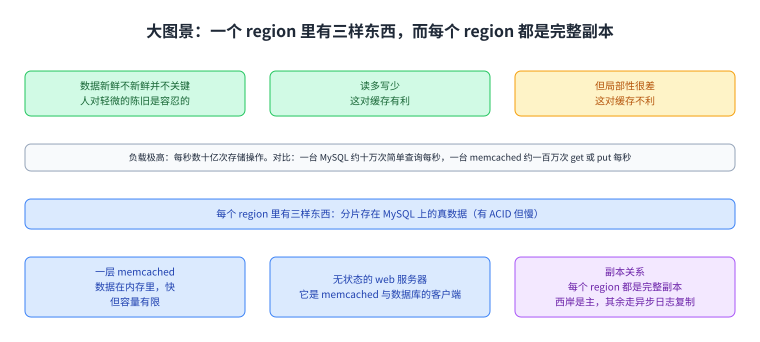
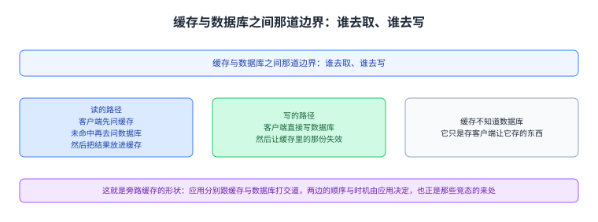
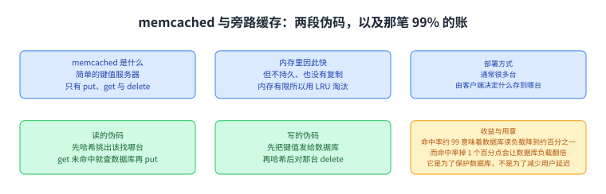
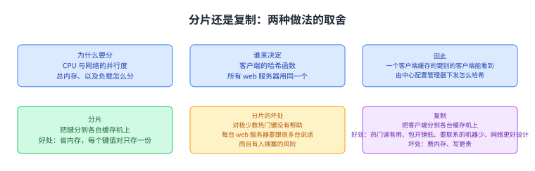
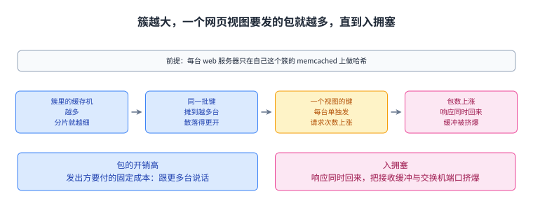
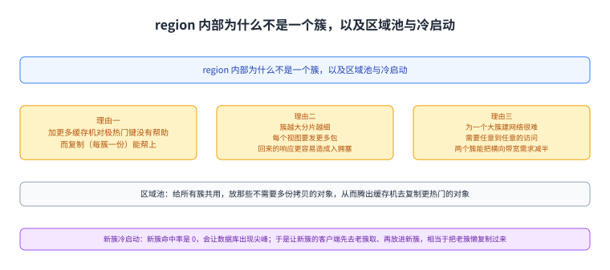
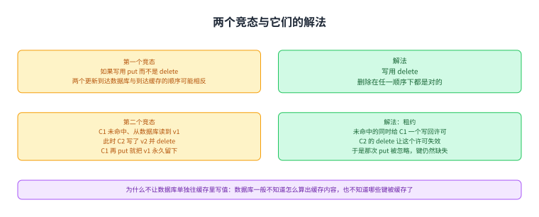
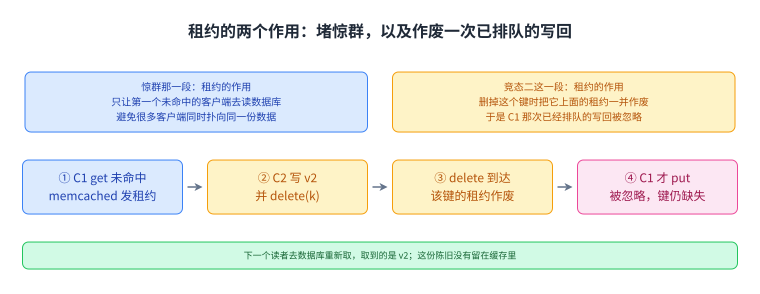

+++
kind = "lecture"
lecture = 16
slug = "memcached"
title = "缓存一致性：Facebook 的 Memcached"
status = "draft"
output_mode = "explanation"
source_kind = "notes"
source_url = "https://pdos.csail.mit.edu/6.824/notes/l-memcached.txt"
+++

> 来源课程：MIT 6.5840 / 6.824 Distributed Systems（Robert Morris、Frans Kaashoek 与 MIT PDOS）；
> 对应内容：Lecture 16 — Cache Consistency: Memcached at Facebook，阅读材料是 Nishtala 等人的 "Scaling Memcache at Facebook"（NSDI 2013）；
> 原文笔记：https://pdos.csail.mit.edu/6.824/notes/l-memcached.txt ；
> 上游许可：课程主页标注 CC BY 3.0 US，但本讲所依据的笔记文件本身没有许可声明，覆盖范围未获确认，因此本页只讲概念、不转载任何原文；
> 本文由 CourseLingo 原创撰写：我们对这一讲的主题做了重新讲解，而不是翻译原讲座文本，也没有逐句改写原文、没有转载它的幻灯片与图表；本文非官方材料，CourseLingo 与 MIT 及本课程教学团队无隶属关系；如与原文有出入，以原文为准。

## 这一讲为什么值得读：一篇把系统做大的经验论文

这一讲的阅读材料不是一份协议设计，而是一篇经验论文：作者们要回答的是「我们怎么把一个已经很大的系统做大」。源笔记把它的价值列成三条：它讲的是一套真实系统怎么被撑起来、它把遇到的问题与解法都写出来、以及它给了一个看真实世界的窗口，而贯穿全篇的取舍是性能、[[term:consistency]]一致性、实用性三者之间的平衡。

这一讲要解决的痛点也在这里：缓存本身不难，难的是在把缓存加到多数据中心、上千台缓存机之后，读到的东西还能不能算对。源笔记说得很直白：论文的大部分篇幅都在讲怎么避免读到陈旧的缓存数据，而那些陈旧恰恰是当初为了提性能才引入的。

图里上面是这一讲的材料与它的性质（一篇经验论文，讲怎么把一个系统做大），中间三格是它的三个价值（真实系统怎么被撑起来、问题与解法都在里面、一个看真实世界的窗口），下面是那条贯穿全篇的取舍（性能、一致性、实用性）。

## 大图景：数据、负载与多数据中心

源笔记先给规模。Facebook 存的东西是朋友列表、状态、帖子、点赞、照片这类数据；它给出四条判断：这些数据新鲜不新鲜并不关键，因为人对轻微的陈旧是容忍的；负载是读多写少的（这对缓存有利）；但局部性很差（这对缓存不利）；而负载极高，源笔记给的是每秒数十亿次存储操作，并把它与单机能力对比：一台 MySQL 大约每秒十万次简单查询，一台 memcached 大约每秒一百万次 get/put。这三个数要分清说的不是同一层：「每秒数十亿次」是整个 Facebook 的负载，而后面两个是单台服务器的能力。把量级摆平就能看出结论：数十亿除以十万是四个数量级上下，除以一百万也有三个数量级上下，也就是说整个负载比任何一台服务器能扛的量高出几千到上万倍。这个差距就是这道题的全部难度来源：单靠把数据库换更大是追不上的，必须加一层缓存、并且把负载摊到很多台机器上（下一节讲怎么摊）。

接着是多数据中心的形状。源笔记说它至少有西岸与东岸两个数据中心，每个数据中心叫作一个 region，而每个 region 里有三样东西：真正的数据分片存在若干 MySQL 数据库上（有 ACID，但慢）；一层 memcached（数据在内存里，快，但容量有限）；以及无状态的 web 服务器（它是 memcached 与数据库的客户端）。每个 region 的数据库里都有完整副本，其中西岸是主，其余 region 通过 MySQL 的异步日志复制跟着它。

图里上面三格是源笔记给的规模判断（数据新鲜不新鲜并不关键、读多写少、局部性很差），中间一格是那个量级对比（每秒数十亿次操作；一台 MySQL 约十万次查询每秒，一台 memcached 约一百万次 get/put 每秒），下面三格是一个 region 里的三样东西（分片在 MySQL 上、快但容量有限的一层 memcached、无状态的 web 服务器）与那句副本关系（每个 region 都是完整副本，西岸是主，其余走异步日志复制）。

## memcached 是什么，以及它怎么被用

源笔记给的定义很朴素：memcached 是一个简单的键值服务器，接口就是 `put(k,v)`、`get(k)`、`delete(k)`；数据放在内存里，因此快、但不持久、也没有复制；内存有限，所以用 LRU 淘汰；它只是存客户端让它存的东西；通常部署很多台，而由客户端决定什么存到哪台。（这里的「没有复制」指服务器自己不做副本；下一节说的「复制」是客户端哈希把同一份数据放进不同簇形成的多份拷贝，那是部署策略，不是服务器之间的复制。）

真正的设计在于应用怎么用它。Facebook 把 memcached 当旁路缓存（look-aside）用：真数据在数据库里，应用分别跟 memcached 与数据库打交道，而 memcached 根本不知道数据库的存在。源笔记给了两段伪码。读的时候：先对键做哈希挑出该找哪台 memcached，去 `get(k)`；如果拿到空值，就从数据库取，然后 `put(k,v)` 缓存起来。写的时候：把键值发给数据库，再对键做哈希，然后对那台 memcached `delete(k)`。

图里三格是读的路径、写的路径与「缓存不知道数据库」这件事。

源笔记还解释了这套为什么流行：旁路方式让它可以很容易地加进已有的 web 应用；从数据库的行到整个算好的 HTML 页面都能缓存；它灵活、简单、快。至于收益，源笔记算了一笔账：它只对读有帮助，但读占了绝大多数操作；命中率高就能把数据库的负载降下来，源笔记引用的表说命中率约 99%，也就是数据库的读负载降到约百分之一；

而它同时警告：命中率掉 1 个百分点，数据库负载就翻倍。最后它点明这套缓存的用意：它不是为了减少用户看到的[[term:latency]]，而是为了保护数据库不被海量请求压垮。

图里上面两格是 memcached 是什么（简单键值服务器，只有 put/get/delete；内存里快但不持久、无复制、LRU 淘汰；存客户端让它存的东西）与它的部署方式（通常很多台，客户端决定什么存哪台），中间两格是那两段伪码（读：哈希选机器、get、未命中就查数据库再 put；写：先写数据库，再哈希后 delete），下面是它的收益与用意（命中率约 99% 意味着数据库读负载降到约百分之一，而命中率掉 1 个百分点会让数据库负载翻倍；这套缓存是为了保护数据库，不是为了减少用户延迟）。

## 分片还是复制：负载怎么摊到多台缓存机上

既然需要很多台 memcached 来扛总负载（源笔记列了三条理由：CPU 与网络的并行度、总内存、以及负载怎么在它们之间分），那怎么分就成了设计核心。源笔记说分工是由客户端的哈希函数决定的：它可以做分片、也可以做复制、或者两者混合。这里先定义后面反复出现的两个名字：C1 与 C2 是两台客户端，也就是前面说的 web 服务器（在这个系统里做哈希的一直是客户端，memcached 服务器自己不决定任何键放在哪）。而所有 web 服务器用的是同一个哈希函数，所以如果 C1 缓存了某个键，C2 也能看到它；用哪个哈希函数、服务器集合是什么，由一台中心配置管理器下发给客户端。要分清这件事的归属：具体某个键落在哪台 memcached 上，是客户端算出来的，配置管理器只负责告诉客户端「按哪套规则、对哪些服务器算」，它不替客户端决定任何一个键的去处。

源笔记把两种做法的优缺点都列了出来。[[term:sharding]]是把键分到各台 memcached 上：好处是省内存（每个键值对只存一份）；坏处是对极少数热门键没有帮助、每个 web 服务器都得跟很多台 memcached 说话（包的开销高）、而且有入拥塞（in-cast congestion）的风险。入拥塞说的是这样一件事：一台机器同时向很多台服务器发出请求，那些响应会在差不多同一时刻全部回到它这里，把它自己的接收缓冲区、以及路上交换机的端口缓冲区一起挤爆，于是丢包或延迟。它和「包的开销高」不是同一件事：前者是发出方要付的固定成本，后者是响应一起回来时的瞬时压力。

另一种做法是把客户端分到各台 memcached 上（也就是复制）。好处有四个，拆开看：一是当少数键被大量读取时有用（同一份热门数据在多台机器上都有，热度被摊开）；二是一个包里能装下多个请求与响应，开销低；三是需要打交道的服务器少，每包成本低；四是支撑它的网络更容易设计。第四条要说明它比的是什么：这里的「两台」与「一台」指的是网络，不是机器，源笔记的原话是「两张容量各减半的网络，比一张容量翻倍的网络更容易做」（复制让每个簇内部的横向流量减半，于是可以把一张要求很高的网络拆成两张要求较低的）。坏处是更费内存（能缓存的东西变少）、而且写更贵。

图里上面两格是为什么要分（三条理由：CPU 与网络并行度、总内存、以及负载怎么分）与谁来决定（客户端的哈希函数；所有 web 服务器用同一个，所以一个客户端缓存的键别的客户端能看到；由中心配置管理器下发），下面两格是两种做法各自的取舍（分片省内存、但热门键无解、包开销高、有入拥塞风险；复制对热门读有用、包开销低、需要联系的服务器少、网络更好设计，但费内存、写更贵）。

## 跨 region 与 region 内部：为什么是多个簇

源笔记把性能问题分成跨 region 与 region 内部两部分。跨 region 的那组问题是这样：为什么要多个 region。源笔记给了三条：离用户更近（东西两岸各一个）、本地读很快（读本地的 memcached 与数据库）、以及主 region 挂掉时有一个热的副本顶上。它接着问：那为什么不干脆按用户把 region 切开（东岸用户的数据就放在东岸），那样就不需要复制、硬件成本可能省一半。它的回答是：社交网络局部性很差，这招不灵。把这条推理链补出来：按用户切 region 能省掉复制的前提是「一个用户的数据主要被他同一个 region 的人读」，那样读请求就地解决，不必复制到别处；而社交网络里，一个人的数据会被他的朋友读，朋友散布在各个 region，于是东岸用户的数据照样要送到西岸去读，该复制的还是得复制，硬件省不下多少。源笔记因此加了一句：对电子邮件这类应用可能可以，因为通信对象本来就集中。

region 内部的结构是多个簇：每个簇是一整套 memcached 服务器加 web 服务器，而每台 web 服务器只在自己这个簇的 memcached 上做哈希。源笔记给了三条为什么不在一个 region 里只放一个大簇的理由：第一，加更多的 memcached 对极热门的键没有帮助，而复制（每个簇一份）能帮上；

第二，簇越大就意味着分片越细，于是每个网页视图要发更多包。这中间的几步值得补上：每个 web 服务器只在自己这个簇的 memcached 上做哈希，所以簇里的 memcached 越多，同一批键就被摊到越多的机器上；而一个网页视图要取的键往往有 20 到 500 个，这些键于是散落在更多台 memcached 上，每台都得单独发一次请求，包数就跟着涨，回来的响应也就更容易造成入拥塞。源笔记说这些请求必须并行发（串行总延迟太大），可那样所有响应会同时回来，交换机和网卡就会缓冲区耗尽；

图里把这条链的每一步都摆出来了：分片变细并不会直接导致拥塞，中间还隔着「每台单独发一次请求」与「响应同时回来」两步；而最下面两格把「包的开销高」与「入拥塞」分成两种不同的代价。

第三，为一个大簇建网络很难，因为它需要任意客户端到任意服务器的访问，横向带宽必须很大，而两个簇就能把横向带宽需求减半。

源笔记还补了三件事，下面依次说：其一是给不太热门的对象留一个区域池；其二是新簇的冷启动；其三是惊群。紧接的那张图（`mc-10`）画的是前两件，第三件（惊群）在它后面另有一张图。

图里三格是三条理由（为什么不在一个 region 里只放一个大簇），另两处是刚说的三件事里的前两件（区域池与新簇的冷启动）。其一，对不太热门的对象来说复制是浪费内存的，于是他们留了一个区域池（regional pool）给所有簇共用，放那些不需要多份拷贝的对象，放什么由应用软件决定（这里的「应用软件」指的是跑在 web 服务器上、调用 memcached 的那段应用代码，不是 memcached 自己，也不是数据库），这样就能腾出缓存机去复制更热门的对象。其二，新起一个簇本身是个性能问题：新簇命中率是 0，它的客户端会给数据库带来一个尖峰；

于是他们让新簇的客户端先去老簇取，取到之后再放进新簇，相当于把老簇懒复制到新簇。懒复制是相对于「一次性搬过来」说的：系统不主动把老簇的内容搬迁一遍，而是等客户端来取某个键的时候，顺手在老簇取到、再写进新簇，也就是复制的进度由访问驱动，没人访问的键就一直不会被复制过去。（这是新簇冷启动期的临时做法：命中率从 0 升上来之后就回到「只在自己这个簇里哈希」的常态，它不是对那条规则的否定。）其三，另一个过载问题是惊群：一个客户端更新了数据库并删掉某个键，很多客户端同时 `get` 未命中，于是它们一起去数据库取同一份数据，造成没必要的数据库负载；

解法是 memcached 只把租约发给第一个未命中的客户端（租约就是允许它去数据库刷新这份数据的许可），memcached 记住哪些租约有效，对其他客户端说「过几毫秒再试一次」；效果是只有一个客户端去读数据库并写回，其他人稍后重试时大概率就命中了。

至于memcached 服务器故障：源笔记说不能让数据库去扛这些未命中（负载太大），也不能把负载挪给另一台 memcached（同样太大）；他们的做法是 Gutter，也就是一池空闲的 memcached，只有在有缓存机故障之后客户端才会去用，每个簇有自己的一套 Gutter；故障的机器过一阵会被替换，而只要同一时间只有少数几台缓存机倒下，一小池 Gutter 就能给一大批缓存机当备胎。（它为什么不等于「把负载挪给另一台」：Gutter 是空闲的，不承接任何机原有的那份分片负载，只是故障与冷启动期间的临时去处；源笔记没有交代客户端是怎么知道哪台坏了的，也没有交代 Gutter 是怎么被哈希选中的。）

源笔记最后留了一个问题：为什么失效（删除）不发到 Gutter，并给了一个猜测：Gutter 可以持有任意键，所以所有失效都得发给它，那至少让删除流量翻倍，而且可能把很重的负载压到少数几台 Gutter 上。

图里上面两格是多区域的理由与为什么不按用户切 region（离用户近、本地读快、主挂了有热副本；而社交网络局部性差，切了要复制的数据仍然很多），下面三格是惊群与它的解法、以及故障时的 Gutter（一个客户端更新数据库并删除键之后很多客户端一起未命中、一起去数据库取；解法是只给第一个未命中的客户端发租约；缓存机故障时用一池空闲的 Gutter 顶上，而失效不发 Gutter 的理由是那会让删除流量至少翻倍）。

## 一致性：这篇论文的「一致性」是什么意思

源笔记把一致性单独拿出来讲，先给方案：写是直接进主数据库的、带事务，所以数据库自己是自洽的。自洽在这里指的是数据库内部不会自相矛盾：事务要么全做要么全不做，所以像「给点赞计数加一」这种操作，最终落在库里的结果一定是对的。而读就没有保证：读不保证能看到最近一次写、不同客户端看到的也不一定是同一个值，但陈旧得有限，只有几秒钟，也就是[[term:eventual-consistency]]（允许一段时间内读到旧的，但只要不再有新写，过一阵所有读者都会看到同一个新值）。另外还要求读到自己的写：一个客户端自己刚写进去的值，它自己随后去读必须能读到，不能读到比它这次写更旧的版本。这一条是附加在最终一致之上的，因为「最终」只保证过一阵会一致，不保证「我刚写完回头看」能看到自己的写。

源笔记说这是一个常见的模式：更新是 ACID 的、因此慢；读不很一致、但快。它随后解释了为什么接受读到的陈旧数据：这些数据是新闻流条目、帖子、点赞之类，用户看到的内容比数据库稍微滞后一点，很少有人会注意到或者在意；而下次再看时，memcached 大概率已经追上数据库了。

接着是最关键的一句校准：这篇论文说的 consistency 指的是「一次读可能有多旧」，「更一致」意味着读落后于最近的写不太多；它默认读可以是陈旧的，只是想限制陈旧的幅度。源笔记明确点出：这是用户体验视角的一致性，不是关于正确性与可保证性质的那种一致性。

跨 region 的同步方式源笔记也交代了：只有一个 region 是主，所有客户端只把更新发给主 region 的数据库服务器；主数据库把更新日志分发给其他 region 的数据库，后者再应用；其他 region 的数据库是完整副本（不是缓存），而数据库复制的延迟可能相当可观（好几秒）。（这意味着顶上来的那份副本可能落后若干次更新，源笔记没有交代这算不算丢数据；本页只按源笔记复述它的读写保证，不对故障切换时的丢失量下结论。）

至于数据库被写之后怎么处理已经陈旧的缓存，源笔记说一个 region 里一份数据可能有很多份缓存拷贝（每个簇一份），于是有两路失效：一是数据库把失效（`delete`）发给 region 内相关的 memcached 服务器（论文图里那条 McSqueal 通路）。McSqueal 是论文给这条通路起的名字，指的就是「数据库侧发出失效、送到 memcached」这条路；源笔记只是把它当作图 6 里的一条通路来提，没有解释这个名字的由来，我们也不替它编一个解释；二是发起写的那台客户端顺手失效自己本地簇里的缓存，用来满足「读到自己的写」；而其他 region 的数据库听到更新之后，也会发出失效。

图里三格是两路失效与跨 region 的同步方式。

图里三格是写、读与「陈旧得有限」各自的保证，另两处补上读到自己的写与为什么可接受。

## 两个竞态，以及它们各自的解法

源笔记最后用两个竞态把「缓存一致性」讲到了底。第一个竞态说明为什么写要用删除而不是更新：假设写操作被写成「先写数据库，再 `put(k,v)` 到 memcached」，那么当两个客户端同时写同一个键时，两个更新到达数据库的顺序与到达 memcached 的顺序可能相反，于是缓存里就可能留下永久错误的数据；解法就是他们用的 `delete(k)`，因为删除在任一顺序下都是对的。这里的「永久」到底多久，源笔记写的是「可能永久」，没有给时限。按同一个机制推，它至少会留到下次有人写这个键为止（那时缓存里那份会被删除或覆盖）；也就是说它与下面竞态二里那份陈旧数据的命运相同，都是「等下一次写才被清掉」。这一步是我们按机制推的，源笔记没有写。

第二个竞态更像一个真实的坑：键不在缓存里，C1 去 `get` 未命中，接着从数据库读到 v1；就在这时 C2 把数据库里的键写成了 v2 并执行了 `delete(k)`；然后 C1 才 `put(k, v1)`，于是缓存里留下了陈旧数据，而那次删除已经发生过了，这份陈旧会一直留到下次有人写这个键为止。

这里有一处读者容易卡住的前提，先交代清楚：竞态要成立，C1 的 `put` 与 C2 的 `delete` 必须落在同一台 memcached 上，也就是两台客户端在同一个簇里。原因是 C1 的写回只会去它自己那个簇的 memcached，而 C2 的删除也只有落到那一台上，才谈得上「把 C1 的租约作废」；如果两台分属不同簇，它们之间根本没有这一次交锋。而源笔记在这一段里没有明写两台客户端是否同簇，只说了一个 region 内每簇各有一份拷贝；我们把「同簇」写成显式前提，是因为不写它这一步接不上。

解法还是租约，而这里的机制要把前面那节的定义接上。memcached 在返回未命中的同时给 C1 一个关于这个键的租约（也就是写回许可），并且它记着哪些键上当前有有效租约（这一点上一节讲惊群时提过）。于是当 C2 的 `delete(k)` 到达时，它不只是删掉那个键，还把这个键上的租约一并作废；C1 后来拿着已经作废的租约来 `put(k, v1)`，memcached 一看这个键上已经没有有效租约，就忽略这次写回。结果是键仍然是缺失的，下一个读者会去数据库重新取，取到的就是 v2。换句话说，租约在这里的作用不是防止重复读数据库（那是惊群那一段的作用），而是让一次已经排过队的写回在被删除之后失效。

图里上面两格是第一个竞态与解法（如果写用 put 而不是 delete，两个更新到达数据库与到达缓存的顺序可能相反，于是留下永久错误的数据；delete 在任一顺序下都对），下面三格是第二个竞态与解法（get 未命中之后读到 v1，同时 C2 写了 v2 并 delete，C1 再 put 就把 v1 永久留下；租约让 C2 的 delete 作废 C1 的写回许可），以及那个自问自答（为什么不让数据库单独往缓存里写值：数据库不知道怎么算缓存内容，也不知道哪些键被缓存了）。

这张图把「租约」这个词在两处的不同作用并排摆开：在惊群那一段，它省掉的是**重复的数据库读**；在竞态二这一段，它作废的是一次**已经排过队的写回**。同一个机制在两种场合下防的不是同一件事。

源笔记还自问自答了一个很自然的质疑：这些一致性问题是「客户端把数据库数据拷进缓存」造成的，那为什么不让只有数据库往缓存里写值、客户端从不写？它的回答是原则上对，但有两处行不通：一是数据库一般不知道怎么算出缓存里该放的值（缓存内容常常不是数据库记录本身，而是客户端应用代码从数据库结果算出来的东西）；二是数据库不知道什么被缓存了，那样它就会把大量根本没被缓存的键的值也发出去。

## 这一讲给存储系统设计者的三条教训

最后它把这篇论文给存储系统设计者的教训收成三条：缓存是扛住高负载的关键，而不只是用来降低延迟；设计者需要灵活的工具来控制分片与复制；以及[[term:linearizability]]太重，而最终一致又常常不够。

图里三格就是那三条教训。

## 读完应该能回答

1. 为什么 Facebook 把 memcached 当旁路缓存用，这套缓存的收益为什么说主要是保护数据库而不是降延迟？
2. 分片与复制各有什么优缺点，为什么一个 region 里要放多个簇而不是一个簇？
3. 这篇论文说的 consistency 指的是什么，为什么读可以陈旧到什么程度是可接受的？
4. 两个竞态各是怎么发生的，为什么写要用删除而不是更新，以及租约又解决了什么。

## 脉络回顾

这一讲在整门课里的位置很特别：前面几讲（Raft、ZooKeeper，以及更早的 Paxos）处理的是多副本之间要严格一致的场景，而那些做法都建立在「多数派同意」这一步上；这一讲换了一个完全不同的目标，它要回答的是在一个读多写少、而且用户对轻微陈旧并不敏感的系统里，能不能用代价小得多的办法把读分摊出去。答案是能：memcached 一层内存缓存把数据库的读负载降了大约两个数量级，代价是读可能陈旧几秒、不同客户端看到的值可能不同。

最要紧的转折是一致性的口径被换了。这一讲全程讲的 consistency 不是分布式系统课上那种可证明的性质，而是「一次读可能有多旧」这个用户体验口径：写走主数据库的事务，因此数据库自洽；读走缓存，因此允许落后，只要求落后得不多，另加一条「读到自己的写」。

正因为口径换了，后面那些看起来凑合的补丁才说得通：写用 `delete` 而不是 `put`，是为了让两个并发的写在任何到达顺序下都不留下错误；租约是为了堵住「未命中、读到旧值、再写回」这条时间窗；而数据库不单独往缓存里写，是因为算缓存内容与判断哪些键被缓存，都是客户端才知道的事。

这一讲与仓内另外两页有明确分工。`content/09-zookeeper/index.md` 处理的是协调：一组客户端要就「谁是主、配置是什么、锁在谁手上」达成一致，它给的是一套带顺序保证的协调服务；而这一讲处理的是缓存：数据真身在数据库里，缓存只是副本，允许它短暂陈旧。`content/papers/raft/index.md` 处理的是复制日志本身：如何让多个副本对同一串操作达成一致，那是「写到哪、按什么顺序写」的问题；

而这一讲几乎不讨论复制日志，它讨论的是读到的东西能有多旧。换句话说，那两页在争「同一个值到底是什么」，而这一讲在限定「读者可能落后多久」。

## 溯源

- 字段核对：`courses/mit-6.5840/docs/lecture-manifest.md` 第 16 行为 `Cache Consistency: Memcached at Facebook`，源文件 `notes/l-memcached.txt`（标注可用、11,735 B），本仓状态为「待做」；本页按该行落盘到 `content/16-memcached/`、`lecture = 16`、`slug = memcached`。抓取副本在 `_fc/l-memcached.txt`：291 行、11,735 字节、SHA256 `0D477E2E74B3B2B1873CF779DAC2C78D0EEDCA7064C251365EB2B556CAB64BBA`。
- 源的性质与范围：这是一份讲授笔记（源笔记自身就是要点式），不是论文全文；本页只依据这份笔记重新讲解概念，`status = "draft"`，并在 `docs/audit/16-memcached-factcheck.md` 里给出与本页对应的核对草稿。

- - 许可：本课 `course.toml` 的 `[license] verified = false`、`redistribution = "unknown"`（课程主页有徽章，但本讲所依据的笔记文件没有许可声明）因此 本页只写原创讲解，不产出逐字稿、不产出双语原文对照，也没有转载原笔记的图表；Lab 代码与作业答案不在本页范围内。
- 配图：本次为这一页自绘，图都在 `figures/` 目录里（编号是 `mc-1` 到 `mc-13`，编号只是标识、不表示先后；正文里每张图都紧跟在它说明的那一段之后，所以读到的先后与编号的先后不一致），没有取用源笔记的图示（源笔记里以 `[diagram]` 标注的示意图也未转载）；

- 因此「独立/连播/看了哪几张/版本」这一项在本页不适用：本讲没有源图可看。
- 成对的数与跨讲自查（含把源文与我自己写的每个「N 项」数一遍）：源笔记的三条价值、三条 region 作用、三条大簇理由、两条数据库写入理由，后面都正好列出对应条数；命中率的账自洽（99% 对应约百分之一，降到 98% 时未命中率翻倍）；量级对比是三个不同对象对（整体负载、单台 MySQL、单台 memcached）；本轮又补了三件事的逐项点名（区域池、新簇冷启动、惊群）与复制的四条好处，这两处也都与图说明对齐了；本页自己写的每一处数目都重数过一遍：内容小节 8 个、配图 13 张（`mc-1` 到 `mc-13`）、自测题 4 道。
- 术语 grep 的结果：本页涉及的英文词里，`memcached`／`MySQL`／`region`／`cluster`／`LRU`／`Gutter`／`McSqueal`／`lease` 逐个在本仓所有已提交页面 grep 过（`-i`，且把 `[[term:…]]` 里的键也算命中）：这些词此前都没有出现；而 `consistency`／`replica`／`linearizability` 一类在 `09-zookeeper` 与 `papers/raft` 里出现过。

- 结论：本页不新增词条（`glossary.toml` 未改动），专有词一律用纯文本；页内标记只在正文里使用，写完标记后跑了一遍 `validate --strict` 复核。
- 我们补的（原文没有写）：把要点式笔记重新组织成八节的结构说明；后来按读者报告又补了两张图（`mc-12` 讲租约在惊群与竞态二里的两个不同作用，`mc-13` 讲「簇越大、包越多、直到入拥塞」那条链），它们对应的是读者反馈里「两句之间没有桥」与「机制只被暗示过一次」两处；「这一讲把一致性的口径从可证明性质换成了用户体验口径」这个把它与 Raft／ZooKeeper 分开的读法；以及那处 `region` 与 `cluster` 的层级区分。

- - 我没做的事：没有读那篇 NSDI 2013 论文全文（本页只依据这一份讲授笔记）；没有取用源笔记里以 `[diagram]` 标注的示意图；没有核对论文里 Table 2 的原始数字（99% 这个数按源笔记的转述引用）。
- 来源没写、我们写明是推论的两处：一是竞态一里那份错误数据「永久」多久（源笔记只写「可能永久」，没有给时限，我们按同一机制推成「留到下次有人写这个键为止」并标明是推论）；二是竞态二里两台客户端是否同簇（源笔记没有明写，我们把它写成显式前提并说明为什么必须如此）。
- 与仓内两页的分工：`content/09-zookeeper/index.md` 讲的是协调服务（一组客户端就谁是主、配置、锁达成一致，带顺序保证）；`content/papers/raft/index.md` 讲的是复制日志（多副本如何对同一串操作达成一致）；

- 本页讲的是缓存的陈旧程度（真身在数据库、缓存只是副本，允许短暂陈旧），三页的重叠部分是「多副本读到什么才算对」这个问题，而三页各自站在不同的答案上，本页没有重复那两页的机制讲解，只在与它们交界的地方注明「这是同一件事的另一面」。