+++
title = "Ray：用 future 与 ownership 管理细粒度任务"
lecture = 18
slug = "ray"
status = "draft"
source_kind = "notes"
source_url = "https://pdos.csail.mit.edu/6.824/schedule.html"
source_title = "Lecture 18: Ray"
output_mode = "explanation"
papers = ["ray"]
+++

> 本讲的指定阅读是《Ray: A Distributed Framework for Emerging AI Applications》（OSDI 2018，USENIX），
> 以及其后续工作《Ownership: A Distributed Futures System for Fine-Grained Tasks》（NSDI 2021，USENIX）。
> 论文可免费阅读，但 USENIX 未给出复用与翻译条款；本讲依据的课程笔记页也无许可声明，
> 而课程主页的 CC BY 3.0 US 徽章只出现在主页一处，覆盖范围未获确认。
> 因此本页是 CourseLingo 自己撰写的概念讲解，不是任何论文或讲义的译文，不复制原文表述，也不复现原文插图；
> 本页同样不是 MIT 官方材料，不代表课程方立场。笔记里出现的作业讨论题我们只讲其中涉及的概念，不给答案。

## 这一讲要解决什么问题

前面几讲讲的是「一台机器做不完一件事，怎么把它们连起来」：第 1 讲立起分布式系统的框架，第 2 讲讲 [[term:rpc]] 与线程，第 3 讲 GFS 说明数据该放在哪。它们有一个共同前提：一次调用对应一件事，调用方等着结果。

这一讲换一个前提：如果一件事本身可以拆成成千上万个很短的任务（有的只跑几毫秒），而任务之间还要共享状态、还要低延迟，那套「一次调用一件事」的形状就不合适了。[[term:mapreduce]] 与 Spark 擅长大批量的数据流处理，但它们有两个假设：任务的启动开销可以被摊薄，以及计算基本是无状态的一段数据流水线。模型推理、在线视频处理这类负载两条都不满足：它们既要有状态（模型副本、解码后的帧），又要低延迟（不能等一整个批次的边界）。

Ray 是为此重新设计的系统，而这一讲的重点是它的三个想法：future、actor，以及按 ownership 分片的状态管理。这三件事里，第三件才是这一讲的真正主题，因为前两件本身不新，把它们的元数据分散到正确的机器上才是难点。

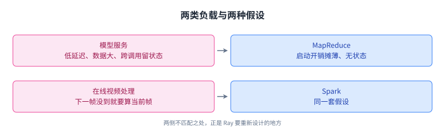

换句话说，Ray 要处理的是「任务的粒度小到元数据本身就成了负担」这一类负载。

## 一、为什么原来的形状不适用

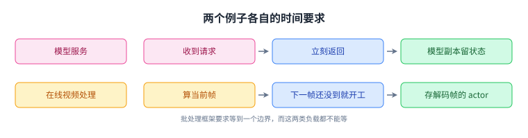

两条流程的共同点是都不能等一个批次的边界，这正是功能与状态必须合在一起的原因。

这一讲开篇把「演进中的并行应用」归纳成两条特征：函数式与有状态要合在一起，以及低延迟要求。它给了两个例子。

第一个是模型服务。一次请求要在很短时间里返回，而请求里可能带着很大的数据（比如用户上传的图片）；同时，路由器与模型副本需要在多次调用之间保持状态（比如加载好的模型参数、累积的统计）。批处理式的框架会把「保持状态」这件事推给用户自己去做，而在服务场景里，状态恰恰是常态。

第二个是在线视频处理，具体例子是 3b 里的视频稳定：要算出一个物体的运动轨迹，程序希望在看到下一帧之前就开始处理当前帧；同时还需要一个 actor 把解码后的帧存起来，供后续步骤复用。这里两个需求同时出现：帧与帧之间有依赖，而每一步都要尽快开始。

教材的结论很直接：MapReduce 与 Spark 不擅长这类负载。

## 二、三个想法

Ray 用三个想法来回应这些需求。

第一是 [[term:future]]：它是这次计算结果的句柄。程序可以异步地调用一个函数，调用立刻返回一个 future；可以把这个 future 的引用当作参数传给别的函数；也可以强制求值（等它算出结果）。它带来的好处是：系统因此可以自己决定这个计算在哪里跑、以及数据什么时候搬家，而不是让程序员把这些决定写在代码里。

第二是 [[term:actor]]：它用来在多次调用之间持有状态。模型服务里的模型副本、视频处理里存帧的对象，都可以是一个 actor。

第三是按 [[term:ownership]] 分片关于 future 的状态。教材在这里没有先解释 why，而是直接说这是第三个想法，把「为什么」留到后面实现那一节，这一讲的结构也是这样：先用前两个想法把编程模型讲通，再用整节的篇幅讲第三个。

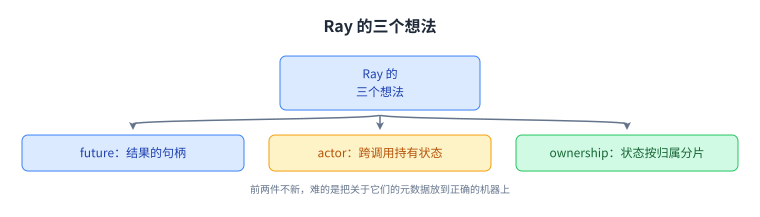

三个想法里，前两个改变的是编程接口，第三个改变的是系统内部的账本放在谁那里。

## 三、借用：把 future 的引用传下去

future 的用法里有一件事值得单独看，教材叫它借用（borrowing）。它给了两个例子。

先说明这一节的两套写法。这一节与上一节里的 `C()`、`shared()`、`get()` 是教材用来讲概念的伪代码，它们不是可以照着敲的 API；而到了本节后半段出现的 `g.remote()`、`ray.get()`、`Counter.remote()` 才是真实的 Ray 接口。两套写法讲的是同一件事（异步调用得到凭据、按引用传递、需要时才求值），只是前者为了让概念显形、省掉了所有样板。

第一个例子是三行调用：

```
f1 = C()
f2 = C()
f3 = Add(shared(f1), shared(f2))   # 按引用把 f1 与 f2 传进去
c = get(f3)
```

注意 `shared(f1)` 与 `shared(f2)`：传进去的不是值，而是引用。「引用」之所以便宜，是因为它小到可以随调用消息一起走，而值可能很大、还可能在另一台机器上、甚至还没算出来；把引用传过去，等于把「我需要它的结果」这句话传过去，而不等于把结果搬过去。于是 `Add` 这个任务并不需要把 f1、f2 的结果先搬到自己的机器上再相加；它可以由系统来决定在哪里加、以及要不要搬数据。这一步是整个编程模型的收益来源：「在哪算」与「数据何时搬」被从程序员手里收走了。

第二个例子是嵌套。先提醒一处同名：上一段代码里的 `C()` 是一个被调用的函数，而下面这个嵌套例子里，`C` 是 `A` 内部调用的那个函数；到了第 6 节之后，`C` 又指跑在 worker 3 上的那个任务。三处用的是同一个字母，指的是三件不同的事，读到时按上下文区分：

```
def A():
    x = B()
    y = C(shared(x))   # 按引用把 x 传进去
f1 = A()
```

这里 `A` 调用了 `B`，拿到 x 的 future，又把 x 的引用传给了 `C`。于是关于 x 的状态（谁在等它、值的副本在哪）就不只属于 `A` 了，`C` 也借到了 x。教材特别指出：借到之后还可能继续往外传，所以「谁在用这个 future」是一组会变化的关系，而不是一条固定的父子线。

这正是后面 ownership 要处理的东西：借用的存在，让「一个 future 的状态」天然需要被引用计数，而引用计数的所有者必须有一个明确的归属。

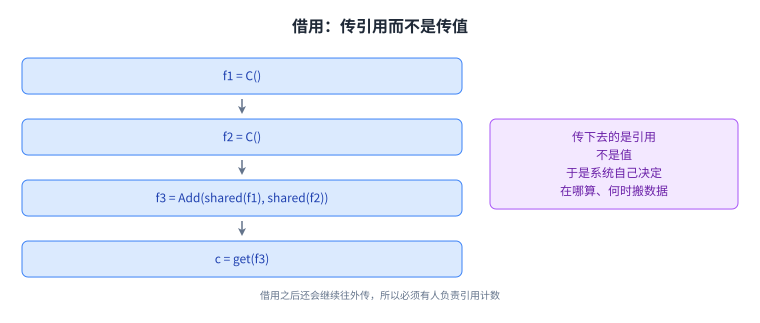

引用而不是值，这一条差别是后面所有元数据问题的源头。

## 四、Ray 里怎么写

把上面那两段伪代码（远程函数与 actor）的写法，与本图两侧的行为对照起来看：

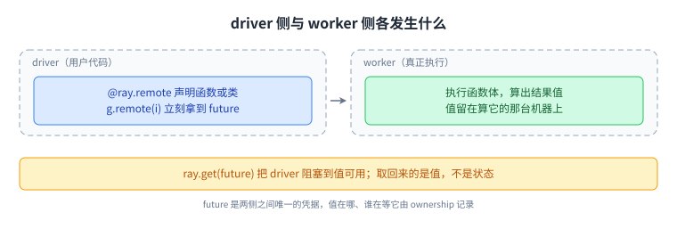

把执行放到 worker 之后，driver 手里就只剩 future，而关于这个 future 的账要由 ownership 记。

教材用几段代码给出手感。先是远程函数：

```python
import ray
ray.init()

@ray.remote
def g(i):
    return i

f = g.remote(10)          # f 是一个 future，g 被异步调用
future_ids = [g.remote(i) for i in range(4)]   # 这 4 次调用并行执行
results = ray.get(future_ids)
```

`@ray.remote` 把一个普通函数变成远程函数；`g.remote(10)` 立刻返回一个 future；把四次调用放进列表，四次调用并行跑起来；`ray.get` 负责强制求值，把结果取回来。

再是 actor：

```python
@ray.remote
class Counter:
    def __init__(self):
        self.value = 0
    def increment(self):
        self.value += 1
        return self.value

counter = Counter.remote()            # 作为一个远程 actor 实例化
f = counter.increment.remote()        # 返回一个 future，对应一个对象引用
print(ray.get(f))
```

这里能看出两件事。一是 actor 的实例化本身也是远程的（`Counter.remote()`）；二是调用 actor 上的方法同样返回 future（`counter.increment.remote()` 返回的 future 对应一个对象引用），而 `self.value` 这个状态留在 actor 所在的机器上，不会随返回值被搬走。

## 五、实现要面对的三件事

写完编程模型，教材转到实现，并列出要处理的挑战，一共两件：第一件是跟踪 future 与对象（包括对这两者的垃圾回收）；第二件是 worker 机器在跑一个 future 的时候崩溃。

对第二件，教材给的答案是幂等 future 的透明恢复。这三个词要拆开读。幂等说的是这个任务重算一次与算一次的结果相同，不会有额外的副作用；透明说的是调用方察觉不到这次重算；恢复说的是系统自己找一台机器把丢掉的那份结果再算出来，而不是把错误抛给用户。所以这条答案成立的前提是任务本身无副作用。而上一节的 actor 恰好相反：它有可变状态（`self.value` 就在机器上累积），所以「重算一次是安全的」这句话对无状态任务是成立的，对 actor 不成立。这一处的细节笔记没有展开，我们只把这条边界写明，不替它补方案。

「跟踪」这件事听起来简单，而在分布式系统里它是全部难点的来源：一个 future 的值可能还没算出来、可能已经存在别的机器上、可能有好几份副本、可能已经没人需要了。而「崩溃恢复」又要求系统知道：这个值丢了以后，该由谁来重算，重算到什么范围为止。这两件事都需要一份元数据表，接下来的几节都在讨论这份表该放在哪里。

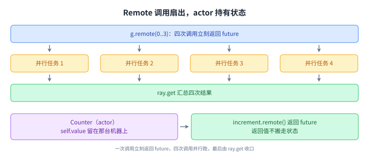

代码层面的手感讲完，剩下的篇幅都在回答「关于这些 future 的账记在哪」。

## 六、先看最简单的实现：一个中心协调者

教材先用一个「简单或假想的实现」把问题立清楚：用一个中心协调者。

先说两个后面反复要用的词。这里说的对象，指的是一个 future 算出来之后、被系统存起来的那份值；而对象存储是存放这些值的另一套存储，它与记账的那张表分开，因为值的体积可能很大而表条目很小。

[[term:coordinator]]维护一张表，每行是 `(id, task, refs, worker, value)`。这张表里也出现两个角色：调度器决定一个任务放到哪台 worker 上跑，协调者负责保管刚才那张表。在下面这个「简单或假想」的实现里，两个角色都住在协调者这一侧；到了第 10 节讲真正的调度时，调度是分布式的，那时要分清说的是哪一个方案。

流程是这样的。发起一个 future 任务时，调度器挑一个 worker，并把这条 future 记进表里。调用 `Get()` 时联系协调者：如果值已经有了就直接返回；如果还没有，就在协调者那里阻塞，直到 worker 把值填进去。如果这个值很大，就把它存进对象存储，并让「值」变成那个对象的 id，之后调用者直接从对象存储取，不再经过协调者。这一句要留意它影响的是哪一趟：大值情形下，取值那一趟不再打到协调者身上，但仍然要打到对象存储身上，所以「取值要一次往返」这句话说的是往返次数不变、目的地变了。教材还注明：对象是不可变的。

回收依靠 refs 里的引用计数：一个任务可以回收自己名下的 future 与对象。教材接下来用同一组名字举例，这里用的 A、B、C 与 x、y 就是第 3 节那段嵌套代码里的 A、B、C 与 x、y（`A` 先调 `B` 得到 x，再把 x 的引用传给 `C` 得到 y）。此刻的状态是 worker 1 在跑 A、worker 2 在跑 B、worker 3 在跑 C，表里 x 的 refs 是 W1 与 W3，y 的 refs 是 W1：

```
如果 C 返回，从 x 的 refs 里去掉 W3；
  但此时还不能回收 x，因为 A 还在用它。
如果 A 返回，x 与 y 都没有引用了，
  这时才可以安全地删除 x 与 y。
```

崩溃恢复则靠 [[term:lineage]] reconstruction（沿血缘重建）：如果一个 worker 崩溃，driver 或任务会重新执行被调用的任务，重新执行会连带重建出它们的 future 与更下层的 future，也就是重新执行任务及其后代。教材还补了一条优化：可以使用对象的第二份副本来避免重新计算。

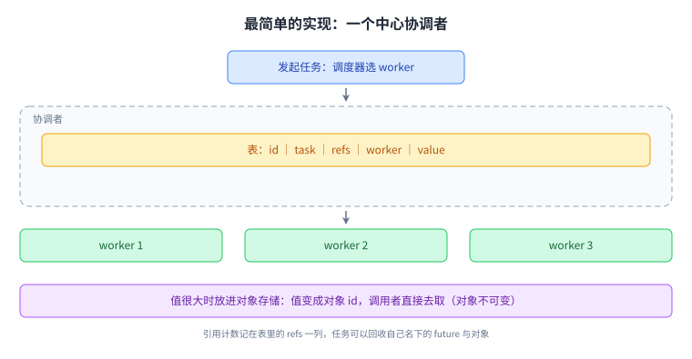

中心协调者把复杂度摊开了，也把瓶颈暴露了出来。

## 七、中心方案的瓶颈

这个设计能跑通，但它有两个成本。

第一是往返次数。中心方案里，一个 future 从发起到拿到值，要问协调者两次：发起时问一次（把任务登记进表里），取值时再问一次（`Get()` 要联系协调者，值还没算出来时还要在那里阻塞等待）。这两个数是本节与后面两节对比时的基准，所以先把它记准：中心方案是两次。

第二是 future 的数量非常多，而其中一些只跑几毫秒，当任务的粒度小到这个程度，协调者就成了可扩展性瓶颈。

教材给了一个自然的改进方向：把表分片（比如按对象 id 分片）。但这样每一次操作仍然要找一次协调者（因为请求得先问「该找哪个分片」），所以发起与取值这两次往返都没有减少，只是每次要问的分片变窄了；而且垃圾回收可能要涉及多个分片（一个对象被多个分片里的记录引用）。

分片解决了「一张表放不下」的问题，却没有解决「每次调用都要问一次中心」的问题。把三个方案的同一条轴摆在一起看：中心方案每次 future 要问中心两次（发起、取值），按对象 id 分片之后仍是两次，而按 ownership 分片之后，发起那一次降到零，取值那一次只在值不在本地时才需要，而且那次是去取数据、不是去问元数据。要拆掉中心这一层，就得让元数据跟着它最相关的那台机器走，这就是 Ray 的做法。

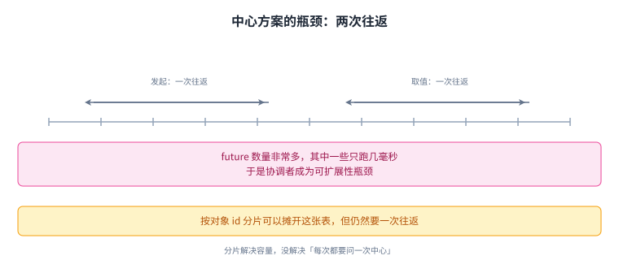

瓶颈一旦明确，改进方向就只剩一句话：让元数据跟着最常问它的那台机器走。

## 八、Ray 的答案：按 ownership 分片

Ray 的做法是按 ownership 分片，也就是按「谁拥有这个 future」来分。规则是：一个函数返回的 future，由它的调用者拥有。

教材用 x 这个例子说明：A 拥有 x；C 借用 x（借用者可能把它继续往外传，并负责它那一份引用计数）。而关键在于：对象的值存储在跑那个任务的 worker 上。在例子里，A 是 x 的所有者，而 x 的值存在跑 B 的那台 worker（2 号）上。

这样做的好处，教材用一句话点出：A 可以发起对 C 的调用，而完全不需要与 B 通信。换到中心方案里，这次调用在发起这一趟就必须先与协调者往返一次；而在 ownership 方案里，元数据本来就在 A 手上，所以发起这一趟的往返次数是零。要注意这里比较的是同一趟（都只比发起），而不是拿一边的发起去比另一边的发起加取值。

于是「谁是所有者」与「值在哪里」这两件事被分开了：所有者管引用计数与生命周期，值放在算它的机器上，需要时才把数据搬过去（小值走控制路径，大值走对象存储）。这也回答了大值那一问：大值只是让取值那一趟改道去对象存储，并没有让取值变成零次。而 ownership 省掉的是元数据的往返，不是数据的往返；数据该搬还是得搬，只是搬的路径短了。这也是为什么这一讲的三个想法里，ownership 是那个真正把系统撑起来的设计。

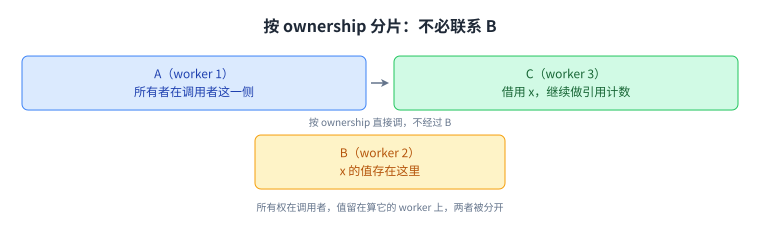

这就是这一讲的主线：所有权与值分开，通信量随之下降。

## 九、owner 表长什么样

教材把上面的状态画成了三张表（A 在 worker 1、B 在 worker 2、C 在 worker 3，此时 B 与 C 同时跑着）：

三张表都用同样六个字段，字段的含义在下一段解释；`—` 表示这一份表里不记这一项。

```
worker 1 的表（所有者那一份，六个字段都记）
ID  Task   Owner  Ref      Loc  Val
x   B()    W1     W1,W3    W2   —
y   C(x)   W1     W1       W3   —

worker 2 的表（只记所有者与位置）
ID  Task   Owner  Ref      Loc  Val
x   —      W1     —        W2   —

worker 3 的表（只记所有者与位置）
ID  Task   Owner  Ref      Loc  Val
x   —      W1     —        W2   —
y   —      W1     —        W3   —
```

先把六列的含义摆清，后面再看三张表的差别。ID 是 future 的名字；Task 是产生这个 future 的任务；Owner 是谁拥有它；Ref 是谁在引用它，也就是引用计数的那份名单；Loc 是值所在的位置；Val 是值本身（为空表示还没算出来）。

再看三张表的差别。worker 1 的表里，x 与 y 的 Owner 都是 W1，也就是「调用者拥有」这条规则的结果（x 由 A 调用 B 得到，y 由 A 调用 C 得到）。Ref 只记在所有者这里（x 的 `W1,W3` 表示 A 与 C 都在用），别的 worker 的表里不记引用，只记「所有者是谁」与「值在哪」。

这里有一处容易读错：worker 2 与 worker 3 的表里，x 那一行的 `Loc` 都是 `W2`，这个 `W2` 是 Loc 不是 Ref（Ref 那一列在它们表里是 `—`）。而它们之所以要记这一行，是因为值就存在它们中的某一台上：x 的值存在跑 B 的那台 worker（2 号）上，所以 2 号必须知道自己手上有一份值；3 号那一行的 Loc 是 W2，意思是「要 x 就去找 2 号」。换句话说，所有者那一份表记的是责任（谁该管回收、谁该发起重算），其余各份记的是去向（值在哪一台）。

表该放在哪里，还与应用的结构有关。教材给了一条经验：如果一个任务发起了很多 future，就把这个任务拆成几个，让每个子任务负责其中一部分 future 的归属。也就是说，分片不是凭空切，而是跟着调用结构切。

至于 owner 本身的表示，教材给得很具体：owner 是一个 `(IP, port, worker id)` 三元组；`taskId = parentTaskId + task_index`，`objectId = taskId + obj_index`。这三行写法要逐个说清。owner 是一个地址三元组，也就是「该找谁」这个问题的答案本身；而两个式子里的 `+` 是把编号接在父编号后面（拼接，不是算术相加），`task_index` 是这个子任务在父任务的子任务里的序号，`obj_index` 是这个对象在同一任务产出的对象里的序号。接出来的结果是一个能看出调用链的编号：从 `objectId` 往前剥，就能回到它属于哪个任务、哪个父任务。

要小心不要多推一步。从编号本身推不出 owner 的 IP：编号里编的是「属于哪条调用链」，而「该找谁」来自表里那一列 Owner（那一列存的才是三元组）。所以去中心靠的是把这张表按 ownership 切开、各份放在最常问它的那台机器上，而不是靠编号自带地址。

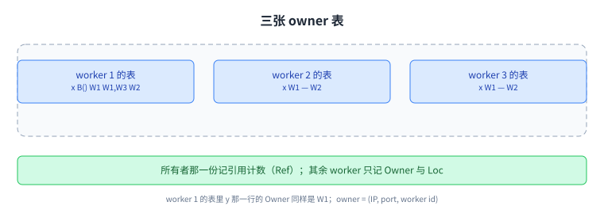

表里的 Ref 一列是回收的依据，而 Owner 一列是崩溃时决定谁来重算的依据。

## 十、调度与内存管理

所有权解决「元数据放哪」，另有两块配套：任务在哪跑，以及对象怎么管。

调度是分布式的，教材给出的循环是：先取本机（当前 worker）的 id；然后反复尝试用一次资源请求去预留这个 worker；成功就为它取一个 [[term:lease]] 并跳出循环；最后把该任务的 `Loc` 设成这个租约。这里的租约是一台 worker 把资源租给某个任务的一段时间，租期内别人不会再抢走它；而循环里那两种「当前」都指发起调度的这台 worker，不是被调度的那台。这里有一条明确的优化：复用已经租出去的 worker，避免每次都重新预留。

这里有一处同名要留意：这个 `Loc` 与第 9 节表里的 `Loc` 拼写相同而含义不同。第 9 节表里的 `Loc` 是「值在对象存储里的位置」，而这里被赋成的是「这个任务被预留到了哪台 worker」（一个租约）。源笔记两处都写作 `Loc`，我们没有改动它的写法，但读到这里要按上下文区分，不要把它当成「值的位置」。

内存管理围绕对象存储的四个操作，逐个说清。`Create` 把一份值写进对象存储并得到一个对象 id；`Get` 按 id 取这份值，如果它还没被创建出来就一直阻塞到创建完为止；`Pin` 把这个对象钉住，也就是不让回收把它清掉，所以首次 `Create` 会顺带把对象 pin 住；`Release` 是反过来，声明不再需要它了。四个操作里 `Get` 在读出侧、`Create` 在写入侧，而 `Pin` 与 `Release` 管的是这份值能留多久。表里 `Location` 记的是对象在对象存储里的位置，而教材特意指出：一个对象可以有多份次级副本，比如 C 的 worker 从 B 的 worker 取到 x 之后，就留下了自己的一份，x 很大时尤其值得这样做。

次级副本不只是为了快。它下一节就会派上用场：当主副本随机器一起丢失时，次级副本可以省掉一次重算。

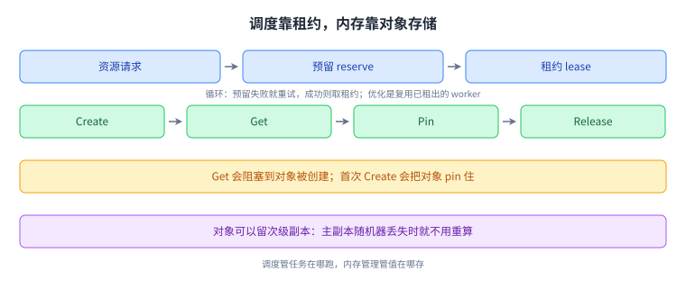

调度与内存管理是 ownership 之外的两块配套，缺一块系统都跑不起来。

## 十一、故障恢复：fate sharing

有了前面的表，恢复逻辑就能说清楚。教材把它分成两种丢失。

拥有的对象丢失时，查表里的位置，然后沿血缘重新执行任务；如果有次级副本，就用副本，避免重算。

所有者丢失时，麻烦更大：别人手里可能留下悬空引用（dangling reference）。这时 Ray 用的是 fate sharing（命运共享）：如果一个引用的所有者已经不在了，那么持有这个引用的任务也不再有意义，于是它把自己也当作崩溃，顺着调用链把这件事上报出去。

教材给了两个例子。第一个：worker 3 在开始跑 C 但还没跑完的时候失败，worker 1（也就是 A）会知道这件事。这里的因果值得补一句：之所以「拥有 y」就等于「能发现 C 的 worker 挂了」，是因为第 9 节那张表就在所有者手上，它记着 y 的 Task 是 `C(x)`、值该出现在 W3；一旦 W3 没了，这条记录与它记的期望就对不上，而能发现这个对不上的只有记着这条记录的那台机器。于是由它请 Ray 重新执行 C(x)。第二个：worker 1 与 worker 2 都失败，此时 worker 3 手里对 x 的引用永远不会被解析出值（x 的所有者 1 号连同存着值的 2 号一起没了），于是 worker 3 与 x 的所有者共享命运，它终止自己、假装崩溃。接着就是这一段的落点：A 是整段调用链最外层那个任务，而「A 的调用者」指的是最初发起这次计算的用户程序（也就是第 4 节里那个 driver）；A 的结果正是 driver 要的东西，所以命运一路共享到它那里时，由它重新提交 A，而重新提交 A 会连带把 B、C 一起重跑。要它重提交的是 A 而不是 C，因为外层任务重跑会把内层任务一起重建出来，这也正是前面那句「重新执行任务及其后代」的意思。

把这两个例子放在一起，ownership 的用处就更清楚了：该由谁来发起重算，不是问出来的，而是从「谁拥有这个 future」直接得出的。教材随后留了一道作业讨论题：如果 `C(x)` 里又调用了 `D` 并 `get` 了它的结果，而跑 D 的 worker 失败，该由谁发起重跑？答案的关键还是那句：z 的所有者是它的调用者 C，所以由 C 重提交 D，这一条我们只讲概念，不替 Lab 给答案。

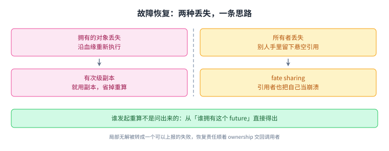

到这里，这一讲的三个想法合上了：future 提供凭据，actor 留住状态，ownership 决定谁负责收拾。

## 读完应该能回答

1. Ray 要服务的两类并行应用各有什么特征，MapReduce 与 Spark 的两个假设为什么在这里不成立。
2. future 与 actor 各解决什么，`shared()` 传引用而不是传值带来了什么好处。
3. 中心协调者方案的两个成本是什么，按对象 id 分片为什么仍然要一次往返。
4. ownership 分片把「谁是所有者」与「值在哪里」分开之后，换来了什么，fate sharing 又在解决什么，重算链条最后交回到谁手里。

## 脉络回顾

这一讲把这一段的形状又推进了一格。前面几讲的主语是「一次调用」：第 2 讲的 RPC 讲怎么把一次调用跨机器做掉，第 3 讲的 GFS 讲大量数据该放在哪里；而这一讲的主语换成了成千上万次很短的计算，于是问题从「怎么把一次调用做好」变成「怎么让关于这些计算的元数据不成为瓶颈」。

三个想法是按依赖顺序立起来的。future 改变了调用与结果的时间关系（异步调用、按引用传递、需要时才求值），actor 补上了跨调用要留下的状态，而 ownership 解决的是前两者必然带来的元数据问题：一旦 future 的引用会在调用链上被借用并且继续往外传，就必须有人负责引用计数，也必须有人负责在崩溃时决定重算的边界。教材先用中心协调者把这件事的复杂度摊开（一张表、一次往返、引用计数、线沿血缘重建），再用「按对象 id 分片仍然要一次往返」逼出真正的答案：分片要按 ownership 分，也就是让元数据跟着最常问它的那台机器走，于是所有权在调用者、值在算它的 worker 上，两者分开。

这条线索与第 1 讲和第 3 讲各自的关注点互不重叠，我们在「溯源」里写清了分工。这一讲的恢复思路与第 4 讲 Raft 的选举、第 9 讲 ZooKeeper 的会话都不同：那两处靠多数派维持一致，而这里靠所有权划清责任。最后，fate sharing 是这一讲最有意思的一处设计：它把「一个引用永远得不到值」这种局部无解的情况，转化成一个可以上报的失败，让恢复责任顺着 ownership 一路交回到最初发起调用的人手里。

## 溯源

- 对应：MIT 6.5840 / 6.824 Distributed Systems，官方日程第 18 讲 Ray（`https://pdos.csail.mit.edu/6.824/schedule.html`）
- 本讲依据：课程笔记 `notes/l-ray.txt`（6,926 B / 223 行，本仓以行尾归一化后的 SHA256 留档，见 `docs/audit/18-ray-factcheck.md`）
- 指定阅读：Ray: A Distributed Framework for Emerging AI Applications（OSDI 2018，USENIX）；Ownership: A Distributed Futures System for Fine-Grained Tasks（NSDI 2021，USENIX）。论文可免费阅读，但 USENIX 未给出复用与翻译条款，本页不是译文，不复制原文表述、不复现原文插图
- 授权依据：`course.toml` 的 `verified = false`、`redistribution = "unknown"` ， 课程主页的 CC BY 3.0 US 徽章只出现在主页一处，笔记页无许可声明，覆盖范围未获确认，因此只发布原创讲解，不产出逐字稿与双语对照，Lab 代码与作业答案排除
- 与相邻讲次的分工（去重说明）：
  - 第 1 讲（`01-introduction`）讲分布式系统的框架与目标（为什么需要、抽象与容错的基本词汇）；本讲不重复框架，只从「细粒度、有状态、低延迟」这一组负载特征切入，框架部分只作为前提引用。
  - 第 3 讲（`03-gfs`）讲数据放在哪（大规模数据密集场景下的文件系统与主节点/块服务器分工）；本讲讲的是关于计算结果的元数据放在哪（future 的状态与 ownership），两者一个管数据位置、一个管控制状态，不重叠。

  - 第 16 讲的 Memcached（`16-memcached`）讨论缓存与后端之间的一致性，与这一讲的「关于计算结果的元数据放在哪」不是同一个问题，故不重复。
- 第 2 讲（`02-rpc-and-threads`）讲一次调用怎么跨机器；本讲正好拿它作对照：笔记里明确说 future「与 Lab 里的 RPC 相当不同」，我们按这条对照来写。
- 结构说明：本讲章节顺序跟随笔记的推进顺序（阅读动机、演进中的并行应用、三个想法、future 的借用例子、Ray 代码例子、实现挑战、中心协调者、分片与瓶颈、按 ownership 分片、owner 表、调度与内存管理、fate sharing）；笔记里 owner 表的三张表与 id 编码两小段我们并成一节，合并后共 12 个内容节、配 12 张图（`ray-1` 到 `ray-12`）
- 作业讨论题：笔记末尾有一道关于「谁发起重跑」的讨论题（含答案线索）。我们只讲其中 ownership 这一概念，不复述该题、不给答案，以免触及作业内容边界
- 我们的归纳（笔记没有明说）：把五节实现内容收成一条线，「元数据放哪」才是难点，中心方案与两种分片是同一问题的三级答案；把 fate sharing 表述为「把局部无解转成可上报的失败」；把三个方案的往返次数并成同一条轴来比（中心两次、按对象 id 分片仍两次、按 ownership 发起零次而取值只在值不在本地时发生）；以及补上若干术语在首次出现处的说明（对象与对象存储、driver、调度器与协调者的分工、租约、血缘）
- 一处超出源笔记的地方已经收回：本页早先写过「一个 id 里就编码了『该找谁』」，而笔记只给了 `owner = (IP, port, worker id)` 与两条编号拼接式，并没有说编号里带着地址；现已改为「编号编的是属于哪条调用链，而『该找谁』来自表里的 Owner 一列」
- 一处同名已经标明：调度循环里的 `Loc` 与 owner 表里的 `Loc` 拼写相同而含义不同（前者是任务被预留到的 worker，后者是值在对象存储里的位置），源笔记两处都写 `Loc`，我们保留原写法但在正文里点出这个差别