+++
kind = "lecture"
lecture = 19
slug = "sundr"
title = "Fork Consistency, SUNDR"
status = "draft"
output_mode = "explanation"
source_kind = "notes"
source_url = "https://pdos.csail.mit.edu/6.824/notes/l-sundr.txt"
+++

> 来源课程：MIT 6.5840 / 6.824 Distributed Systems（Robert Morris、Frans Kaashoek 与 MIT PDOS）；
> 对应内容：Lecture 19 — Fork Consistency, SUNDR，阅读材料是 Li、Krohn、Mazières、Shasha 的 "Secure Untrusted Data Repository (SUNDR)"（OSDI 2004）；
> 原文笔记：https://pdos.csail.mit.edu/6.824/notes/l-sundr.txt ；
> 本页由 CourseLingo 用中文重新讲解，按源笔记的推进顺序组织，不是逐字翻译，也没有转载原笔记里的任何示意图；
> 页内配图全部由我们自绘。本页为非官方材料，与 MIT 及课程教学团队无隶属关系；如与原文有出入，以原文为准。

## 痛点：我们一直在把数据交给别人保管

这一讲换了一个视角。前面几讲讨论的是机器会崩：坏了以后系统还能不能继续给出正确的答案。这一讲要问的是另一种失效，服务器不一定崩，它可能一直在正常工作，只是在骗你。

源笔记先把前提摆出来：我们日常把数据交给 github、gmail、AFS、Dropbox 这样的存储服务，而信任它们的理由其实很薄。服务商也许本意是好的，但有三件事并不受使用者控制：服务器的软件或硬件可能有 bug，甚至可被利用；攻击者可能猜到了管理员的密码并改掉了软件；云服务商的某位员工可能失职，或者本身就是坏的。

它紧接着说这不是假想。论文引用了开源代码仓库被成功攻击的案例，而麻烦在于，攻击者随后可以改动源码，而且可能不被察觉。这句话点出了这一讲全部的技术目标：**在一个不由我们控制的[[term:node]]上，能不能拿到可以验证的存储**。

前面几讲（GFS、[[term:paxos]]、Raft、[[term:zookeeper]]）都建立在一个前提上：参与者诚实，可能停下来但不会故意骗人。这一讲把那个前提拿掉了。

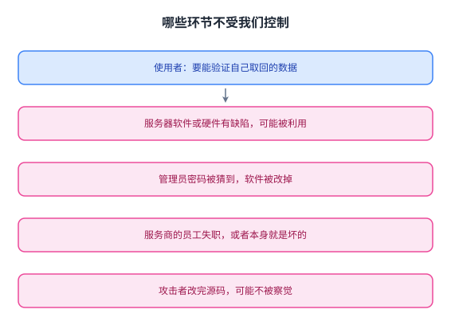

图里左边是使用者的诉求，右边是四条并不受他控制的来源，这一讲要在这两者之间架一条可验证的通道。

## 要的是完整性，不是保密性

那么一个不可信的服务器，能不能被当成可信的存储来用。源笔记把目标收得很窄：我们要的是完整性。

它把完整性拆成三句：读者能检查自己取回的数据是对的；服务器不能伪造更新；服务器也不能藏起更新、或者改变更新的顺序。它举的例子很具体，服务器不能把一次关键的安全补丁藏起来不给你。

这里有一个容易被忽略的限定：SUNDR 的目标只是完整性，不是保密性。密码学在这套系统里只用来验证数据是对的，不用来防止别人看到数据。它用到的工具也只有两样，密码学哈希与数字签名；接下来两节分别看它们各能做什么，因为 SUNDR 的全部难点都在「单靠它们不够」这一点上。

值得注意的是，这三句要求与前面几讲的[[term:fault-tolerance]]不是同一个问题。那边防的是机器停下来，这边防的是机器一直在回话却不打算说真话。

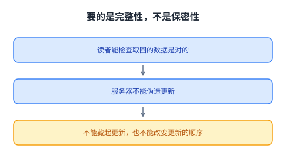

三条要求里，前两条靠密码学直接解决，第三条才是这一讲真正要设计的部分。

## 哈希能做什么：内容寻址，以及它的死穴

哈希的用法在笔记里写得很干净。以 SHA-1 为例，把任意大的数据压成一个很小的值，160 位；它的安全性在于实际找不到两个不同输入得到同一个哈希；于是这个值既能给数据起名字，也能用来校验数据。

把这件事套进一个键值服务器，就有了内容哈希存储。写的时候客户端算出键（键等于值的哈希），把键和值一起发给服务器，并把键返回给调用者；读的时候客户端按键取值，然后校验取回值的哈希是否等于这个键，不等就拒绝。这里的取和放都是一次 [[term:rpc]]，校验则是最基础的那种[[term:checksum]]。

有一个细节值得停一下：键在这里被当成两种东西用，既是名字，又是校验值。这带来一个后果，也是它的死穴。既然键必须等于值的哈希，那么一个键对应的值就永远不能变，源笔记用一个词概括这件事，叫做不可变。

也就是说，内容哈希存储能做只读的、列表或树形的结构。笔记提到可以把文件、目录、根键搭成一棵树，拿到根键的客户端就能验证整棵树，尽管数据块都放在不可信的服务器上，论文把这叫做哈希树。但它做不了可读写的文件系统，因为文件系统的数据要被修改。

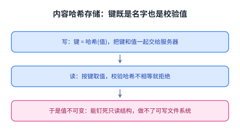

这张图解释了为什么下一步必须引入签名：只读结构可以用哈希钉死，而可写的结构需要一种「允许改变但只能由某个人改」的凭据。

## 数字签名能做什么：让存储可变，但挡不住「旧」

要让存储可变，就要用数字签名。每个用户有一对公私钥，签名用私钥，验证用公钥。于是写变成把值和它的签名一起放上去，读变成取出值和签名、验证通过才接受。

源笔记特别指出，键与私钥是完全分离的两件事，所以值可以被修改而不用改变键；而且任何知道键与公钥的人都能取到值，并验证它是持有私钥的人签的。

不过笔记在这句话后面加了一个很有分量的括号：这还不足以说明「这个值就是那个键对应的正确值」。为什么不足，就是下一节的内容。

单靠签名挡不住的是旧值。服务器无法伪造签名，所以它造不出任意的假值，但它完全可以把一个旧的、签名正确的值交给你。于是它能做到三件坏事：藏起一次更新；给不同的读者看不同的已签名版本；给一部分键显示新值、另一部分键显示旧值。笔记还补了一句更基础的需求，我们要的是一个文件系统，而不是一堆孤立的数据项，也就是要有文件名、目录、多个用户与权限。

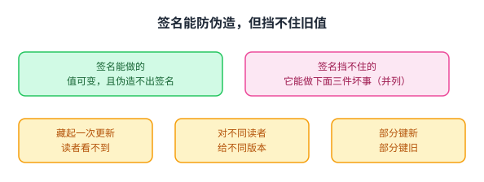

图里右侧那三格就是「有签名却仍然出错」的三种形态，它们的共同点是每一条各自都合法。

## 一个具体的坏例子

抽象的担心不如一个例子清楚，源笔记给了一个。

设想一个开源项目有两个文件，一个是代码，一个是公告，而存放它们的服务器是别人的。时间顺序是这样的：X 提交了代码的第一版；A 提交了第二版，修掉一个 bug；B 更新了公告，宣布 bug 已修；C 先读公告，再读代码。

一个使坏的服务器可以给 C 看新的公告，却给 C 看旧的代码。这两份内容的签名都是正确的，因为都是各自的主人签的，但 C 拿到的代码是错的那一份。也就是说，每一个数据项各自校验通过，整体结论却可以是错的。

这一节是整讲的转折点，因为它说明问题的层次：单条数据的完整性不等于文件系统的完整性。SUNDR 的关键一招就来自这里，笔记写得很直接，每一次更新都包含对整个文件系统的签名。

套进例子就是，B 对公告的那次更新里，带着一个反映 A 已更新代码的签名。于是 C 一旦看到了 B 的新公告，那个签名就只有在 C 同时也能看到 A 的新代码时才会通过。

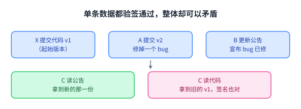

把签名从「一条数据」提升到「整个文件系统」，是这一讲第一个真正有分量的设计决定。

## 稻草人设计：一份谁都改不动的日志

把「对整个文件系统签名」落成一个具体方案，笔记给了一个刻意笨拙但好推理的设计，它自称稻草人。

服务器保存一份完整的文件系统修改日志，条目是建文件、写、改名、删、建目录这类操作。客户端请服务器往日志末尾追加新操作，也把「取用」这件事本身追加成日志条目。客户端通过取回并从头重放整条日志来还原文件系统的内容。

细节是这样的。日志条目的字段是「取用或修改」、用户、签名，而签名覆盖到那一刻为止的整条日志。客户端的一步操作有六个动作：取回整条日志，此时其他客户端要等；检查日志，条件有三条，签名都正确且覆盖之前的日志、操作符合权限、自己上一次的条目在里面；从开头重放以构造文件系统状态；追加自己这次操作以及一个覆盖整条新日志的签名；上传日志；在本地磁盘上记住自己刚签的那条条目。

笔记对这个设计的评价是，效率很差，但推理起来简单。它也给了一个例子日志的三行，X 建文件、A 打上安全补丁、B 公告那次修复。

这里有两个问题值得记住。第一，服务器能不能伪造一条日志，答案是不能，因为那需要知道某个被授权用户的私钥。第二，客户端怎么知道被授权用户的公钥，笔记给了两条来路，所有客户端必须先被告知根目录所有者的公钥，而文件系统自身存放每个用户的公钥。

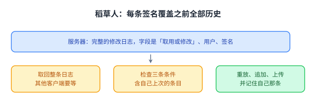

这个设计的重点不在效率，而在于它把「顺序」变成了可验证的东西：客户端记住的[[term:log-entry]]让它无法被悄悄跳过。

## 分叉：服务器藏东西，于是世界裂成两半

现在换上这一讲的核心攻击场景，服务器是有恶意的，比如已经被改造成专门骗 C 的版本。

服务器能不能对 C 藏起一条条目，能。笔记在这里下了一个总结性的判断，藏起来与显示出来，是 SUNDR 服务器唯一能做的两件坏事。

于是会发生这样一串事。服务器对 C 藏起 A 与 B 的更新，C 读到的只有 X 改的那份代码；C 于是请求追加一条取用条目，它的签名覆盖 C 所看到的那条日志；并且 C 记住了自己最后这次操作。到这里，服务器已经让 C 走上了一条分叉的日志。

关键在于接下来。假设服务器过一阵子想让 C 看到 B 更新过的公告，它做不到，笔记把三种插入位置逐一排除了：给真实日志不行，因为 C 要求自己上次的操作在日志里；把公告插在 C 的取用之前不行，因为 C 的取用签名里不包括 A 的那次修改；放在 C 的取用之后也不行，因为 B 的签名里不包括 C 的取用。

结论是，服务器永远没法让 C 看到 B 的那次公告更新，也没法让 C 看到 B 之后的任何操作，因为 B 将来的签名都会包含它。反过来也一样，服务器也没法让 B 看到 C 将来的任何操作。但服务器能做到另一件事，继续给 C 一个单独的文件系统视图，里面只有 C 将来的操作，没有 B 的。

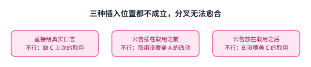

这张图是三格「试错」，每一格都因为某一方的签名覆盖范围不够而失败，这正是分叉不能愈合的原因。

## 这就是 fork consistency，而它算不算好结果

笔记把这个性质命名为 SUNDR 的 fork consistency，也就是分叉一致性：服务器可以永久地把用户分叉开、互相隐瞒更新，但它无法把一个已经产生的分叉愈合。

接着它自己提了一个很诚实的问题：这算好结果吗，回答分三层。第一，SUNDR 允许分叉攻击，这并不理想。第二，藏起一次更新就等于藏起那个用户之后的所有更新，所以这种攻击大概过一段时间就会被发现。第三，用户可以靠 SUNDR 之外的渠道发现分叉，比如发邮件问一句「你觉得我上次的更新怎么样」。笔记的结论是，在这些假设下，这大概是能做到的最好结果。

这一节还留了一个悬念，笔记用一行把它提出来，为什么日志里要包含取用条目。这个问题的分量在后面看版本向量时会显出来，因为「读者看到过什么」这件事本身必须被记录、被签名，否则服务器就能靠改顺序骗人。

用一句话概括这套安全性来自哪里：它不是靠阻止攻击，而是靠把攻击变成一个会持续扩大、因而容易被外部对账发现的异常。这也是它与[[term:consistency]]（严格一致）的区别所在，后者要求所有读者看到同一个顺序，而这里允许永久分裂。

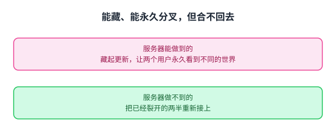

这张图把「能做什么」与「做不到什么」分成上下两排：服务器可以把两边越推越远，但没有一条路径能把它们重新接上。

## 从稻草人到序列化 SUNDR：状态树与版本向量

稻草人不可用的理由很朴素，日志会一直涨。笔记给了一个简化版的正式方案。

第一个想法是存当前状态，而不是操作日志。它用一个哈希树来模仿文件系统的目录与文件树，形状是文件、目录、再加一个带签名的根哈希的 handle。这棵树不能直接被修改，所以更新的做法是，造一棵新的哈希树，给新的根哈希签名并更新 handle，再删掉旧树。这相当于用一次[[term:snapshot]]替换掉不断追加的日志。

但这里冒出一个新问题，有多个用户，各有自己的公私钥，而且用户之间可能并不完全互信。那么一个「所有人都能写」的根就太脆弱了。

第二个想法因此是每个用户一棵树，各带自己签名的 handle，整个文件系统是这些树的并集：每个用户的树只放自己的文件，一次读会取回所有的树再合并成一个文件系统。

接下来是要害，怎么强制分叉一致性，也就是怎么发现服务器在愈合分叉、或让不同客户端看到了不同的更新序列。做法是让用户 X 的树声明，X 上次更新或读取时看到了其他每棵树的哪个版本，于是客户端就能检查这些树是否构成一个线性序列，思路与稻草人里「签名覆盖整条日志」一样，只是便宜得多。

具体结构是，每个用户的树有一串带编号的版本；X 签名的 handle 里包含 X 的根哈希、X 的版本号、一个版本向量（每一位对应另一个用户，记 X 上次读到的那个用户树的版本），以及只对这个 handle 块的签名。于是比较 X 与 Y 的版本向量里的数字，就能判断这些树的更新是否构成一个「每一棵都看到了之前那些」的序列，以及服务器是不是正在试图揭示一棵此前被藏起来的树。

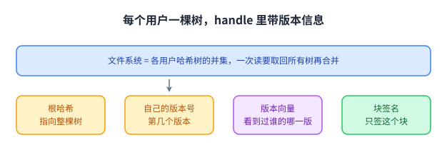

图里把 handle 拆成四格，正是为了说明「谁看到过谁的哪一版」这件事必须随签名一起发布出去。

## 版本向量怎么用：一串数字就能发现分叉

笔记给了两个例子。

服务器规矩行事时，时间往下走，四个版本依次是：第一版是「1 0 0」，第二个用户的第一版是「1 1 0」，第三个用户的第一版是「1 1 1」，第二个用户的第二版是「1 2 1」。可以看到版本向量每次只推进一个位置。最后那条的含义是，第二个用户看到过第一个用户的第 1 版与第三个用户的第 1 版。于是任何看到这次更新的人都会知道，自己应当要求另外两棵树至少达到那些版本。

服务器伪造不了版本向量，因为所有东西都签了名，但它仍然可以藏起最新的树，把旧的已签名 handle 端出来。那么排序就成了关键的判据：在上面这个例子里，版本向量是可以排序的，每一个在所有位置上都大于等于前一个，含义是这些更新按顺序发生、而且每一次都看到了之前的更新。客户端的检查就是版本向量是否可以排序。

服务器藏起一次更新时会发生什么。假设它对一个用户藏起了另一个用户的第二版，于是这两个用户各自产生了一条更新。这时服务器再也无法把一方的更新揭示给另一方：一旦揭示，被揭示的那一方就会看到双方的版本向量无法排序，因为「甲在前」不成立（那意味着甲对乙被藏起来了），「乙在前」也不成立（那意味着乙对甲被藏起来了）。

笔记由此给出这一讲的收束：版本向量这套机制确实强制了分叉一致性，而且比稻草人那种「对整个日志签名」便宜得多。它也顺带说明了它与[[term:linearizability]]一类要求的差别，这里并不要求所有人看到同一个顺序，只要求一旦顺序被拆开就永远合不回去。最后它列了四条要点，从不可信服务器那里拿到可信服务的梦想、分叉攻击、哈希树、版本向量，而下一讲要讲的是比特币怎么对付分叉攻击。

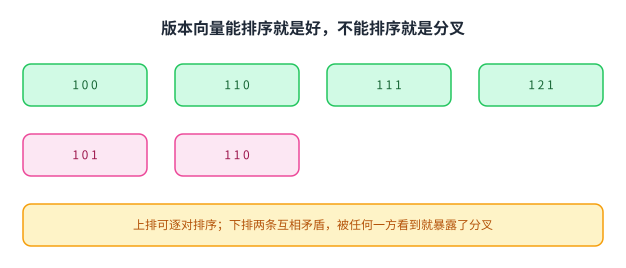

图里左边那串数字每次只推进一位，所以可以逐对比较大小；右边两条各自成立却互相矛盾，这种矛盾一旦被任何一方看到，分叉就暴露了。

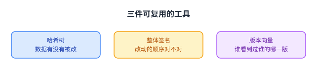

把这三件工具从 SUNDR 里抽出来看，它们分别回答「数据有没有被改」「这些改动的顺序对不对」「谁看到过谁的哪一版」，而这三个问题在任何需要防服务器的系统里都会再出现。

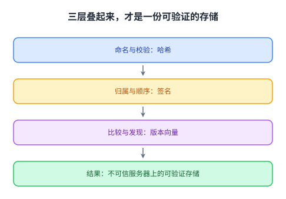

这三层是叠着用的：只有哈希，值就不能改；加上签名，值能改了但顺序还不受约束；再补上版本向量，才轮到「服务器有没有在瞒着我」这个问题有答案。

## 读完应该能回答

1. 为什么单条数据的签名都对，并不足以保证文件系统的正确性，代码与公告那个例子坏在哪一步？
2. 内容哈希存储为什么天然是不可变的，它做不了可读写文件系统的哪一步？
3. 服务器藏起一个用户的更新之后，为什么它再也无法把那次更新揭示给另一方，这与分叉一致性的定义是什么关系？
4. 版本向量里的每一位表示什么，客户端凭什么判据发现服务器在愈合分叉？

## 脉络回顾

这一讲在整门课里的位置，要从它和前面几讲的关系上看。前面那些系统处理的是崩溃，机器坏了、网络断了，系统要在这些情况下继续给出正确答案，它们默认剩下的组件是诚实的，只要多数派还在，服务就能继续。

这一讲把默认前提换掉了，服务器没有崩，它一直在回话，只是在选择给你看什么。于是问题的形状变了：前面几讲问「怎么让多台机器对同一件事达成一致」，这一讲问「当其中一台机器不打算一致时，你怎么发现」。

它的答案是一个很有意思的中间状态。SUNDR 做不到「服务器撒谎一定会被抓」，它只能做到「服务器一旦撒谎，就必须永久撒下去」。这就是分叉一致性的含义，允许分叉，但分叉不能愈合。代价是分裂的两个用户可能长期看到不同的世界，收益是这种分裂迟早会被外部对账发现。

从技术上说，这一讲给了三件可复用的东西：哈希树把「一大片数据是否完好」压缩成一个可以验证的小值；「每次更新对整个状态签名」把分散的校验变成一个整体判断；版本向量把「谁看到过什么」变成一串可比大小的数字，从而让「顺序是否成立」变成一次纯粹的比较。把这一讲放进课程的坐标系里，可以看清它与前几讲的差别：第 3 讲的 GFS 与第 4 讲的 Paxos、以及 Raft 与 ZooKeeper，都在「组件诚实、只是会崩」的前提下解决一致性；第 16 讲的 Memcached 换掉了严格一致的口径，但仍然假设缓存与数据库不会故意骗你。这一讲把前提换成服务器会说谎。从技术上说，这三件工具与第 9 讲 ZooKeeper 的 zxid、与 Raft 的日志编号属于同一类思路，区别在于这里要防的是服务器，而不是网络。

与仓内两页的分工写在下一节。

## 溯源

- **字段核对**：`docs/lecture-manifest.md` 第 33 行为 `Fork Consistency, SUNDR`，源文件 `notes/l-sundr.txt`（标注可用、11,200 B），本仓状态为「待做」；本页落盘到 `content/19-sundr/`、`lecture = 19`、`slug = sundr`。抓取副本 `_fc/l-sundr.txt`：306 行、11,200 字节、归一化 SHA256 `F726D6F33440DEE51A441A7D954E3768C0ABFE0AE7107A0CC5DAE3D904604A6A`（按 CRLF 归一为 LF 后计算）。

- **源的性质与范围**：这是一份讲授笔记（要点式，306 行），不是论文全文；本页只依据它重新讲解概念，`status = "draft"`。核对草稿见 `docs/audit/19-sundr-factcheck.md`，每张图一份复核记录见 `docs/audit/visual-review/mit-6.5840__sundr-<n>.md`。

- **许可**：本课 `course.toml` 的 `[license] verified = false`、`redistribution = "unknown"`（徽章只在课程主页出现，本讲依据的笔记文件无许可声明）⇒ 只写原创讲解，不产出逐字稿与双语原文对照；Lab 代码与作业答案不在范围内。

- **配图**：自绘 12 张（`sundr-1` 到 `sundr-12`），未取用源笔记的图示（它以方括号 diagram 标注的三处示意图也未转载）。本讲没有源图可看，因此「独立/连播/看了哪几张/版本」不适用。

- **成对的数与自查**：源笔记里凡「说 N 项」处都与紧随的清单数过，全部一致（信任的服务四个、骗人的原因三条、完整性三句、旧值的坏处三件、例子的四步、检查日志的三个条件、伪造的前提一条、公钥来路两条、插入位置三种、良性版本向量四个、末尾要点四条）；本页自己声称的数目（11 张图、4 道自测题）也数过。

- **四种子形态的覆盖面**：方向词核三处（读者校验自己的数据、每棵树只放自己的文件而读是合并所有树、服务器只能端出更旧的 handle），自洽；等号两边核一处（键既当名字又当校验值，因此值不可变）；说 N 项列 M 项核四处，一致；例子合判据核两处（代码与公告的读序、版本向量与「看到过谁的哪一版」对应）。

- **第五类即同名是否指同一物**，核两处：consistency 在本讲指分叉一致性，与严格一致及计[[term:linearizability]]不是同一个要求；handle 与哈希树不是同一个东西（前者是带签名的小对象、装当前根哈希，后者是数据本身的结构）。

- **术语 grep**：`SUNDR`／`handle`／`fork`／`hash tree`／`version vector`／`stale`／`immutable`／`content-hash` 在本仓已提交页面中此前未出现；`consistency`／`linearizability`／`log`／`snapshot`／`checksum` 已见于 `09-zookeeper`、`16-memcached`、`papers/raft`。结论：不新增词条（`glossary.toml` 未改动），专有词写纯文本，标记只用既有键且只加在正文。

- **我们补的**：十节的结构说明；「前提从机器会崩换成服务器在骗你，问题就从达成一致变成发现不一致」的读法；「允许分叉，但分叉不能愈合」与「把攻击变成会持续扩大、因而容易被外部对账发现的异常」这两句概括；与 zxid、日志编号的同类比较。

- **我没做的事**：没有读 OSDI 2004 论文全文（论文图 2 与图 3 的细节未能独立核对）；没有取用源笔记里三处 diagram 标注的示意图；没有核对笔记之外的性能数字。

- **与仓内两页的分工**：`content/09-zookeeper/index.md` 讲协调（组件诚实、只会崩）；`content/papers/raft/index.md` 讲复制日志（防崩溃与网络分区）；本页讲不可信服务器上的完整性（服务器不崩，但在挑选给你看什么）。三页的重叠只有「顺序」这一个概念，本页没有重复前两页的机制讲解，只在与它们交界处注明「这是同一件事的另一面」。
