+++
kind = "lecture"
lecture = 20
slug = "bitcoin"
title = "Peer-to-peer: Bitcoin"
status = "draft"
output_mode = "explanation"
source_kind = "notes"
source_url = "https://pdos.csail.mit.edu/6.824/notes/l-bitcoin.txt"
+++

> 来源课程：MIT 6.5840 / 6.824 Distributed Systems（Robert Morris、Frans Kaashoek 与 MIT PDOS）；
> 对应内容：Lecture 20 — Peer-to-peer: Bitcoin，阅读材料是 Satoshi Nakamoto 的 "Bitcoin: A Peer-to-Peer Electronic Cash System"（2008）；
> 原文笔记：https://pdos.csail.mit.edu/6.824/notes/l-bitcoin.txt ；
> 本页由 CourseLingo 用中文重新讲解，按源笔记的推进顺序组织，不是逐字翻译，也没有转载原笔记里的任何示意图；
> 页内配图全部由我们自绘。本页为非官方材料，与 MIT 及课程教学团队无隶属关系；如与原文有出入，以原文为准。

## 痛点：一个看起来不可能的问题

这一讲要讲的系统，一开始就要求你相信一件反直觉的事。源笔记说得很直接，比特币解决的是一个看起来明显不可能的问题：它完全建立在一批互不信任的参与者之上，你不知道他们是谁，其中一定有人是坏的，而它却安全到可以承载真正的金融交易。

换句话说，前面几讲的前提被推到了极端。Raft 与 [[term:zookeeper]] 假设[[term:majority]]是诚实的，只是机器会崩；上一讲 SUNDR 假设服务器不崩但会说谎，于是我们只能做到「分叉不可愈合」。这一讲连身份都不知道，参与者的数量也不知道，而它要解决的却是「所有人都认同同一份 [[term:log]]」（账本）。

源笔记主动把比特币与上一讲 SUNDR 里的那个稻草人方案放在一起比较。那个稻草人是最早的简化设计：服务器存整条日志，每条签名覆盖之前全部历史，客户端从头重放一遍。两者的骨架是同一件事：一串用密码学哈希链接起来的、带签名的操作日志，而一旦大家认同这份日志，就等同于认同了系统状态。危险也一样，分叉仍然是核心威胁。不同之处只有一条，但它是决定性的：**比特币能自动解决分叉**。

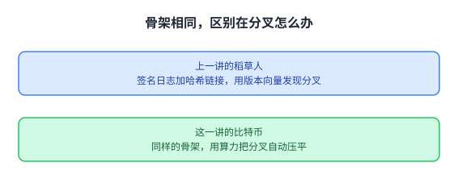

两张图的骨架一样，所以这一讲的难点不在密码学，而在谁来保证大家认同同一份日志。

## 关键危险：双重支付

这一讲的核心威胁叫双重支付。源笔记用一个买三明治的场景把它讲清楚了，我按它的顺序复述。

先看一笔正常交易怎么走。记法只有三样：新主人的公钥、这枚币上一笔交易记录的密码学哈希、以及上一任主人对这整笔交易的签名。X 先把一枚币付给 Y，于是有了一笔指向 Y 的交易；Y 想向 Z 买三明治，就先向 Z 要一个收款地址，也就是 **Z 自己的公钥**；然后由 Y 造一笔新交易（新主人写的就是 Z 的公钥）并签名，发给 Z。

Z 收到后要验三件事：交易里写的确实是自己的公钥；上一笔交易存在而且哈希对得上；这一笔的签名能用上一笔里那个公钥验证通过。三件都过了，Z 就把三明治给 Y。

这里有一个容易误解的地方，源笔记专门点明：比特币只记录交易，不记录币、账户或余额。所以 Z 的「余额」就是所有「花给了 Z、而且还没被花掉」的交易，而一枚币的「身份」就是它最近一笔交易的哈希。

这个简单方案的破口在下面。答案是同一个人可以造出两笔互相矛盾的交易。Y 用同一枚币（同一个上一笔哈希）分别造出「付给 Z」和「付给 Q」两笔交易，都签名有效、哈希都对，然后把不同的那一笔分别给 Z 和 Q 看。两个人各自检查都没问题，于是都给了三明治。源笔记把根因写得很短：**Z 和 Q 都不知道另一笔交易的存在**。

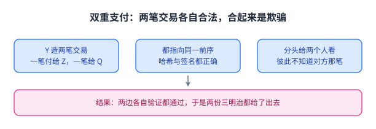

图里两笔交易各自都合法，而合起来就构成了欺骗，这说明「单笔验证通过」不足以支撑金钱。

## 公共账本

根因既然是不知情，解法就是把知情变成强制：让所有人看到同一份记录。

源笔记给的方案是一份公开账本，并对它提出三条要求：账本要发布所有交易；要保证每个人看到的是同一份日志、而且是同一个顺序；要保证没有人能把已经写进去的条目撤掉或改掉。有了这三条，Z 与 Q 就只需要相信账本里的交易。而 Q 之所以会拒绝，靠的是一条要先说明白的规则：**同一枚币不能在账本里出现两次**，一笔交易要生效，前提是它引用的那一笔还没有被别的交易花掉。两条要求各自解决的问题也能分开看：发布所有交易解决的是「不知情」；同一份日志、同一个顺序解决的是「大家看到的是同一条历史」；不可撤掉、不可改掉解决的是「已经生效的交易不会被反悔」。

这三条要求本身并不新鲜，前面几讲的[[term:consistency]]问题说的就是它们。新的问题是：由谁来维护这份账本。源笔记把这个问题留在本节末尾，然后用整讲的其余部分回答它。

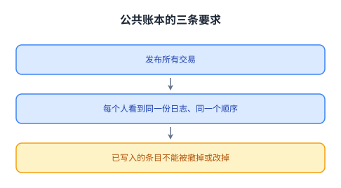

把不知情变成强制知情，就是账本要解决的问题；而账本由谁维护，才是这一讲后面要回答的事。

## 对等网络：泛洪，以及为什么必须无准入

比特币用的是一张对等网络。每个[[term:node]]都保存整条链的完整副本；每个节点只与少数几个节点建 TCP 连接，整体构成一张网格状的结构；新出的块用转发的方式泛洪给所有节点，待确认的交易也一样泛洪。源笔记解释泛洪的作用：它让所有节点都知道所有交易。

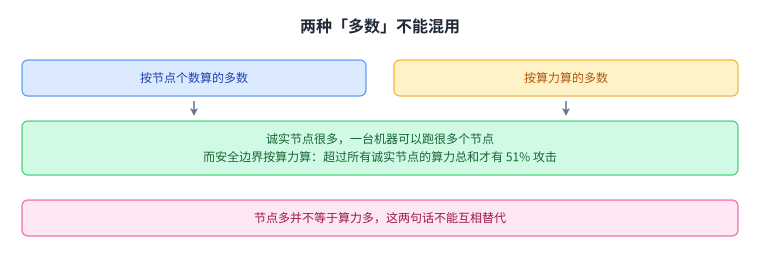

这张图把两种多数并排放，提醒后面看到「多数」时先分清是哪一种。

这个设计里有一条很关键的取舍：**任何人只要能运行程序，就能成为一个比特币节点**。源笔记说目前有数万个节点，因此必然有一部分是恶意的，而整个设计假设诚实者远多于作恶者。这里要提前分清两种「多数」：按**节点个数**算的多数（本节这句），与按**算力**算的多数（51% 攻击那一节的边界）。两者不能混用：一台机器可以跑很多个节点，所以节点多并不等于算力多。它没有试图去识别或排除坏人，而是把安全性建立在这个比例之上。

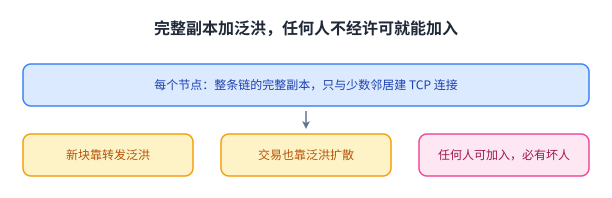

这张图解释了为什么这套系统不需要成员名单：泛洪让信息自己扩散，而比例假设替代了准入。

## 区块链里装了什么

为了让双重支付可见，账本要装下所有币上的所有交易，而装它的结构就是区块链。

源笔记列了一个块里的五样东西：指向前一个块的哈希、一笔奖励交易、一张交易列表（每笔就是公钥、上一笔哈希、签名这三样）、一个随机数、以及出块时的墙上时钟时间戳。它还特意提醒一个常被误解的细节：块本身没有签名。新块大约每 10 分钟出一个，装的是上一个块之后发生的交易，而收款方要等到自己那笔交易出现在链里才认账。

块不签名这件事值得停一下，因为它解释了后面为什么需要工作量证明。一份没有签名的记录，本身并不足以让人相信。答案是让别人没法随便造出来，而「没法随便造」这件事要靠算力来保证。

五样字段里没有签名，这一点决定了后面必须用算力而不是用身份来担保块的合法性。

## 工作量证明：为什么造一个块很贵

新块由挖矿产生，而挖矿靠的是工作量证明。源笔记给的规则只有一句：**块的哈希必须有 N 个前导零**。想造块的人不停地试不同的随机数，直到试出一个满足条件的哈希为止。这里要说明哈希**覆盖什么**：它算的是整个块的内容，也就是前块哈希、奖励交易、交易列表、随机数、时间戳这五样一起；其中只有随机数是可以随手改的那个字段，所以「试随机数」才等价于「试整个块」。改掉交易列表里的任何一笔，哈希就会变，前导零也就不再满足。

它用一个比喻说明这件事的性质：这像不停地抛一枚有无数面的硬币，直到抛出正面，每次抛都有独立的小概率成功，所以挖一个块并不是一份固定的工作量。一个 CPU 很可能要几个月才能出一个块，而同时有成千上万个节点在算，于是第一个找到的平均时间是约 10 分钟，方差很大。

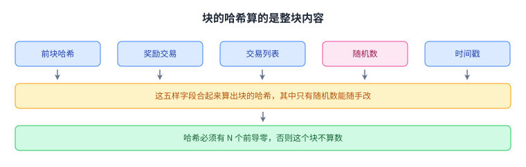

这张图解释了为什么「试随机数」能代表「试整个块」，也说明改动交易会让哈希不再满足条件。

前导零的个数是自动调整的，目的是让平均出块间隔维持在 10 分钟；这就把「算力变多」从「出块变快」改成了「每题变难」，后面讲激励时会看到它的副作用。

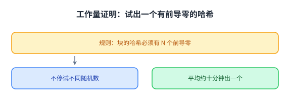

试出一个满足条件的随机数没有固定工作量，这正是「谁先算出来谁说了算」能成立的前提。

## 分叉：什么时候会同时长出两个块

源笔记接下来问了一个很自然的问题：一个块会不会有两个后继。答案是会，有两种常见情形：两个节点几乎同时试出满足条件的随机数；或者网络很慢，第二个块在第一个块还没泛洪完时就已被挖出。两个同时产生的块内容不同，因为挖它们的人知道的新交易集合略有差别。

出现两个后继时，区块链就临时分叉了。节点的做法是：先在它最先听到的那个块上接着挖，一旦听说有更长的链，就切过去。这里的「更长」是按**累积工作量**算的，也就是把沿途每个块的难度加在一起；难度不变时它等于「块数更多」，而前面那个自动调整会让难度变化，那时两者就不再是同一件事。

分叉是怎么被解决的，源笔记讲得比较细。每个节点最初相信自己看到的第一个（且合法的）新块，并在它上面找后继；如果有更多节点先听到某个块，愿意在它上面接着挖的算力通常也更多（这是常见情形，而不是必然，节点多并不自动等于算力多），于是它的后继更可能先被造出来；即使两边各占一半，由于挖矿时间的方差很大，也总会有一边先被延长。节点一旦看到更长的分叉就切过去，于是更长的分叉会吸引更多算力去延长它，共识就不断被加强。

代价是：被抛弃的那个分叉里的交易，有一部分会先出现、再消失。源笔记提醒，大多数交易在两个分叉里都有，但总有一些只在被抛弃的那一支里。「多跟几个块就更不可能被反超」这件事的定量味道在下一节：要反超，攻击者得比所有诚实节点的算力还快地挖块。

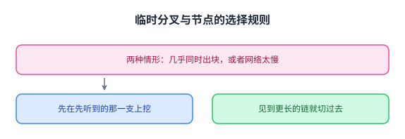

两条分叉都可能成立，节点的选择规则只有一条：谁的链更长就切到谁那一边。

## 分叉与双重支付：为什么收款方要等

被抛弃的分叉会带来一个真实的漏洞。设想 Y 付给 Z 的那笔交易正好落在一条被抛弃的临时分叉里：Z 先看到它，然后它消失了，于是 Y 可以另行广播那笔「付给 Q」的交易：它和刚被抛弃的那笔引用了同一个上一笔哈希，于是同一枚币被花了两次。源笔记由此给出两条结论。

第一，由于分叉的存在，双重支付是可能的，但一条临时分叉极有可能很快被解决。

第二，等待的策略要看商品价值。如果 Z 卖的是贵重物品，就应该等到 Y 那笔交易后面已经跟了好几个块才发货，因为那时它被另一条包含「付给 Q」的分叉反超的可能性已经很小。如果卖的是便宜东西，条件可以放松：只要一部分节点看到并验证过那笔交易就可以，甚至不必等它进块。这两档不是互相推翻，而是同一条规则的两个档位：前一节说的「要等到出现在链里」是最保守的那一档。

这两条其实是同一个权衡的两种取法：**确认的把握是用等待换来的**。

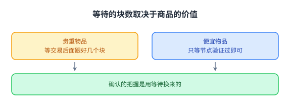

同一套机制下，等待块数就是收款方为「把握」付出的价格，交易的金额越大，这个价格就越值得付。

## 从老块起分叉，以及 **51% 攻击**

下一个问题是攻击者能不能从更早的块开始分叉，把「付给 Q」写进去。源笔记说可以，但有一条硬条件：**分叉必须更长，节点才会接受它**。因为攻击者的分叉起点落后于主链，他必须比所有诚实节点的总算力还快地挖块，才可能追上；而只有一个 CPU 的话，造出一个块就要几个月，要追上好几个块的差距更是遥遥无期，那时主链已经长得多，没有节点会切到他那条更短的链上。

这就引出这套设计最有名的边界：51% 攻击。如果攻击者的算力超过所有诚实节点的总和，他就能造出最长的分叉，所有人都会切过去，于是他就能双重支付。

源笔记给了一个很漂亮的视角来理解工作量证明：它相当于在所有节点之间做一次随机抽签，决定谁有权延长分叉，而抽中的概率与算力成正比。只要多数参与者是诚实的，他们就会不断加强最长分叉上的一致；而随机的选择意味着一个算力很小的攻击者拿不到多少机会去把共识推到另一条分叉上。笔记在这里加了一句感慨：让人意外的是，这种随机选择在不知道参与者身份、甚至不知道参与者有多少个的情况下居然做得成。

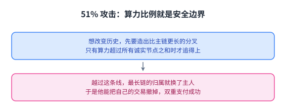

这张图说明算力比例就是这套系统的安全边界：越过一半，最长链的归属就换了主人。

## 激励、验证与这套设计的边界

挖矿要有人做，而且要有很多人做，否则 51% 攻击就变得容易。源笔记因此指出激励的必要性：每个新块会给挖到它的人几枚新造出来的比特币，块里放着收这些币的公钥。这就是让人愿意来挖矿的理由。这里要分清两批人：存全链并转发交易的**节点**几乎零成本，而**挖矿的人**要出算力；奖励只给后者，两者不必是同一批人。而前导零个数会自动调整，把平均间隔维持在 10 分钟。

这一条激励带来四个可预期的后果，笔记都列了出来：算力上的军备竞赛，因为硬件越多奖励越多；为此出现专用硬件；矿工结成矿池协作；以及能源浪费。它还回答了一个看似矛盾的问题：凭空造出钱这件事看起来矛盾，答案是**规则由多数节点运行的代码决定**，而这些代码都认可那笔特殊的奖励交易。

验证那一侧，源笔记分三类写。对一笔新交易，节点要检查上一笔交易存在、没有别的交易花掉同一个上一笔、签名确实来自上一笔里那个公钥；通过之后才把它放进下一个块的候选列表。对一个新块，节点要检查哈希的前导零够不够（也就是随机数对、工作量被证明了）、前一个块的哈希存在、块里所有交易都合法，并且在它比当前最长链更长时切过去。而作为收款方 Z，则要确认自己那笔交易在块里、自己的公钥在交易里、而且后面还跟着好几个块。

这一讲最后列了这套设计的弱点，这一段值得完整看：工作量证明很费电；它同时是一种新货币和一套支付系统，两件事绑在一起并不方便；交易确认至少要 10 分钟，要高把握要 60 分钟；泛洪限制了性能，而且可能成为攻击点；块大小上限加上 10 分钟的间隔限制了每秒交易数，笔记给的数字是约 5 笔每秒，而信用卡系统大约是每秒 5000 笔，[[term:throughput]]差三个数量级；它容易受到[[term:quorum]]层面的多数攻击（这里说的仍是算力上的多数，与前面 51% 攻击是同一件事）；匿名性上有一个两难：交易和地址都是公开的，任何人都能顺着地址看到资金的来去，所以它并不提供真正的匿名；但地址与现实身份之间没有强制的绑定，这种不记名又足以吸引非法活动。加入的门槛也常被误读：跑一个节点几乎零成本，而要挖矿获利则需要专用硬件与电费；普通用户很难保管好自己的私钥。

这张图的作用是提醒：前面那套机制解决的是「无中心如何达成一致」，而不是「这套系统在所有方面都更好」。

笔记最后把这一讲的两条要点收在一起：公开且被共同认可的账本本身是个极好的想法，而挖矿是一种用来解决分叉、保证共识的聪明办法。它预告下一周讲 BFT，那是从可能不可信的服务器那里获得安全的另一条路。

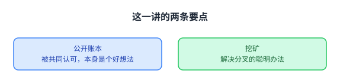

把这两条收在一起看，这一讲给出的不是一种货币，而是一套在无中心条件下产生共识的办法。

## 读完应该能回答

1. 双重支付在那个简单的交易链方案里为什么可行，根因是什么？
2. 公共账本的三条要求各解决什么问题，为什么有了它 Q 就会拒绝那笔付给自己的交易？
3. 工作量证明为什么要让块的哈希有前导零，难度自动调整把「算力变多」变成了什么？
4. 临时分叉是怎么被解决的，为什么收款方等待的块数取决于商品的价值？

## 脉络回顾

这一讲在整门课里的位置，要从「谁来保证顺序」这条线上看。第 3 讲的 GFS、第 4 讲的 Paxos，以及后来的 Raft 与 ZooKeeper，都由一个已知的、有资格参与的小组来维护顺序，它们的成员是配置出来的，多数的同意就是结论。第 16 讲的 Memcached 放弃了严格一致，换来了性能，但它仍然假设参与者的身份是清楚的。

这一讲把这两个前提都拿掉了：没有成员名单，没有准入，参与者可以匿名加入，而且其中必然有人是坏的。它给出的答案是换一种方式产生「谁说了算」：不再靠投票，而是靠算力抽签，谁先算出一个满足条件的哈希，谁就获得延长链的权力；而链越长，切过去的人越多。这套机制把「多数」从一个名单上的概念换成了一个可以随时变化、连总数都不知道的算力比例。

另一条线是它与上一讲的对照关系。上一讲 SUNDR 的目标是发现服务器在骗你，代价是分叉不可愈合；这一讲的目标是自动解决分叉，代价是允许短暂的矛盾存在（所以贵重交易要多等几个块）。两讲都在处理「签名日志加哈希链接」这一骨架，区别在于一个用版本向量去发现分叉，另一个用算力去压平分叉。下一讲要讲的 BFT 是第三条路：仍然靠投票，但把票投给一个明确的成员集合，并用协议去容忍其中一部分成员的任意行为。

## 溯源

以下是为核验而记的元数据（哈希、字段核对、术语检查），与正文内容无关，读者可以跳过。

- 字段核对：`docs/lecture-manifest.md` 第 34 行为 `Peer-to-peer: Bitcoin`，源文件 `notes/l-bitcoin.txt`（标注可用、11,510 B），本仓状态为「待做」；本页按该行落盘到 `content/20-bitcoin/`、`lecture = 20`、`slug = bitcoin`。抓取副本 `_fc/l-bitcoin.txt`：292 行、11,510 字节、归一化 SHA256 `0F3473BAACA96F472EB8F78E9260760D92500C3B321D5B22518AD8F88994F13B`（按 CRLF 归一为 LF 后计算）。

- 源的性质与范围：这是一份讲授笔记（要点式，292 行），不是论文全文；本页只依据它重新讲解概念，`status = "draft"`。核对草稿见 `docs/audit/20-bitcoin-factcheck.md`，每张图一份复核记录见 `docs/audit/visual-review/mit-6.5840__bitcoin-<n>.md`。

- 许可：本课 `course.toml` 的 `[license] verified = false`、`redistribution = "unknown"`（徽章只在课程主页出现，本讲依据的笔记文件无许可声明），因此 只写原创讲解，不产出逐字稿与双语原文对照；Lab 代码与作业答案不在范围内。

- 配图：源笔记里只有一处以方括号 diagram 标注的示意图（对等网络那一处），本页没有取用它，13 张图全部自绘（`bitcoin-1` 到 `bitcoin-13`）。

- 成对的数与自查：源笔记里凡「说 N 项」处都与紧随的清单数过，全部一致：双重支付场景的验签条件三条、公共账本的要求三条、块里的字段五个、块不签名这件事一处、同时出块的两种情形、被抛弃分叉的两条结论、51% 攻击的前提一条、激励带来的后果四条、验证清单三类、设计弱点九条。本页自己声称的数目（13 张图、4 道自测题）也数过，与正文一致；内容小节数不在此处声称，以免与实际节数脱节。

- 四种子形态的覆盖面：方向词核三处（Z 把自己的收款公钥给 Y、新块向前块哈希回指、节点在更长的链出现时切过去），自洽；等号两边核一处（一枚币的「身份」等于它最近一笔交易的哈希，本页写明了它带来的后果，即余额只是一组未花费交易）；说 N 项列 M 项核四处，一致；例子合判据核两处（Y 同时造两笔都指向同一个前笔哈希的交易与「双重支付」结论对应；临时分叉与「先出现再消失」对应）。

- 第五类即同名是否指同一物，核两处：一是「分叉」，本讲的分叉与上一讲 SUNDR 的分叉不是同一种东西（这里的会被算力压平，那里的永远合不回去）；二是「账本」与「链」，账本是逻辑内容、链是装它的结构（本页分别写清，并说明块本身没有签名而链的不可改靠工作量证明）。

- 术语 grep：`Bitcoin`、`blockchain`、`proof-of-work`、`mining`、`nonce`、`double-spending`、`51% attack`、`hard fork` 在本仓已提交页面中此前未出现；`consistency`、`log`、`fault-tolerance`、`Byzantine fault` 已见于 `09-zookeeper`、`papers/raft`、`19-sundr`。结论：不新增词条（`glossary.toml` 未改动，`Bitcoin` 与 `blockchain` 均按纯文本写），页内标记只用既有键且只加在正文。

- 我们补的（源笔记没有写）：十节的结构说明；把「痛点」明确写成「前面几讲的前提被推到极端（连身份和人数都不知道）」这个读法；把等待策略概括成「确认的把握是用等待换来的」；把「分叉」一词在 SUNDR 与本讲之间的差别写成一条对照；以及把难度自动调整解释成「把算力变多从出块变快改成了每题变难」。

- 我没做的事：没有读 2008 年那篇论文全文（本页只依据这份讲授笔记）；没有取用源笔记里那处 diagram 示意图；没有核对笔记里未出现的任何数字（例如笔记提到的比特币价格；本页不引用价格）；没有提交、没有推送。

- 与仓内两页的分工：`content/papers/raft/index.md` 讲有中心的复制日志（成员是已知的一小组，靠多数派投票决定顺序，防的是[[term:crash]]与网络分区，属于[[term:Byzantine-fault]]之外的失效模型）；`content/19-sundr/index.md` 讲不可信服务器上的完整性（服务器不崩但在挑给你看什么，防旧值、藏更新与愈合分叉）；本页讲无中心账本如何达成一致（没有成员名单、没有准入、连参与者总数都不知道，防的是双重支付，并允许短暂分叉、用算力把它压平）。三页共享「带签名的操作日志加哈希链接」这一骨架，本页在开头就把这一点写明，后面只讲与它们不同的部分。
