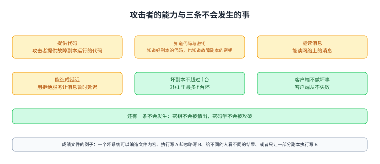
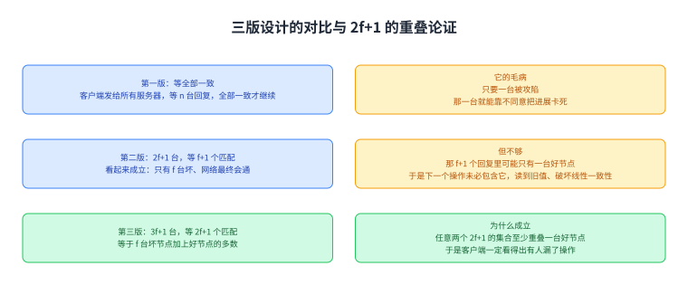
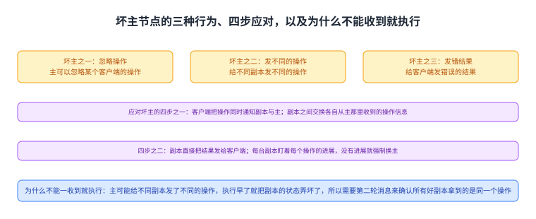
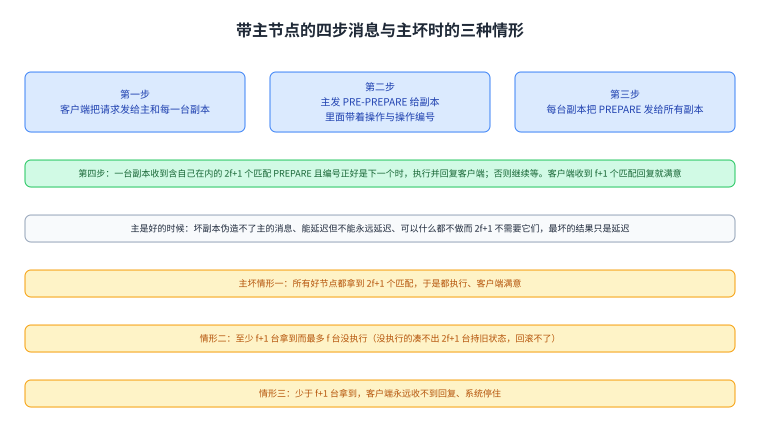
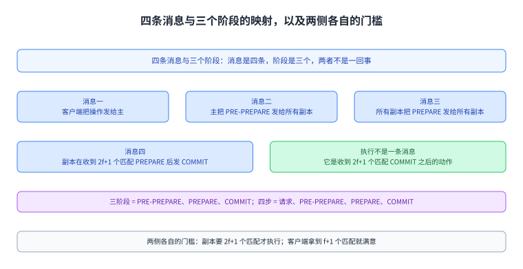
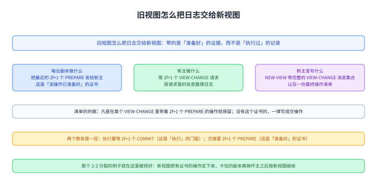
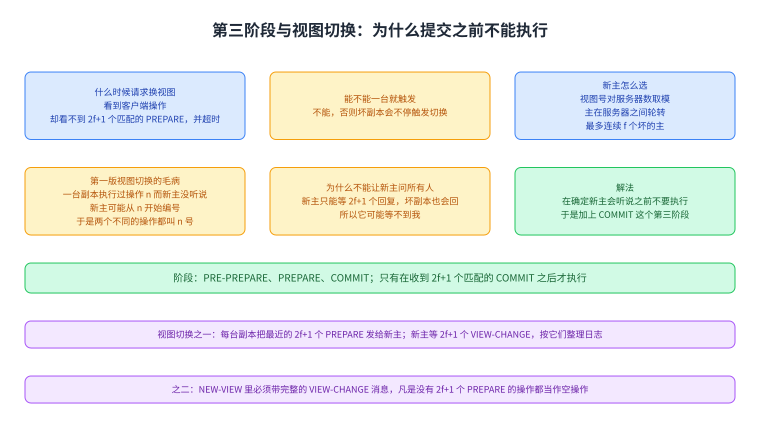

+++
kind = "lecture"
lecture = 21
slug = "bft"
title = "拜占庭容错：当副本会撒谎"
status = "draft"
output_mode = "explanation"
source_kind = "notes"
source_url = "https://pdos.csail.mit.edu/6.824/notes/l-bft.txt"
+++

> 来源课程：MIT 6.5840 / 6.824 Distributed Systems（Robert Morris、Frans Kaashoek 与 MIT PDOS）；
> 对应内容：Lecture 21 — Byzantine Fault Tolerance，阅读材料是 Castro 与 Liskov 的 "Practical Byzantine Fault Tolerance"（OSDI 1999）；
> 原文笔记：https://pdos.csail.mit.edu/6.824/notes/l-bft.txt ；
> 上游许可：课程主页标注 CC BY 3.0 US，但本讲所依据的笔记文件本身没有许可声明，覆盖范围未获确认，因此本页只讲概念、不转载任何原文；
> 本文由 CourseLingo 原创撰写：我们对这一讲的主题做了重新讲解，而不是翻译原讲座文本，也没有逐句改写原文、没有转载它的幻灯片与图表；本文非官方材料，CourseLingo 与 MIT 及本课程教学团队无隶属关系；如与原文有出入，以原文为准。

## 这一讲要解决什么：把「只会崩」换成「任意行为」

前面几讲处理的是崩溃容错：源笔记说我们考虑过很多容错协议，而它们始终假设「失败即停止」，也就是节点像断电那样停下来，并且服务器仍然遵守协议。源笔记说这已经够难了：得区分崩溃与网络中断，还得处理网络分区。这一讲要问的是：能不能处理更大的一类失败。它列出三种：算错而不是停下的有 bug 的服务器、不遵守协议的服务器、以及被攻击者改过的服务器；随后给这类失败起了名字，也就是拜占庭失败。

先把本页的记号说清，后面几节都要用：`f` 在本页只表示数量，也就是允许坏掉的台数；而举例里那台具体的坏服务器写作大写 `F`（源笔记在这两处用了同一个字母，本页把它们分开，免得一页里同一个符号指两样东西）。另外 `v` 是视图号，它表示现在是第几任主，与操作编号 `n` 不是一回事。

图里四格就是这套记号：`f` 是允许坏掉的台数、举例里的坏服务器写作 `F`、`v` 是视图号、`n` 是操作编号。

论文的做法是复制状态机，前提是 3f+1 台里至少 2f+1 台是好的，用投票来选出正确的结果；源笔记特意提醒，这件事没有听起来那么容易。它还交代了为什么不直接假设「有些节点只是有 bug」：我们要按最坏情况来假设，也就是一个攻击者控制了那 f 台故障副本，并且正在主动试图破坏系统；源笔记说，如果我们能扛住这种情况，那么扛住 f 台副本里的 bug 自然也成立。

图里上面是前几讲的假设（失败即停止、服务器遵守协议，而这已经很难：崩溃与网络中断、网络分区），中间四格是这一讲要处理的更大一类失败（算错的服务器、不遵守协议的服务器、被攻击者改过的服务器，以及这类失败的名字「拜占庭失败」），下面一格是论文的做法与前提（复制状态机，3f+1 里至少 2f+1 是好的，用投票选正确结果，而这不简单）。

## 攻击者的能力，以及三条做不到的事

要设计协议，先得把对手写清楚。源笔记说，假设最坏情况就是一个攻击者控制那 f 台故障副本并主动破坏，那么他的能力包括五项：提供故障副本运行的代码、知道好副本运行的代码、知道故障副本的密码学密钥、能读网络上的消息，以及能通过拒绝服务暂时让消息延迟。与之相对，源笔记列了三条不会发生的事：总台数只有 3f+1 台，其中坏掉的不超过 f 台、客户端不会失败（客户端从不做坏事）、以及密钥不会被猜出、密码学不会被攻破。

为了说明「坏系统能做什么」，源笔记给了一个很小的成绩文件场景：一个人写完 `A` 又写 `B`，然后告诉另一个人「成绩文件好了」，后者去读它。一个有故障的系统可以做出四种坏事：彻底编造文件内容、执行了写 A 却忽略写 B、给不同的人看不同的结果（对一个人显示 B、对另一个人显示 A），以及只让一部分副本执行写 B。

图里上面五格是攻击者的能力（提供故障副本的代码、知道好副本的代码、知道故障副本的密钥、能读网络消息、能用拒绝服务暂时延迟消息），下面三格是三条不会发生的事（坏副本不超过 f 台、客户端不做坏事、密码学不被攻破），中间一格是那个成绩文件的场景与坏系统能做的四件事（编造内容、执行 A 忽略 B、对不同人给不同结果、只让部分副本执行）。

## 从三个失败的设计走到能用的设计

源笔记的讲法是先自己设计，再一步步修。第一版设计是：客户端与 n 台服务器各有公私钥，每条消息都签名、收方验证；服务器之间不共享同一套漏洞（不同的操作系统、不同的实现）；客户端把请求发给所有服务器，等所有 n 台回复，只有全部一致才继续。它的毛病很直接：只要有一台被攻陷，那一台就能靠不同意，把整个进展卡死。

第二版改成投票：用 2f+1 台服务器、假设最多 f 台坏，客户端等 f+1 个匹配的回复。源笔记说它的理由看起来成立（如果只有 f 台坏，而网络最终会通，那一定能凑到）。但它立刻指出这不够：那 f+1 个匹配的回复里可能只有一个是好节点，也就是说可能只有一台好节点执行了这个操作；而下一个操作也只要 f+1 个匹配回复，未必包括那台见过上一个操作的好节点。

源笔记给了一个具体的错法：三台里 F（那台坏服务器）收到并回复了两个写操作、g1 收到两个、g2 漏掉第二个；随后一次读里，F 与 g2 回复，而 g1 这一次漏掉。g1 漏掉不是因为它坏，而是攻击者按前面列出的能力把它的消息暂时延迟了，于是读出来的是旧值。后果是客户端被一个过时的状态骗了，而这破坏了正确性：本应返回新值的线性一致性读，返回了旧值。

源笔记在结论那行写得很清楚：必须保证回复里包含好节点的多数，这样后面至少有一个好节点会返回新值。这里说的「多数」是在好节点那个集合里取的（不是全部 3f+1 台，也不是客户端实际收到的那些回复）；下一节把总台数改成 3f+1、把副本侧的执行门槛改成 2f+1，正是为了让这句话有一个能操作的形式。

这里先留一句桥，免得后面看起来自相矛盾：客户端那一侧的门槛（f+1）本身不是问题，问题在副本侧。第二版里副本一收到主的 PRE-PREPARE 就执行，所以「f+1 个匹配回复」很可能只对应一台真正执行过的好节点；而到了本节末尾那版设计，副本必须拿到 2f+1 个匹配 PREPARE 才执行，客户端等 f+1 个回复就安全了：那 f+1 个回复里至少有一台执行过的好副本，而好副本之间不会就同一个操作给出不同结果。

图里三格是那个论域：总数 3f+1、好节点 2f+1、坏节点最多 f；下面两格说明两个各含至少 f+1 个好副本的子集必定相交。

第三版就是 3f+1 台、最多 f 台坏，客户端等 2f+1 个匹配的回复；源笔记说这等于 f 台坏节点加上好节点的多数，于是任意两个 2f+1 的集合至少重叠一个好节点。它给的第二个错法例子说明了这种情况下客户端会怎样：一个写操作被 F、g1、g2 处理而 g3 漏掉；随后读时，F 与 g3 回旧值、g1 与 g2 回新值，两边都凑不到 2f+1 ⇒ 客户端不知道信谁，但它一定看得出出了问题；源笔记说客户端因此能发现有些好节点漏掉了操作，至于怎么修，稍后讲。

图里上面三格是三版设计（第一版等全部 n 台一致，但一台被攻陷就能卡死；第二版 2f+1 台等 f+1 匹配，但可能只有一个好节点看到操作，于是读到旧值、破坏线性一致性；第三版 3f+1 台等 2f+1 匹配），中间一格是第三版为什么成立（f 台坏节点加上好节点的多数，任意两个 2f+1 集合至少重叠一个好节点），下面一格是它的效果（客户端一定看得出有人漏了操作，怎么修稍后讲）。

## 多个客户端、主节点，以及主节点能做的坏事

多客户端带来一个新要求：源笔记说好副本必须按同样的顺序处理操作。于是要有一个主节点为并发的客户端请求排定顺序，可是主节点自己也可能是坏的。源笔记列出坏主节点的三种行为：忽略某个客户端的操作、给不同副本发不同的操作、以及给客户端发错误的结果。

对应的通用应对办法是四步：客户端把每个操作同时通知副本与主；副本之间交换各自从主那里收到的操作信息；副本直接把结果发给客户端；以及每台副本都盯着每个操作的进展，如果没有进展，就强制更换主节点。

接着是一个很关键的问题：副本能不能一收到主发来的操作就执行。源笔记的回答是不能，理由是主可能给不同副本发了不同的操作；如果在没弄清之前就执行，副本的状态就被弄坏了；所以需要第二轮消息来确认所有好副本拿到的是同一个操作。

图里上面三格是坏主节点能做的三件坏事（忽略某个客户端的操作、给不同副本发不同的操作、给客户端发错误的结果），中间四格是通用应对的四步（客户端同时通知副本与主、副本之间交换信息、副本直接把结果发给客户端、每台副本盯着进展并在没有进展时强制换主），下面一格是为什么不能一收到就执行（主可能给不同副本发不同的操作，执行早了就把状态弄坏了，所以需要第二轮消息）。

## 带主节点的设计：四步消息与三种情形

源笔记给的这一版设计是：3f+1 台服务器里有一台是主，最多 f 台坏，而主自己也可能坏；客户端把请求发给主和每一台副本；主选定下一个操作与操作编号，并把 PRE-PREPARE(操作, 编号) 发给副本；每台副本把 PREPARE(操作, 编号) 发给所有副本；如果一台副本收到包括自己在内的 2f+1 台发来的同一个 PREPARE，而且编号正好是下一个操作编号，它就执行这个操作（可能修改状态）并把回复发给客户端；否则就继续等。而客户端在收到 f+1 个匹配的回复时就满意了。这里的「匹配」指值与编号都一样：值相同才算同一个结果，编号相同才排除两件事被当成一件。顺便把三个会在后面反复出现的词一次说清：复制状态机指多台副本从同一初始状态出发、按同一顺序执行同一串操作，因而走到同一状态；视图指「当前由哪一任主来排定顺序」这一届任期，视图号 `v` 就是它的编号，与操作编号 `n` 无关；空操作指占着一个编号、但什么都不做的操作。

源笔记随后用「好的主」与「坏的主」两种情况逐一推演。如果主是好的，坏副本能不能阻止正确的进展：它们伪造不了主的消息；它们能延迟消息但不能永远延迟；它们可以什么都不做，但那样 2f+1 个匹配的 PREPARE 不需要它们；它们也可以发出正确的 PREPARE，同时对 f 台好副本做拒绝服务让它们听不到操作，但那些副本最终会从主那里听到；所以最坏的结果只是延迟。

如果主是坏的，副本会不会发现：主伪造不了客户端的操作（那些是签过名的）；它也忽略不掉客户端的操作（客户端是发给所有副本的）；它能尝试的是给不同副本发不同顺序、或者让副本以为某个操作已经被处理而其实没有。源笔记把主给不同副本发不同操作的结果分成三种情形。

情形一：所有好节点都拿到 2f+1 个匹配的 PREPARE ⇒ 它们拿到的是同一个操作（因为任意两个 2f+1 集合至少共享一台好服务器）⇒ 所有好节点都会执行，客户端满意。情形二：至少 f+1 台好节点拿到 2f+1 个匹配的 PREPARE ⇒ 同样不可能出现分歧，于是 f+1 台好节点会执行、客户端满意，但最多 f 台好节点没有执行；

源笔记在这里推演坏主的一次尝试：它能不能让客户端以为这个操作没有发生（也就是把状态退回去）。做法是把「写 B」只发给 f+1 台副本，而把随后那个「读」发给剩下 f 台，这样客户端看到的就是旧值。源笔记的回答是退不回去：那 f 台没执行过这个操作的副本凑不出 2f+1 台持旧状态的匹配 PREPARE，于是既过不了副本侧的执行门槛，也留不下能让新主采信的证据。情形三：拿到 2f+1 个匹配 PREPARE 的好节点少于 f+1 台 ⇒ 客户端永远收不到回复，而系统会停住，因为有 f+1 台卡在这个操作上等。

图里上面四格是那四步消息（客户端发给主和每台副本、主发 PRE-PREPARE、每台副本向所有副本发 PREPARE、收到含自己的 2f+1 个匹配 PREPARE 且编号正确时执行并回复），中间一格是主好时的结论（坏副本伪造不了主的消息、能延迟但不能永远延迟、可以什么都不做而 2f+1 不需要它们，最坏只是延迟），下面三格是主坏时的三种情形（所有好节点都拿到 2f+1 个匹配 PREPARE；至少 f+1 台好节点拿到而最多 f 台没执行、且凑不出足够 PREPARE 来回滚；少于 f+1 台拿到则客户端永远收不到回复、系统停住）。

## 第三阶段：为什么提交之前不能执行

主坏掉之后怎么继续。源笔记说要一次视图切换来选出新的主（它特意说明这次切换只选主，不涉及「哪些服务器还活着」这件事），而触发条件是：一台副本看到某个客户端操作、却看不到 2f+1 个匹配的 PREPARE，并且超时之后。有了 COMMIT 阶段之后还要补一条：拿到了 2f+1 个匹配的 PREPARE、却拿不到 2f+1 个匹配的 COMMIT，同样算没有进展，超时后也可以触发视图切换。它还指出不能让单独一台副本就能触发切换，否则坏副本可以不停地触发切换；至于要多少台才能触发，源笔记说先搁置。

新主是谁：为了让坏副本不能总是把自己变成新主，他们用视图号 v，主是 v 对 n 取模，于是主在服务器之间轮转，最多连续 f 个坏的主。第一版视图切换设计（源笔记注明不正确）是：副本把 VIEW-CHANGE 请求发给新主；新主等足够多的请求；新主用 NEW-VIEW 宣布切换，里面带着那些 VIEW-CHANGE 请求作为「足够多副本想换视图」的证据；新主从它见到的最后一个编号加一开始给操作编号。

问题立刻出现：源笔记设想一台副本看到了 2f+1 个匹配的 PREPARE 因而执行了操作 n，而新主没有，于是新主可能从 n 开始编号，导致两个不同的操作都叫 n 号。能不能让新主去问所有副本「你们执行了哪些操作」：不行，因为新主只能等 2f+1 个回复，而坏副本也会回，所以它可能等不到那台已经执行过操作 n 的副本。解法是换一条原则：在确定新主一定会听说这个操作之前，不要执行它，于是加上第三个阶段：PRE-PREPARE、PREPARE，然后 [[term:commit]]COMMIT，只有在 COMMIT 之后才执行。

这里要把两件容易混的事分开，否则后面会看起来像前后打架：PREPARE 证书证明的是「这个操作已经在上一视图里准备好」，而执行要等到 COMMIT；视图切换时新主采信的正是这个「准备好」的证据（2f+1 个 PREPARE），把该操作连同证据一起写进新视图。「准备好」不等于「执行过」，所以它与「必须等到 COMMIT 才执行」并不冲突。

于是操作协议按四条消息排，而消息是四条、阶段是三个，两者不是一回事：第一条消息是客户端把操作发给主；第二条是主把 PRE-PREPARE(操作, 编号) 发给所有副本；第三条是所有副本把 PREPARE(操作, 编号) 发给所有副本；第四条是一台副本在收到 2f+1 个匹配的 PREPARE 之后，向所有副本发 COMMIT(操作, 编号)。执行不算一条消息，它是这条消息之后的动作：副本在收到 2f+1 个匹配的 COMMIT 之后才执行。也就是说：三阶段是 PRE-PREPARE、PREPARE、COMMIT；四步是请求、PRE-PREPARE、PREPARE、COMMIT。另外，和 PREPARE 一样，副本自己发出的 COMMIT 也算在那 2f+1 个里。

图里四格是那四条消息与前三个阶段（执行是门槛之后的动作），另外两格是两侧各自的门槛：副本要 2f+1 个匹配才执行，客户端拿到 f+1 个匹配就满意。视图切换也随之变成：每台副本把最近的 2f+1 个 PREPARE 发给新主；新主等 2f+1 个 VIEW-CHANGE 请求，并按这些请求里的信息整理日志；新主把 NEW-VIEW 发给所有副本，里面带着完整的 VIEW-CHANGE 消息集合，以及一份「凡是在某个 VIEW-CHANGE 里带着 2f+1 个 PREPARE 的操作」的清单，而不在这个清单里的操作一律当作空操作。

最后源笔记给了两处「为什么这样才安全」的论证。其一：一台副本执行了某个操作，新主会知道吗。副本只在收到 2f+1 个 COMMIT 之后才执行，其中最多 f 个来自坏节点、而它们不会告诉新主，所以至少 f+1 个好副本给它发过 COMMIT；新主等的是 2f+1 个 VIEW-CHANGE 请求，其中最多 f 个来自坏节点，所以也至少 f+1 个好副本给它发过 VIEW-CHANGE。关键是把两边的论域限定在好副本那 2f+1 台里：两个子集各至少 f+1 个成员，而 2 乘 (f+1) 大于 2f+1，因此它们在好副本集合里必定相交，也就是说新主一定会从某台好副本那里听说这个操作。其二：新主能不能漏掉一些被报告上来的近期操作。不能，因为 NEW-VIEW 必须包含签过名的 VIEW-CHANGE 消息。

图里三格是三方各自做的事（副本把 2f+1 个 PREPARE 当证书交给新主、新主等 2f+1 个 VIEW-CHANGE 并按它们整理日志、新主用 NEW-VIEW 宣布并附上最终操作清单），另三格是清单的判据、两个数各管一段、以及那个 2-2 分裂的例子在这里被接上。

图里上面两格是视图切换的触发与「不能只由一台副本触发」（看到操作却看不到 2f+1 个匹配 PREPARE 且超时；若一台就能触发，坏副本会不停触发切换），中间两格是新主的选择与第一版设计的毛病（视图号对服务器数取模、主轮转、最多连续 f 个坏的主；新主可能从同一个编号开始，于是两个不同的操作都叫 n 号），下面三格是解法（在确定新主会听说之前不要执行、加上 COMMIT 这个第三阶段、视图切换时新主按 2f+1 个 VIEW-CHANGE 整理日志并把没有 2f+1 个 PREPARE 的操作当成空操作）。

## 收束：论文的其他内容、极端情形，以及三页的分工

源笔记最后交代了论文里还讨论了什么：检查点与日志来帮助好节点恢复、各种密码学优化、在常见情况下减少消息数量的优化，以及快速的只读操作。它随后留下两个问题让我们自己思考：坏掉的服务器超过 f 台时会怎样、系统还能不能恢复；以及如果客户端本身是坏的呢。最后它给了一个很实际的角度：假设攻击者能攻陷一台服务器（利用漏洞、偷到口令、或者物理接触），那他为什么不能把所有服务器都攻陷。

至于这一讲在整门课里的位置，可以与另外两页对照着看。`content/papers/raft/index.md` 处理的是崩溃容错：节点只会停下来、不会撒谎，因此多数派选出的日志就是可信的；`content/19-sundr/index.md` 处理的是不可信的服务器：服务器会骗你，但它不会主动与其他服务器合谋，于是客户端可以靠自己的检测与历史记录发现被篡改；

而这一讲要处理的是任意行为，包括撒谎与合谋，代价是副本数从多数派变成 3f+1 里 2f+1、阶段从两轮变成三轮。换句话说，三页都在问「多副本读到什么才算对」，而它们的答案沿着一个阶梯收紧：不会撒谎 → 会撒谎但不合谋 → 任意行为。

图里上面三格是那条阶梯（Raft：节点只会停下来，多数派日志可信；SUNDR：服务器会骗你但不主动合谋，客户端靠检测与历史发现篡改；本讲：任意行为，包括撒谎与合谋），下面两格是这一讲的代价（副本数从多数派变成 3f+1 里 2f+1）与三个阶段的协议，最后一格说明这一页只在与那两页交界处注明分工，不重复它们的机制。

图里上面四格是论文还讨论了什么（检查点与日志帮助好节点恢复、密码学优化、常见情况减少消息数、快速只读操作），下面三格是留给读者的问题（坏掉的服务器超过 f 台会怎样、客户端本身坏了呢，以及那个很实际的角度：攻击者能攻陷一台，为什么不能攻陷全部）。

## 读完应该能回答

1. 「失败即停止」假设了什么，拜占庭失败比它多了哪几种可能？
2. 攻击者能做哪四件事、又有哪三件事不会发生，坏系统在这个成绩文件场景里能做出哪四种坏事？
3. 为什么 2f+1 台里等 f+1 个匹配回复不够，而 3f+1 台里等 2f+1 个匹配回复就够（重叠论证说的是什么）？
4. 为什么要加上 COMMIT 这个第三阶段，视图切换里新主凭什么能整理出正确的日志？

## 脉络回顾

这一讲是这门课在容错方向上的收束。前面几讲一路把假设收紧：先是从崩溃容错谈到网络分区，然后是复制日志（多副本如何对同一串操作达成一致），再是协调服务与不可信服务器。这一讲把假设放到最松：副本可能撒谎、可能合谋、可能被攻击者完全控制，而我们要在这种前提下仍然让所有好副本按同一顺序执行同一串操作。

最要紧的转折是数量与阶段这两件事一起变了。在崩溃容错里，多数派（例如 3 台里的 2 台）就够，因为坏节点不会撒谎；而一旦允许撒谎，就必须把「好节点的多数」与「坏节点的上限」分开来算：3f+1 台里允许 f 台坏，客户端等 2f+1 个匹配回复，才能保证任意两次决策的集合至少重叠一台好节点。

第二个变化是阶段：源笔记特意演示了第一版视图切换为什么错（一台副本执行过、而新主没听说，于是两个不同的操作会共用一个编号），而修法不是让新主去问更多人（它只能等 2f+1 个回复，坏节点也会回），而是把原则改成「在确定新主一定会听说之前不要执行」，于是有了 PRE-PREPARE、PREPARE、COMMIT 三个阶段。

这一讲的许多细节（检查点、密码学优化、只读快路径）都在论文里，而它们都是在这套骨架之上做的优化。

回到前面那个 2-2 分裂的例子：当时说「怎么修，稍后讲」，而修法就是本节这套视图切换，它让卡住的副本换掉坏主，把漏掉的操作用新视图补回来，于是那两段故事在这里接上了。

回到前面那个 2-2 分裂的例子：当时说「怎么修，稍后讲」，而修法就是本节这套视图切换，它让卡住的副本换掉坏主、把漏掉的操作用新视图补回来，于是那两段故事在这里接上了。

按仓内清单，这一讲是这门课最后一条待产出的讲次；它的价值不在代码，而在这条阶梯的最右端：当节点不再可信时，共识的价格是多少。

## 溯源

- **字段核对**：`courses/mit-6.5840/docs/lecture-manifest.md` 第 21 行为 `Byzantine Fault Tolerance`，源文件 `notes/l-bft.txt`（标注可用、13,785 B），本仓状态原为「待做」；本页按该行落盘到 `content/21-bft/`、`lecture = 21`、`slug = bft`、`status = "draft"`。
- **源文件**：抓取副本 `_fc/l-bft.txt` —— 342 行、13,785 字节、归一化（`read_bytes().replace(b"\r\n", b"\n")`）SHA256 `8BA9633DFFA0E8A64277D97E45B9F2E436720F9715FA6E10C1F1401EEE4D7767`。
- **源里的图**：源笔记没有任何图片文件（`.png`/`.jpg` 计数为 0，`[diagram]` 占位也为 0）；它用纯 ASCII 画了两幅消息时序示意（在第 108 行与第 140 行一带），本页没有转载这些 ASCII 图，而是用自己的 8 张自绘图讲解同一件事。

- - **许可**：本课 `course.toml` 的 `[license] verified = false`、`redistribution = "unknown"` ⇒ 本页只写原创讲解，不产出逐字稿、不产出双语原文对照，也没有转载源笔记的图表；Lab 代码与作业答案不在本页范围内。

- **成对的数与跨讲自查（含把源文与我自己写的每个「N 项」数一遍）**：攻击者能力五项、不会发生的事三条、坏系统能做的坏事四种、坏主能做的三件、应对坏主的四步、主坏时的三种情形 —— 上述每一处都顺着页面数过一遍，与该处随后的列表条数一致；

- 参数自洽：3f+1 里至多 f 坏，2×(2f+1)−(3f+1) = f+1 > f ⇒ 任意两个 2f+1 集合至少重叠一台好节点对；

- 本页溯源里我自己写的每一处数目（七节、五项、三条、四种、三件、四步、三种）都在最后一次改字后重数过一遍；而**图的张数以 `figures/` 目录为准**（本页不写死张数，避免加图后忘记改）。

- **术语 grep 的结果**：本页涉及的英文词里，`Byzantine`／`PBFT`／`PRE-PREPARE`／`PREPARE`／`COMMIT`／`VIEW-CHANGE`／`NEW-VIEW`／`Stellar`／`Hyperledger`／`Bitcoin` 逐个在本仓所有已提交页面 grep 过（`-i`，且把 `[[term:…]]` 里的键也算命中）：这些词此前都没有出现；而 `Raft`／`ZooKeeper`／`linearizability`／`state machine` 一类在 `papers/raft`、`09-zookeeper` 与 `04-paxos` 里出现过。结论：本页不新增词条（`glossary.toml` 未改动），专有词一律用纯文本，也不为 `PBFT`／`Byzantine` 造键。
- **我们补的（原文没有写）**：把要点式笔记重新组织成七节的结构说明；「数量与阶段这两件事一起变了」这个把全讲串起来的读法；

- 那一处 `f` 在第二版与第三版里对应不同总台数的说明；以及「不会撒谎 → 会撒谎但不合谋 → 任意行为」这条与本仓另外两页的分工三角。
- **与仓内两页的分工**：`content/papers/raft/index.md` 讲崩溃容错（节点只会停下来，多数派日志即可信）；`content/19-sundr/index.md` 讲不可信服务器（服务器会骗你，但不主动与其他服务器合谋，客户端靠检测与历史记录发现篡改）；

- 本页讲任意行为（含撒谎与合谋，代价是 3f+1 里 2f+1 与三个阶段）。三页都关乎「多副本读到什么才算对」，交界处只注明各自的层次，没有重复对方的机制讲解。
- **我没做的事**：没有读 OSDI 1999 的论文全文（本页只依据这一份讲授笔记，论文里的检查点、密码学优化、只读快路径等细节我只按笔记提到的一两句写）；没有取用（也没有）源笔记的 ASCII 示意图；

- 没有回核笔记里提到的那些参考文献。