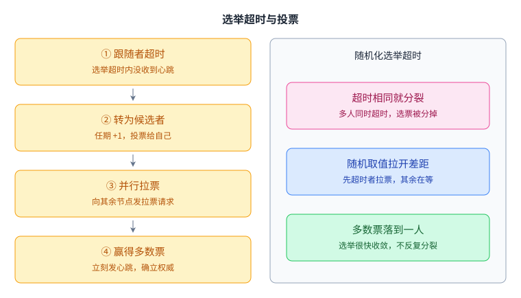
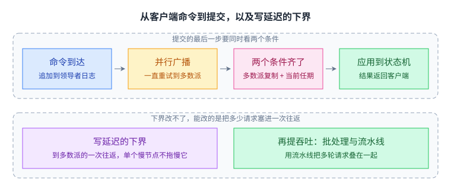

+++
kind = "paper"
paper = "raft"
title = "Raft 导读"
status = "draft"
output_mode = "guide"
+++

> **这是导读，不是翻译。**
> 本文由 CourseLingo 撰写，用我们自己的话讲清这篇论文要解决什么问题、核心思路是什么、机制怎么运转、代价在哪里；全文不含原论文的段落，也不是逐句对照。
> 原文作者：Diego Ongaro 与 John Ousterhout；发表于 USENIX ATC 2014（会议版）；课程使用的是内容更全的扩展技术报告版。
> 论文官方页面：[In Search of an Understandable Consensus Algorithm](https://www.usenix.org/conference/atc14/technical-sessions/presentation/ongaro)。
> 论文的权利归出版方 USENIX 所有；我们只提供链接与自己的解读，不复制、不翻译原文。
> 本页不是 USENIX、论文作者或 MIT 的官方材料，CourseLingo 与上述各方均无隶属关系；如与原文有出入，以原文为准。

## 这篇论文要解决什么问题

想象一个很常见的工程场景：你有一个由五台机器组成的小集群，需要它们对「接下来执行哪条命令」这件事保持完全一致。可能是保存集群配置、记录谁是当前的主控节点、维护一张锁表或命名空间。这类需求的出现频率高得惊人：大型存储系统里通常都有一个这样的小集群，专门负责那些必须熬过主控节点崩溃的元数据。它的实现方式就是 [[term:state-machine-replication]]，让每台机器按同样的顺序执行同样的命令，于是它们自然得到同样的状态。

要做到这一点，必须有一个 [[term:consensus]] 算法来维护那份被复制的日志。而在 2014 年之前，这个位置上几乎只有 [[term:Paxos]] 一个答案：它被证明过、被讲过无数遍、被大量系统当作起点。问题是，作者发现它很难真正被理解。论文里毫不客气地列了两条理由。第一，Paxos 的教学形式是「对单个值达成一致」，这个内核本身就很紧凑而微妙，两个阶段之间没有直观解释、也无法独立理解，读者很难建立起「为什么它是对的」的直觉；而把它拼装成一条日志的规则又引入了更多细节。第二，它并不适合当作实际系统的骨架：多副本场景下并不存在一个大家公认的多决策版本，每个真实系统都从 Paxos 出发，然后各自演化出差别很大的架构，最后变成「以一份没被证明过的协议为基础」。论文引用了当时的原话：Paxos 的描述与真实系统的需求之间存在明显的鸿沟。

所以这篇论文提出的问题不是「如何达成共识」，而是「能不能设计一个工程实践者能读懂、能推理、能扩展的共识算法」。它把可理解性当作首要设计目标，而不是事后包装。作者也承认这个目标带有主观性，于是给它配了两个可操作的手法：一是问题分解，把算法切成能相对独立理解的部分；二是状态空间缩减，减少系统可能处于的状态、消除不必要的非确定性。

论文用一个小规模用户研究支撑了这个主张：斯坦福与伯克利的高级操作系统课／分布式计算课上，43 名学生先后观看 Raft 与 Paxos 的录像并各自答题，Raft 卷面平均 25.7 分（满分 60），Paxos 平均 20.8 分，43 人中有 33 人在 Raft 上得分更高。需要连同论文自己给出的保留一起读：43 人里有 15 人事先接触过 Paxos，Paxos 的录像还长 14%，这些因素对 Paxos 有利；作者用配对检验与回归模型来修正，回归预测的差距是 12.5 分，比实测的 4.9 分更大。这些数字说明的不是「Raft 更快」，而是「Raft 更容易学会」。

## 核心思路

论文的思路可以概括成一句话：在假设不变的前提下，把共识拆成三个可以分别理解的部分，并把它们写清楚。

拆出来的三块是：[[term:leader-election]]（原领导者失效后选出新的）、日志复制（领导者接收客户端命令并把它们复制给其他节点，并强制其他日志与自己一致）、安全性（保证状态机之间的安全性质）。这三块能分开讲、分开推理，是这个设计最大的结构特征。

与它配套的是「强领导者」这个立场。Raft 中一个时刻最多只有一个领导者，日志条目只从领导者流向其他节点，领导者决定新条目的位置时不必征询任何人，日志中不允许出现空洞。这和 Paxos 那种对称的、点对点的内核形成对比：后者在「只做一个决定」的世界里合理，但真实系统要做一连串决定，先选出一个领导者再让它统一协调，既简单又高效。

这里有个容易被误读的地方，值得说透：**Raft 并没有靠弱化假设来换简单**。它面对的是和 Paxos 一样的故障模型：节点 [[term:crash]] 后停止（[[term:fail-stop]]），不考虑会撒谎的 [[term:Byzantine-fault]]；网络可能延迟、丢包、重复、乱序，甚至出现 [[term:network-partition]]；它同样承诺在任意非拜占庭条件下不出错。更关键的是，安全性完全不依赖时间：定时器只影响可用性，不影响正确性。它换来的简洁来自别处：减少非确定性、减少日志之间可能出现的差异形态、让每个机制都能被单独讲明白。反过来，当非确定性有帮助时它也主动使用：选举超时被刻意随机化，用一个「谁都可能先超时、无所谓谁先」的机制回避了原本需要引入优先级比较才能解决的冲突。论文特别记录了这段权衡：他们最初给候选人设计了一套排位规则，但每次修补都会冒出新的可用性角落情况，最后判定随机重试更容易看懂。

## 它怎么工作

一台服务器在任何时刻处于三种状态之一：跟随者、候选者、领导者。正常运行时恰好有一个领导者，其余都是被动的跟随者；客户端如果把请求发给跟随者，跟随者会把它转给领导者。一个五节点的集群可以容忍两台机器失效。

**任期与逻辑时钟。** Raft 把时间切成一段段连续编号的 [[term:term]]，每一段都以一次选举开始。一个任期内最多只会产生一个领导者（这是「选举安全」性质）。任期的真正作用是充当逻辑时钟：任何一次通信都带上发送方的任期；谁发现自己看到的任期号比对方小，就把自己的任期更新为更大的那个，而候选者或领导者一旦发现自己的任期过期，立刻退回跟随者；收到任期号比自己旧的请求，直接拒绝。这样每个节点都能识别出「过期的领导者」这类陈旧信息，而且完全不依赖物理时钟，因为现实中的 [[term:clock-skew]] 让它无法被用来判断先后。

角色与任期是同一件事的两个侧面，下面这张图把状态转换和任期编号放在一起看。

转换关系只有这几条，但每条都被任期约束着：谁看到更大的任期号都必须让步，所以一个任期里不可能同时存在两个领导者。

**选举超时与 [[term:heartbeat]]。** 领导者周期性地向所有跟随者发送心跳。跟随者只要在一段称为选举超时的时间内没有听到任何消息，就认为当前没有可用的领导者，于是发起选举：把任期加一、转为候选者、投票给自己，并并行地向其他所有节点发送拉票请求；只要拿到集群 [[term:majority]] 的票，就当选为领导者，并立刻用心跳确立权威、阻止新的选举。如果多个跟随者同时超时导致选票被分掉，谁也拿不到多数，随机的选举超时就派上用场：每个候选者重新随机取一个超时值等待，于是下一次通常只有一个节点先超时，选举很快收敛。时间上有一条明确的要求：广播时间要远小于选举超时、选举超时要远小于单机的平均故障间隔。第一条保证领导者来得及发出心跳，第二条保证系统大部分时间有领导者在推进。

一次成功的选举可以拆成四步，这张图把从超时到当选的链路画了出来。

第三步的拉票是并行发出的，所以选票可能被分掉；随机化的超时值让下一轮通常只有一个人先超时，选举很快收敛。

**[[term:replication]] 与 [[term:commit]]。** 领导者收到客户端命令后，把它作为一条新的 [[term:log-entry]] 追加到自己的 [[term:log]] 上，条目里带着它被接收时的任期号；随后并行地向其他节点发送复制请求。当这条条目被复制到集群多数派上时，它就算被提交：领导者把它应用到自己的状态机、把结果返回给客户端。只要还没到多数派，领导者就会一直重试，即使已经答复过客户端也不会停；反过来，单个慢节点不会拖慢提交速度。领导者把自己知道的最高已提交位置记下来，并在之后的所有请求（包括心跳）里带上它，跟随者由此得知哪些条目已经提交、可以按序应用到本地状态机。

从客户端命令到提交之间只隔一次多数派往返，但最后那一步要同时看两个条件。

最后那个方框是这张图的重点：多数派复现只是必要条件，条目还必须属于当前任期，否则旧条目仍可能被后来的领导者覆盖。

**日志匹配。** Raft 维护一条很强的性质：如果两份日志在同一个位置有同一个任期的条目，那么它们在这个位置之前的所有条目也完全相同（「日志匹配」性质）。它靠复制请求里的一个一致性检查归纳地维持：领导者发送新条目时，一并带上紧邻在前的那个条目的位置与任期；跟随者如果在自己的日志里找不到这个前缀，就拒绝这次请求。被拒绝时领导者把该跟随者的下一个待发位置往前退一格再试，直到找到两份日志真正一致的那一点，然后把跟随者多余的、冲突的后缀覆盖掉。这套机制有个很漂亮的结果：新领导者上台后不需要任何专门的修复流程，正常操作本身就会让日志自动收敛。

**为什么领导者永不改写自己的日志。** 这是理解 Raft 安全性的关键，也是它与 Viewstamped Replication 一类算法的区别。因为候选者要当选必须拿到多数派的票，而任何一条已提交的条目必定存在于某个多数派之上（多数派是最常见的一种 [[term:quorum]]），两个多数派必然相交，所以在选举环节加一条限制就足够了：投票者拒绝把票投给日志不如自己「新」的候选者（比较方式是先看最后一条条目的任期，任期大的更新；任期相同则日志更长的更新）。有了这条限制，任何新当选的领导者在上台那一刻就已经包含全部已提交的条目，套用日志匹配性质，它之前的所有前缀也就都在。于是日志条目永远只需要从领导者单方向流向跟随者，领导者从不需要从跟随者那里接收或改写条目。如果允许领导者改写自己的日志，就必须反过来把缺失的已提交条目传送给新领导者，那正是其他算法为了更宽松的选举条件而付出的复杂度。

**提交规则的微妙之处。** 上面说「复制到多数派即提交」，但这句话加上一个限定才成立：**只有属于当前任期的条目才能靠数副本判定为已提交**。原因是过去的条目即使已经被复制到多数派，仍然可能被后来的领导者覆盖。论文用一个四步时序图说明了这一点：某条任期 2 的条目在领导者崩溃前只复制到部分节点，另一个节点在任期 3 当选并写入了不同的条目，原来的领导者复活后再次当选、把任期 2 的条目补齐到多数派 —— 此时它看起来「已提交」，但实际上还没提交，如果这位领导者随即崩溃，任期 3 的那个节点仍可能当选并用它自己的条目覆盖掉它。避免这个陷阱的办法很保守：领导者提交一条当前任期的条目（哪怕是空操作），一旦它提交成功，它之前的所有条目就都因为日志匹配性质而被间接提交。论文也承认，存在一些情况下领导者可以安全地断定更老的条目已提交（比如那条条目已经在每台机器上），但它为了简单而没有这么做。

## 它在哪里会碰到麻烦

**旧任期条目的提交规则是最容易写错的地方。** 它不是一个可以省略的细节：如果实现者为了「优化」而允许领导者靠副本数提交一条旧任期条目，那条目就有可能被后续领导者覆盖，状态机之间执行不同命令，「状态机安全」性质当场破裂。判断条件也必须写全：多数派的复制位置大于某个 N 还不够，还得要求这条位置上的条目任期等于当前任期。另一个实践上的麻烦是「找到日志一致点」的方式：朴素的实现每被拒绝一次只把位置退一格，日志差距大时要浪费很多轮往返，真实系统会按任期跳着退，这也是实验作业里常见的性能坑。

**成员变更。** 集群的成员集合并不总是固定的：要换掉坏机器、要调整副本数。麻烦在于不存在「所有节点同时切换配置」这件事，节点只能一个一个切，于是在切换过程中集群可能被切成两个各自拥有多数派的群体，同一个任期里选出两个领导者。所以直接切换是不安全的，必须两阶段：Raft 的做法是先进入一个同时包含新旧两套配置的过渡状态（联合共识），日志要复制到两套配置的所有节点、领导者可以来自任一配置、而投票与提交都需要同时获得新旧配置各自的多数派；等过渡配置被提交之后再切到新配置。除此之外还有三处细节：新加入的节点日志是空的，直接让它参与多数派会拖住提交，所以先让它以非投票成员身份追日志；领导者自己可能不在新配置里，它要在提交新配置条目之后主动退位，而在提交完成之前不能把自己算进多数派；被移出配置的节点收不到心跳，会反复超时并带着更高的任期号发起选举，把现任领导者挤下去，因此节点在刚听到过领导者消息的最小选举超时内应当忽略拉票请求。

**日志会无限增长。** 长期运行的集群日志不断变长，重启后重放全部条目也越来越慢，所以需要 [[term:snapshot]]：把状态机的当前状态整体写下来，连同一个「最后包含的位置」等元信息，然后丢弃该位置之前的日志。这带来一个与设计原则的小张力：原本「一切由领导者主导」，但让每个跟随者各自独立地做快照更高效，领导者只在某个跟随者落后太多时才主动把快照分块传给它。与此相关还有状态机的确定性问题：如果状态机内部有随机数、依赖墙上时钟或者外部副作用，那么「按相同顺序执行相同命令得到相同状态」就不再成立，这部分不确定性必须由上层自行处理。

**强保证的价格：每次写一次多数派往返。** 常态下一条命令要等多数派确认才能返回，因此写 [[term:latency]] 的下界大约是到多数派的一次往返时间；论文的评估里也明确说，Raft 与 Paxos 在性能上相当，正常情况用最少的消息数（领导者到半个集群的一次往返）完成复制，想提高 [[term:throughput]] 就得靠批处理与流水线。可用性同样有价格：只有多数派可达才能推进，五节点集群需要三台同时在网，少数派一侧无法服务写入，这正是为了杜绝 [[term:split-brain]] 必须付出的代价。领导者更替期间系统会短暂无领导者，论文测得的中位停机时间在有 5ms 随机化时约 287ms，把选举超时压到 12–24ms 可以把平均选举时间降到 35ms，但再低就会破坏时间要求、导致不必要的领导者更替。

**读取并不自动是强一致的。** 日志提交保证的是写入顺序，但如果客户端从一个跟随者读，读到的可能是旧值。要得到 [[term:linearizability]]，或者把读也走一遍日志、或者借助带时限的租约之类机制让领导者确认自己仍然权威。这一条常被初学者忽略，而它恰好是把「复制一份日志」变成「对外表现为一台可靠机器」的关键一步。

**领导者是写吞吐的 [[term:bottleneck]]。** 所有写都要经过同一位领导者，集群越大，领导者的网络与处理能力越早成为上限。这与 [[term:primary-backup-replication]] 的直觉一样：单写者的结构换来了简单，也换来了天花板。

## 代价

把上面的分析收束一下：Raft 放弃了**分区少数派一侧的可用性**，放弃了**写延迟的下界**，也放弃了**单集群的写吞吐上限**。它换到的是一份能被完整讲清、能被逐块推理、并且有形式化规格与安全性证明支撑的算法：论文给出的实现约 2000 行 C++，还有二十多个第三方实现，这本身就说明它有多容易被照着做出来。但要说清一件事：**可理解不等于没有角落**。成员变更与日志压缩的复杂度并没有消失，只是被放在了两块相对独立、可以单独讲清楚的地方。

按「后来者攻击了哪个弱点」来看，这些取舍各自引出过一批工作。单写者的吞吐天花板催生了把键空间切成许多个独立复制组、每组各跑一套 Raft 的方案（多组 Raft 已经成为工业界常见形态），每个分片内部仍有领导者，但整体吞吐可以随分片数增长；跨分片的事务仍然需要在 Raft 之上叠加 [[term:two-phase-commit]] 之类的协议。广域网下的提交延迟催生了不依赖单一领导者、以延迟最优为目标的复制协议。读取侧的代价催生了租约、只读索引一类的优化。成员变更的复杂度则被后续工作进一步简化（例如把「一次只加/减一台机器」作为联合共识的特例）。而论文对 Paxos「讲不清」的批评本身也推动了社区把共识写成 TLA+ 规格、做机械化验证，论文自己也正是这么做的。

还有一个值得放在最后说的观察：这篇论文的价值有一半不在算法，而在于它把「可理解性」当成了可以拿来讨论、可以拿数据支撑的工程目标。在同一个正确性等级上有多个算法可选时，让人读懂本身就是一种质量，而且它直接影响系统在真实世界里被实现成什么样子 —— 因为实现者终究要在文档之外做大量论文里没写的决定。读完这篇论文，你至少应该带走这个判断标准。

## 读完应该能回答

- 候选者的日志必须「至少和新的一样新」才能拿到选票，以及如果没有这条限制会具体发生什么。
- 一条在任期 2 就被复制到多数派的 [[term:log-entry]]，为什么在任期 3 的领导者手上仍然不能算已提交，以及领导者该怎么做才能安全地推进。
- 一条日志条目在什么条件下算提交，以及为什么「当前任期的条目提交」会自动把它之前的所有条目一起提交。
- 选举超时为什么必须远大于广播时间、又远小于单机平均故障间隔，以及随机化解决的是哪一个具体问题。
- 成员变更期间为什么需要联合共识，以及让集群直接从旧配置切到新配置会出现什么。

## 脉络回顾

这篇论文值得带走的不是某一条规则，而是它把「可理解性」立成了一个可以讨论、可以拿数据检验的设计目标。在同一个正确性等级上有多个算法可选时，让人读懂本身就是一种质量：它决定了实现者在文档之外做那些论文没写的决定时，会往哪个方向猜。这也是 LEC 6 与 LEC 7 把它排在这里的原因，Lab 3 要你亲手实现的正是这套复制层。

课程的另一份共识材料是 Paxos。两者面对同样的故障模型、回答同一个问题，区别在入口：Paxos 从「对单个值达成一致」这个内核出发，Raft 从「先选出一个领导者，再由它统一安排日志」出发。Raft 的论文本身就是在批评 Paxos 难以理解，所以这两份材料要对照着读：一边是「可理解」这个设计目标，另一边是它针对的那个对象。

把它和 [[term:two-phase-commit]] 对照，可以看出「协调者崩溃会阻塞」与「少数派无法服务」是两类不同的失败姿态；把它和 [[term:mapreduce]] 对照，则能看到「重跑」与「达成一致」这两条容错路线的分界。如果你要动手实现实验里的复制层，这篇论文里的三个变量会反复出现：每个跟随者的下一个待发位置、提交位置只能由当前任期的条目推进、以及 `currentTerm` 与投票记录必须先落盘再应答。
